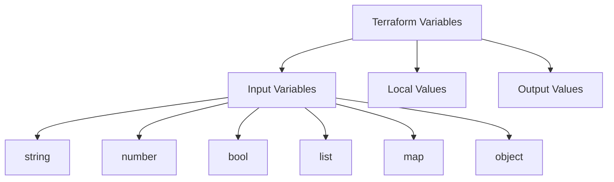

# How to Configure Terraform Variables and Outputs on RHEL

Author: [nawazdhandala](https://www.github.com/nawazdhandala)

Tags: RHEL, Terraform, Variables, Outputs, IaC, Linux

Description: Master Terraform variables and outputs on RHEL, including input variables, local values, output values, and variable validation.

---

Variables and outputs are the interface of your Terraform configurations. Variables let you parameterize your infrastructure, and outputs let you extract useful information after deployment. Getting them right makes your configurations reusable and composable.

## Variable Types



## Input Variables

```hcl
# variables.tf - Different variable types

# Simple string variable
variable "environment" {
  description = "Deployment environment (dev, staging, prod)"
  type        = string
  default     = "dev"
}

# Number variable
variable "instance_count" {
  description = "Number of RHEL instances to create"
  type        = number
  default     = 2
}

# Boolean variable
variable "enable_monitoring" {
  description = "Whether to install monitoring agents"
  type        = bool
  default     = true
}

# List variable
variable "allowed_ports" {
  description = "Ports to open in the firewall"
  type        = list(number)
  default     = [22, 80, 443]
}

# Map variable
variable "instance_tags" {
  description = "Tags to apply to instances"
  type        = map(string)
  default = {
    Team    = "infrastructure"
    Project = "rhel-deployment"
  }
}

# Object variable for structured data
variable "server_config" {
  description = "Server configuration settings"
  type = object({
    instance_type = string
    disk_size     = number
    memory        = number
  })
  default = {
    instance_type = "t3.medium"
    disk_size     = 30
    memory        = 4096
  }
}
```

## Variable Validation

```hcl
# variables-validated.tf - Variables with validation rules

variable "environment" {
  description = "Deployment environment"
  type        = string

  # Only allow specific values
  validation {
    condition     = contains(["dev", "staging", "prod"], var.environment)
    error_message = "Environment must be dev, staging, or prod."
  }
}

variable "disk_size_gb" {
  description = "Root disk size in GB"
  type        = number
  default     = 30

  validation {
    condition     = var.disk_size_gb >= 20 && var.disk_size_gb <= 500
    error_message = "Disk size must be between 20 and 500 GB."
  }
}

variable "hostname" {
  description = "Server hostname"
  type        = string

  validation {
    condition     = can(regex("^[a-z][a-z0-9-]{2,62}$", var.hostname))
    error_message = "Hostname must be 3-63 characters, start with a letter, and contain only lowercase letters, numbers, and hyphens."
  }
}
```

## Setting Variable Values

There are several ways to provide variable values:

```bash
# Method 1: Command line flags
terraform apply -var="environment=prod" -var="instance_count=5"

# Method 2: Variable file (terraform.tfvars - loaded automatically)
cat > terraform.tfvars << 'EOF'
environment    = "prod"
instance_count = 5
allowed_ports  = [22, 80, 443, 8080]
instance_tags = {
  Team    = "platform"
  Project = "production"
}
EOF

# Method 3: Named variable file
terraform apply -var-file="prod.tfvars"

# Method 4: Environment variables (prefix with TF_VAR_)
export TF_VAR_environment="prod"
export TF_VAR_instance_count=5
terraform apply
```

## Local Values

Locals let you compute intermediate values:

```hcl
# locals.tf - Computed values

locals {
  # Combine tags
  common_tags = merge(var.instance_tags, {
    Environment = var.environment
    ManagedBy   = "Terraform"
  })

  # Compute a name prefix
  name_prefix = "${var.environment}-rhel9"

  # Conditional logic
  is_production = var.environment == "prod"
  instance_type = local.is_production ? "t3.large" : "t3.medium"
}
```

## Using Variables in Resources

```hcl
# main.tf - Use variables to create resources

resource "aws_instance" "rhel_servers" {
  count         = var.instance_count
  ami           = data.aws_ami.rhel9.id
  instance_type = local.instance_type

  root_block_device {
    volume_size = var.server_config.disk_size
    volume_type = "gp3"
  }

  tags = merge(local.common_tags, {
    Name = "${local.name_prefix}-server-${count.index + 1}"
  })
}
```

## Output Values

```hcl
# outputs.tf - Export useful information

# Simple output
output "instance_ids" {
  description = "IDs of created instances"
  value       = aws_instance.rhel_servers[*].id
}

# Formatted output
output "ssh_commands" {
  description = "SSH commands for each server"
  value = [
    for inst in aws_instance.rhel_servers :
    "ssh ec2-user@${inst.public_ip}"
  ]
}

# Sensitive output (hidden in CLI output)
output "private_ips" {
  description = "Private IP addresses"
  value       = aws_instance.rhel_servers[*].private_ip
  sensitive   = true
}

# Map output
output "server_info" {
  description = "Map of server names to IPs"
  value = {
    for inst in aws_instance.rhel_servers :
    inst.tags["Name"] => inst.public_ip
  }
}
```

## Access Outputs

```bash
# View all outputs after apply
terraform output

# Get a specific output
terraform output instance_ids

# Get raw value (useful for scripts)
terraform output -raw instance_ids

# Get JSON output (useful for piping to jq)
terraform output -json server_info
```

Variables and outputs form the contract between your Terraform modules and the outside world. Well-defined variables with validation make your configurations safer, and clear outputs make them easier to integrate with other tools and scripts on RHEL.
