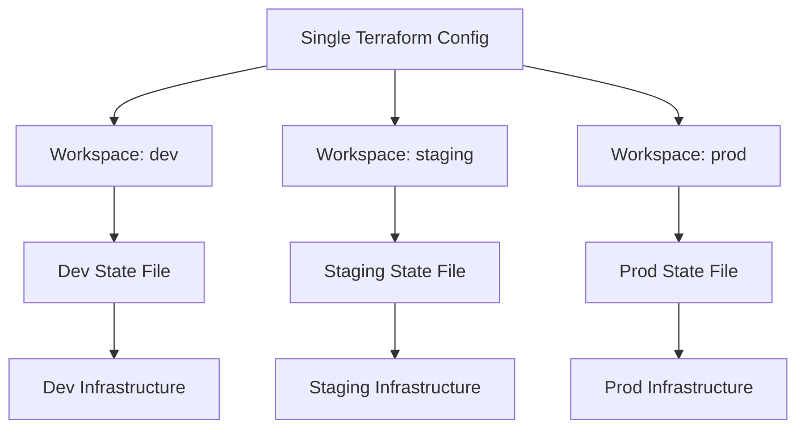

# How to Use Terraform Workspaces for Multi-Environment Deployment on RHEL

Author: [nawazdhandala](https://www.github.com/nawazdhandala)

Tags: RHEL, Terraform, Workspaces, Multi-Environment, IaC, Linux

Description: Use Terraform workspaces to manage multiple environments like dev, staging, and production from a single configuration on RHEL.

---

Running separate copies of your Terraform configuration for each environment leads to drift and duplication. Workspaces let you use one configuration to manage multiple environments, each with its own state file.

## How Workspaces Work



## Create and Manage Workspaces

```bash
# List existing workspaces (* marks the current one)
terraform workspace list

# Create new workspaces
terraform workspace new dev
terraform workspace new staging
terraform workspace new prod

# Switch between workspaces
terraform workspace select dev
terraform workspace select prod

# Show current workspace
terraform workspace show

# Delete a workspace (must not be selected)
terraform workspace select default
terraform workspace delete dev
```

## Use Workspace Names in Configuration

```hcl
# variables.tf - Environment-specific defaults

# Map workspace names to instance types
variable "instance_types" {
  type = map(string)
  default = {
    dev     = "t3.small"
    staging = "t3.medium"
    prod    = "t3.large"
  }
}

# Map workspace names to instance counts
variable "instance_counts" {
  type = map(number)
  default = {
    dev     = 1
    staging = 2
    prod    = 3
  }
}

variable "disk_sizes" {
  type = map(number)
  default = {
    dev     = 20
    staging = 30
    prod    = 50
  }
}
```

```hcl
# main.tf - Use terraform.workspace to select settings

locals {
  # Current workspace name
  env = terraform.workspace

  # Look up settings for the current workspace
  instance_type  = var.instance_types[local.env]
  instance_count = var.instance_counts[local.env]
  disk_size      = var.disk_sizes[local.env]

  # Tags that include the environment
  common_tags = {
    Environment = local.env
    ManagedBy   = "Terraform"
  }
}

resource "aws_instance" "rhel_servers" {
  count         = local.instance_count
  ami           = data.aws_ami.rhel9.id
  instance_type = local.instance_type

  root_block_device {
    volume_size = local.disk_size
    volume_type = "gp3"
  }

  tags = merge(local.common_tags, {
    Name = "${local.env}-rhel9-${count.index + 1}"
  })
}
```

## Workspace-Specific Backend Keys

When using S3 remote state, workspaces automatically get separate state files:

```hcl
# backend.tf
terraform {
  backend "s3" {
    bucket         = "my-terraform-state"
    key            = "rhel9/terraform.tfstate"
    region         = "us-east-1"
    dynamodb_table = "terraform-lock"

    # Workspaces store state in:
    # s3://my-terraform-state/env:/dev/rhel9/terraform.tfstate
    # s3://my-terraform-state/env:/staging/rhel9/terraform.tfstate
    # s3://my-terraform-state/env:/prod/rhel9/terraform.tfstate
  }
}
```

## Deploy to Each Environment

```bash
# Deploy to dev
terraform workspace select dev
terraform apply -auto-approve

# Deploy to staging
terraform workspace select staging
terraform apply -auto-approve

# Deploy to prod (with manual approval)
terraform workspace select prod
terraform plan
terraform apply
```

## Automation Script

```bash
#!/bin/bash
# deploy-env.sh - Deploy to a specific environment
set -euo pipefail

ENV=${1:?Usage: $0 <dev|staging|prod>}

# Validate environment name
if [[ ! "$ENV" =~ ^(dev|staging|prod)$ ]]; then
  echo "Error: environment must be dev, staging, or prod"
  exit 1
fi

# Switch to the workspace
terraform workspace select "$ENV" 2>/dev/null || terraform workspace new "$ENV"

# Plan and apply
echo "Deploying to $ENV..."
terraform plan -out="tfplan-${ENV}"

if [ "$ENV" = "prod" ]; then
  echo "Production deployment requires confirmation."
  terraform apply "tfplan-${ENV}"
else
  terraform apply -auto-approve "tfplan-${ENV}"
fi

echo "Deployment to $ENV complete."
terraform output
```

Workspaces provide a clean way to manage multiple environments from a single Terraform codebase on RHEL. Each workspace gets its own isolated state, so dev changes never accidentally affect production.
