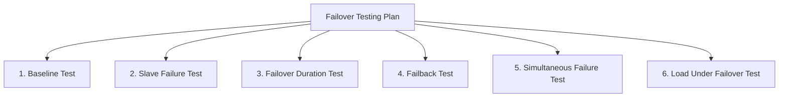

# How to Test Network Bond Failover Before Deploying to Production on RHEL

Author: [nawazdhandala](https://www.github.com/nawazdhandala)

Tags: RHEL, Bonding, Failover Testing, Linux

Description: A testing playbook for validating network bond failover behavior on RHEL, covering simulated failures, measurement techniques, and acceptance criteria.

---

You would be surprised how many people set up bonding and push it to production without ever testing if failover actually works. I have seen bonds that were misconfigured from day one, running on a single NIC for months until the active one failed and everything went dark. Do not be that person. Test your bonds before they go live.

## Testing Plan Overview



## Prerequisites

- A bonded interface configured and active
- Console access (IPMI, iLO, or physical) in case you lose network
- A peer server to test connectivity
- iperf3 installed on both servers for throughput testing

```bash
# Install testing tools
dnf install -y iperf3 tcpdump
```

## Test 1: Baseline Verification

First, confirm the bond is healthy and both slaves are up:

```bash
# Verify bond status
cat /proc/net/bonding/bond0

# Confirm both slaves show MII Status: up
grep "MII Status" /proc/net/bonding/bond0

# Test basic connectivity
ping -c 10 -i 0.1 10.0.1.1
```

Record the baseline throughput:

```bash
# On the peer server
iperf3 -s

# On the bonded server
iperf3 -c 10.0.1.100 -t 10
```

Write down the throughput number. You will compare it after failover.

## Test 2: Simulate Slave Failure

There are several ways to simulate a NIC failure without physically pulling cables.

### Method A: Software Disconnect

```bash
# Disconnect the active slave via nmcli
nmcli device disconnect eth0
```

### Method B: Bring the Interface Down

```bash
# Bring down the interface at the IP level
ip link set eth0 down
```

### Method C: Block Traffic with iptables

This simulates a network failure without dropping the link:

```bash
# Block all traffic on eth0 (link stays up, but no traffic flows)
iptables -A INPUT -i eth0 -j DROP
iptables -A OUTPUT -o eth0 -j DROP
```

This is useful for testing ARP-based monitoring since MII monitoring will not detect this type of failure.

## Test 3: Measure Failover Duration

Start a continuous ping with timestamps before triggering the failure:

```bash
# Continuous ping with 100ms interval and timestamps
ping -D -i 0.1 10.0.1.1 > /tmp/failover-test.log 2>&1 &
PID=$!
echo "Ping running as PID $PID"
```

In another terminal, trigger the failure:

```bash
# Record the time and disconnect the active slave
date +%s.%N && nmcli device disconnect eth0
```

Wait for traffic to resume, then stop the ping:

```bash
# Stop the ping
kill $PID

# Analyze the results
grep -c "icmp_seq" /tmp/failover-test.log    # Total pings sent
grep -c "bytes from" /tmp/failover-test.log   # Successful replies
```

The difference between total pings and successful replies, multiplied by the ping interval (0.1s), gives you the approximate failover duration.

## Test 4: Verify Failover Behavior

After the failover, confirm:

```bash
# Check which slave is now active
cat /proc/net/bonding/bond0 | grep "Currently Active"

# Verify the bond IP is still accessible
ip addr show bond0

# Verify connectivity
ping -c 4 10.0.1.1

# Measure throughput on the remaining slave
iperf3 -c 10.0.1.100 -t 10
```

Throughput should be at least as good as a single NIC (it should not be less than one slave's capacity).

## Test 5: Test Failback

Bring the failed slave back and check the bond's behavior:

```bash
# Bring the slave back up
nmcli device connect eth0

# Wait a few seconds for the bond to detect the link
sleep 5

# Check if the bond reselected the primary
cat /proc/net/bonding/bond0 | grep "Currently Active"

# Verify both slaves are healthy
grep "MII Status" /proc/net/bonding/bond0
```

If you configured `primary_reselect=failure`, the bond should stay on the current active slave. With the default `primary_reselect=always`, it switches back to the primary.

## Test 6: Simultaneous Failure

Test what happens when all slaves go down:

```bash
# Start pinging
ping -D -i 0.1 10.0.1.1 > /tmp/all-down-test.log 2>&1 &

# Take down both slaves
nmcli device disconnect eth0
nmcli device disconnect eth1

# Wait a few seconds
sleep 5

# Check bond status (should show down)
cat /proc/net/bonding/bond0

# Bring both back
nmcli device connect eth0
nmcli device connect eth1

# Wait for recovery
sleep 5

# Verify recovery
cat /proc/net/bonding/bond0
ping -c 4 10.0.1.1
```

## Test 7: Load Under Failover

Test failover while the bond is under load:

```bash
# On the peer server
iperf3 -s

# On the bonded server, start a long throughput test
iperf3 -c 10.0.1.100 -t 60 -P 4 &

# While iperf3 is running, trigger failover 15 seconds in
sleep 15 && nmcli device disconnect eth0

# Watch the iperf3 output for the throughput dip
```

Check the iperf3 output for the moment of failover. You should see a brief dip in throughput followed by recovery.

## Acceptance Criteria

Define what "pass" means before you start testing:

| Test | Pass Criteria |
|---|---|
| Slave failure detection | Bond detects failure within 200ms (2x miimon) |
| Failover duration | Less than 500ms of packet loss |
| Connectivity after failover | All pings succeed, ARP resolves |
| Throughput after failover | At least single-NIC throughput |
| Failback behavior | Matches configured primary_reselect |
| Both slaves down | Bond recovers when slave returns |
| Load during failover | iperf3 sessions survive with brief dip |

## Documenting Results

Create a simple test report:

```bash
# Log all test results
cat <<'REPORT' > /tmp/bond-test-report.txt
Bond Failover Test Report
Date: $(date)
Bond: bond0
Mode: active-backup
Slaves: eth0, eth1

Test 1 - Baseline: PASS/FAIL
  Throughput: X Gbps

Test 2 - Slave failure: PASS/FAIL
  Failover duration: X ms

Test 3 - Failback: PASS/FAIL
  Primary reselected: yes/no

Test 4 - Load under failover: PASS/FAIL
  Throughput dip: X seconds

Notes:
REPORT
```

## Cleanup After Testing

Make sure you restore everything after testing:

```bash
# Verify all slaves are connected
nmcli device connect eth0
nmcli device connect eth1

# Remove any iptables rules you added
iptables -F

# Confirm bond is healthy
cat /proc/net/bonding/bond0

# Final connectivity check
ping -c 4 10.0.1.1
```

## Summary

Testing bond failover takes 30 minutes and can save you from a production outage. Test slave failure, measure failover duration, verify failback, and run load tests during failover. Define acceptance criteria before testing so you have clear pass/fail results. If the bond does not meet your criteria, tune the miimon interval, primary_reselect policy, or bonding mode before deploying. Every bond in production should have a test report attached to it.
