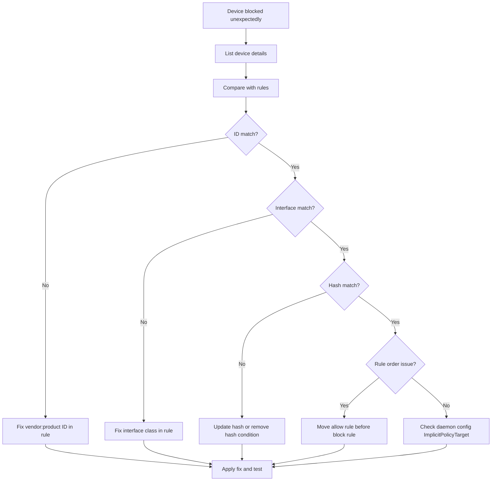

# How to Test and Troubleshoot USBGuard Policies on RHEL 9

Author: [nawazdhandala](https://www.github.com/nawazdhandala)

Tags: RHEL, USBGuard, Troubleshooting, Linux

Description: Learn how to test USBGuard policies, diagnose device blocking issues, and troubleshoot common problems on RHEL 9 to keep your USB security working correctly.

---

USBGuard policies can be tricky to get right. A rule that looks correct on paper might not match the device you expect, or a blocked device might be something critical you forgot to whitelist. Testing and troubleshooting skills are essential for maintaining USB security without disrupting operations.

## Testing Policies Before Deployment

Before applying a new policy, test it without enforcement:

```bash
# Back up the current working policy
sudo cp /etc/usbguard/rules.conf /etc/usbguard/rules.conf.known-good

# Apply the new policy
sudo cp /path/to/new/rules.conf /etc/usbguard/rules.conf

# Restart USBGuard
sudo systemctl restart usbguard

# Immediately check that critical devices are still allowed
sudo usbguard list-devices
```

If something goes wrong, restore immediately:

```bash
# Restore the known-good policy
sudo cp /etc/usbguard/rules.conf.known-good /etc/usbguard/rules.conf
sudo systemctl restart usbguard
```

## Listing Device Details

When a device is not matching your rules, get its full details:

```bash
# List all devices with full attributes
sudo usbguard list-devices -b

# List only blocked devices
sudo usbguard list-devices | grep block

# List only allowed devices
sudo usbguard list-devices | grep allow
```

Compare the device attributes with your rules to find mismatches.

## Common Rule Matching Problems

### Wrong Interface Class

The most common issue is interface class mismatches. A USB keyboard might present as interface `03:01:01` on one model and `03:00:00` on another:

```bash
# Check what interface class a device actually presents
sudo usbguard list-devices -b | grep -A5 "keyboard"
```

Fix by using a broader interface match:

```
# Instead of matching exact subclass
allow with-interface 03:01:01

# Match all HID devices
allow with-interface 03:*:*
```

### Composite Devices

Some devices present multiple interfaces. A USB headset might have audio and HID interfaces:

```bash
# A headset might show interfaces like:
# with-interface { 01:01:00 01:02:00 03:00:00 }
```

Your rule needs to account for all interfaces:

```
# Allow the headset with all its interfaces
allow id 046d:0a44 with-interface { 01:01:00 01:02:00 03:00:00 }

# Or be more permissive
allow id 046d:0a44 with-interface one-of { 01:*:* 03:*:* }
```

### Hash Mismatches

Hash-based rules are very specific. If the device firmware updates or attributes change slightly, the hash will not match:

```bash
# Get the current hash of a device
sudo usbguard list-devices -b | grep "hash"
```

Update the hash in your rules or switch to ID-based matching.

## Troubleshooting Workflow



## Debugging with Journal Logs

USBGuard logs detailed information about device authorization decisions:

```bash
# View recent USBGuard decisions
sudo journalctl -u usbguard --since "1 hour ago"

# Watch in real time while plugging in devices
sudo journalctl -u usbguard -f

# Filter for device events
sudo journalctl -u usbguard | grep -i "device"
```

## Using usbguard watch for Real-Time Monitoring

```bash
# Watch USB events in real time
sudo usbguard watch
```

Plug in a device and watch the output. It shows exactly what attributes USBGuard sees, which helps you write matching rules.

## Testing with usbguard allow-device and block-device

Temporarily allow or block devices for testing:

```bash
# List devices to get the device number
sudo usbguard list-devices

# Temporarily allow a blocked device (device number 15)
sudo usbguard allow-device 15

# Temporarily block an allowed device
sudo usbguard block-device 15

# Reject a device (remove it from the system entirely)
sudo usbguard reject-device 15
```

These changes are temporary and do not modify the policy file.

## Verifying Rule Syntax

If USBGuard fails to start after a policy change:

```bash
# Check the service status for errors
sudo systemctl status usbguard

# Look for syntax errors in the journal
sudo journalctl -u usbguard --no-pager | tail -20
```

Common syntax issues:
- Missing quotes around string values
- Invalid interface class format (must be XX:XX:XX)
- Typos in attribute names

## Testing Policy Changes Safely

A safe approach for policy updates:

```bash
# Step 1: Save the current working policy
sudo cp /etc/usbguard/rules.conf /etc/usbguard/rules.conf.backup

# Step 2: Make your changes
sudo vi /etc/usbguard/rules.conf

# Step 3: Restart USBGuard
sudo systemctl restart usbguard

# Step 4: Immediately verify critical devices
sudo usbguard list-devices

# Step 5: Test new device scenarios
# Plug in test devices and verify behavior

# Step 6: If anything is wrong, roll back
# sudo cp /etc/usbguard/rules.conf.backup /etc/usbguard/rules.conf
# sudo systemctl restart usbguard
```

## Recovering from Lockout

If USBGuard blocks your keyboard and you lose console access:

```bash
# Option 1: SSH in from another machine
ssh admin@server

# Option 2: If SSH is not available, reboot to single-user mode
# At GRUB menu, edit the kernel line and add: systemd.unit=rescue.target

# Once in, stop USBGuard
sudo systemctl stop usbguard

# Fix the policy
sudo vi /etc/usbguard/rules.conf

# Restart
sudo systemctl start usbguard
```

To prevent lockout in the first place, always make sure your current keyboard and mouse are in the policy before enabling USBGuard:

```bash
# Generate policy including all current devices before any changes
sudo usbguard generate-policy > /etc/usbguard/rules.conf
```

## Checking Daemon Configuration

Some issues come from the daemon configuration, not the rules:

```bash
# Review daemon settings
sudo cat /etc/usbguard/usbguard-daemon.conf
```

Key settings to check:
- `ImplicitPolicyTarget` - what happens to devices that match no rules
- `PresentDevicePolicy` - how to handle devices present at daemon startup
- `InsertedDevicePolicy` - how to handle devices inserted while running

If `ImplicitPolicyTarget=block` and your rules have no match, devices will be blocked. If it is set to `allow`, unmatched devices pass through, which may not be what you want for security.

Systematic testing and good backup habits will keep your USBGuard policies working correctly while maintaining the security posture you need.
