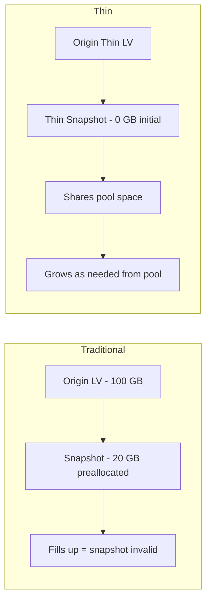

# How to Create Thin LVM Snapshots Without Preallocating Space on RHEL 9

Author: [nawazdhandala](https://www.github.com/nawazdhandala)

Tags: RHEL, LVM, Thin Snapshots, Linux

Description: Learn how to create thin LVM snapshots on RHEL 9 that share pool space instead of requiring preallocated storage, enabling efficient point-in-time copies.

---

Traditional LVM snapshots require you to preallocate space upfront, and if you guess wrong, the snapshot fills up and becomes invalid. Thin snapshots solve this problem by sharing space from the thin pool. They start at zero additional space and grow only as data changes, pulling from the same pool as all other thin volumes.

## Traditional vs. Thin Snapshots



Key differences:

| Feature | Traditional Snapshot | Thin Snapshot |
|---------|---------------------|---------------|
| Space allocation | Fixed at creation | On-demand from pool |
| Can overflow | Yes, becomes invalid | No, uses pool space |
| Performance impact | Higher COW overhead | Lower, more efficient |
| Multiple snapshots | Each needs own space | All share pool |
| Snapshot of snapshot | Not supported | Supported |

## Prerequisites

You need an existing thin pool with thin volumes. If you do not have one yet:

```bash
# Create a thin pool
lvcreate -L 100G --thinpool thinpool vg_data

# Create a thin volume
lvcreate -V 50G --thin -n app_data vg_data/thinpool
mkfs.xfs /dev/vg_data/app_data
```

Check your setup:

```bash
# Verify thin pool and volumes
lvs -o lv_name,lv_size,pool_lv,data_percent vg_data
```

## Creating a Thin Snapshot

Creating a thin snapshot is simple and instant:

```bash
# Create a thin snapshot of app_data
lvcreate -s -n app_data_snap /dev/vg_data/app_data
```

Notice there is no `-L` size parameter. Thin snapshots do not need a preallocated size because they share pool space.

Verify:

```bash
# Check the snapshot
lvs -o lv_name,lv_size,origin,pool_lv,data_percent vg_data
```

The snapshot shows the same virtual size as the origin but uses essentially zero additional pool space initially.

## Creating Multiple Snapshots

You can create many snapshots without worrying about preallocating space for each:

```bash
# Create timestamped snapshots for different points in time
lvcreate -s -n app_snap_$(date +%Y%m%d_%H%M) /dev/vg_data/app_data
```

A quick script for daily snapshots:

```bash
#!/bin/bash
# /usr/local/bin/daily-snapshot.sh
# Creates a daily thin snapshot and removes old ones

VOLUME="vg_data/app_data"
KEEP_DAYS=7

# Create today's snapshot
SNAP_NAME="app_snap_$(date +%Y%m%d)"
lvcreate -s -n "$SNAP_NAME" /dev/$VOLUME
logger "Created thin snapshot: $SNAP_NAME"

# Remove snapshots older than KEEP_DAYS
CUTOFF_DATE=$(date -d "$KEEP_DAYS days ago" +%Y%m%d)
lvs --noheadings -o lv_name vg_data | grep "app_snap_" | while read -r SNAP; do
    SNAP_DATE=$(echo "$SNAP" | sed 's/app_snap_//')
    if [ "$SNAP_DATE" -lt "$CUTOFF_DATE" ] 2>/dev/null; then
        lvremove -f "vg_data/$SNAP"
        logger "Removed old snapshot: $SNAP"
    fi
done
```

## Mounting Thin Snapshots

Mount a thin snapshot to access the data:

```bash
# Create a mount point
mkdir -p /mnt/snapshot

# Mount read-only (add nouuid for XFS)
mount -o ro,nouuid /dev/vg_data/app_data_snap /mnt/snapshot
```

You can also mount thin snapshots read-write. Unlike traditional snapshots, writing to a thin snapshot does not affect the origin:

```bash
# Mount read-write for testing
mount -o nouuid /dev/vg_data/app_data_snap /mnt/snapshot
```

## Snapshot of a Snapshot

Thin snapshots support recursive snapshots:

```bash
# Create a snapshot of a snapshot
lvcreate -s -n snap_of_snap /dev/vg_data/app_data_snap
```

This is useful for creating a "working copy" from a snapshot while keeping the original snapshot intact.

## Activating Thin Snapshots

By default, thin snapshots are not activated automatically. To access one:

```bash
# Activate a specific snapshot
lvchange -ay -K vg_data/app_data_snap
```

To set a snapshot to auto-activate:

```bash
# Enable auto-activation
lvchange -pr vg_data/app_data_snap
```

## Monitoring Pool Usage with Snapshots

Snapshots consume pool space as the origin changes. Monitor carefully:

```bash
# Detailed view of pool, volumes, and snapshots
lvs -a -o lv_name,lv_size,origin,data_percent,pool_lv vg_data
```

```bash
# Check total pool usage
lvs -o data_percent,metadata_percent vg_data/thinpool
```

## Restoring from a Thin Snapshot

### Method 1: Merge

Merge reverts the origin to the snapshot's state:

```bash
# Unmount the origin first
umount /data/app

# Merge snapshot back into origin
lvconvert --merge /dev/vg_data/app_data_snap

# Remount
mount /dev/vg_data/app_data /data/app
```

### Method 2: Promote the Snapshot

Instead of merging, you can disconnect the snapshot from the origin and use it independently:

```bash
# Disconnect snapshot from its origin
# This makes app_data_snap an independent thin volume
lvconvert --merge /dev/vg_data/app_data_snap
```

### Method 3: Copy Specific Files

```bash
# Mount snapshot and copy what you need
mount -o ro,nouuid /dev/vg_data/app_data_snap /mnt/snapshot
cp /mnt/snapshot/path/to/file /data/app/path/to/file
umount /mnt/snapshot
```

## Removing Thin Snapshots

```bash
# Unmount if mounted
umount /mnt/snapshot 2>/dev/null

# Remove the snapshot
lvremove /dev/vg_data/app_data_snap
```

The pool space used by the snapshot is immediately returned.

## Best Practices

1. **Monitor pool usage** - Snapshots consume pool space silently as data changes
2. **Remove old snapshots promptly** - Every snapshot adds overhead
3. **Do not keep dozens of snapshots** - Even thin snapshots have metadata overhead
4. **Set up pool extension alerts** - If the pool fills, all volumes freeze
5. **Use naming conventions** - Include dates in snapshot names for easy management

## Summary

Thin LVM snapshots on RHEL 9 are a major improvement over traditional snapshots. They require no space prealocation, share pool storage, and support recursive snapshots. Create them before risky changes, use them for daily backup points, and remove them when no longer needed. The critical requirement is monitoring your thin pool - when the pool is full, everything stops.
