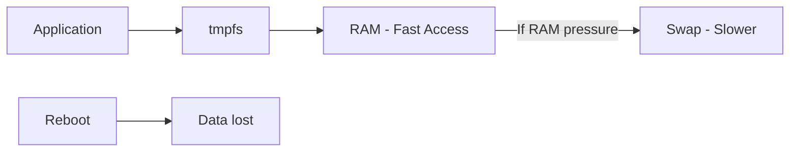

# How to Create a tmpfs RAM Disk for High-Speed Temporary Storage on RHEL

Author: [nawazdhandala](https://www.github.com/nawazdhandala)

Tags: RHEL, Tmpfs, RAM Disk, Linux

Description: Learn how to create and configure tmpfs RAM disks on RHEL for ultra-fast temporary storage that lives entirely in memory.

---

When you need the fastest possible storage for temporary data, nothing beats RAM. A tmpfs filesystem stores everything in memory, giving you microsecond access times instead of milliseconds. Build artifacts, test data, in-process temporary files, session caches - anything that is temporary and performance-sensitive is a good candidate for tmpfs.

## What Is tmpfs

tmpfs is a filesystem that lives in RAM (and can spill to swap if needed). Key characteristics:

- Data is in memory, so reads and writes are extremely fast
- Data is lost on reboot (it is volatile)
- It only uses as much RAM as the data stored in it (not the configured max size)
- It can use swap space if the system runs low on RAM



## RHEL Default tmpfs Mounts

RHEL already uses tmpfs for several system directories:

```bash
# Show existing tmpfs mounts
mount | grep tmpfs
```

You will typically see:
- `/dev/shm` - shared memory
- `/run` - runtime data
- `/tmp` - temporary files (may or may not be tmpfs depending on configuration)

## Creating a tmpfs Mount

### Quick Temporary Mount

```bash
# Create a tmpfs mount point
mkdir -p /mnt/ramdisk

# Mount a 2 GB tmpfs
mount -t tmpfs -o size=2G tmpfs /mnt/ramdisk
```

Verify:

```bash
# Check the mount
df -h /mnt/ramdisk
mount | grep ramdisk
```

### Persistent via fstab

Add to `/etc/fstab`:

```bash
tmpfs  /mnt/ramdisk  tmpfs  defaults,size=2G,mode=1777  0 0
```

Mount it:

```bash
mount /mnt/ramdisk
```

## Practical Use Cases

### Build Directory for Faster Compilations

```bash
# Create a tmpfs for build output
mkdir -p /tmp/build
mount -t tmpfs -o size=4G tmpfs /tmp/build

# Point your build system at it
make BUILDDIR=/tmp/build
```

Compilation speed can improve dramatically because writing object files and intermediate outputs to RAM eliminates disk I/O entirely.

### Database Temporary Tables

For databases that create temporary tables during queries:

```bash
# Create tmpfs for MySQL/MariaDB temp tables
mkdir -p /var/lib/mysql/tmp
mount -t tmpfs -o size=2G,uid=mysql,gid=mysql tmpfs /var/lib/mysql/tmp
```

Configure the database to use this directory for temporary tables.

### Test Data Storage

For integration tests that write and read large amounts of temporary data:

```bash
# Create tmpfs for test data
mkdir -p /tmp/testdata
mount -t tmpfs -o size=1G tmpfs /tmp/testdata
```

### Web Application Session Storage

```bash
# Fast session storage for PHP/Python/Ruby apps
mkdir -p /var/lib/sessions
mount -t tmpfs -o size=512M,mode=0700,uid=apache,gid=apache tmpfs /var/lib/sessions
```

## Mount Options

| Option | Description |
|--------|-------------|
| `size=` | Maximum size (e.g., 2G, 512M) |
| `mode=` | Permission mode (e.g., 1777, 0755) |
| `uid=` | Owner user ID or name |
| `gid=` | Owner group ID or name |
| `noexec` | Prevent execution of binaries |
| `nosuid` | Ignore SUID bits |
| `nodev` | Ignore device files |
| `noatime` | Skip access time updates |

Example with security options:

```bash
# Secure tmpfs mount
mount -t tmpfs -o size=1G,mode=1777,noexec,nosuid,nodev tmpfs /mnt/ramdisk
```

## Checking tmpfs Usage

```bash
# Check how much RAM the tmpfs is actually using
df -h /mnt/ramdisk
```

Remember, `size` is the maximum capacity, but actual RAM usage equals the amount of data stored. An empty 4 GB tmpfs uses essentially zero RAM.

```bash
# Check system-wide tmpfs usage
df -h -t tmpfs
```

## Performance Comparison

A quick test shows the speed difference:

```bash
# Write test on tmpfs
dd if=/dev/zero of=/mnt/ramdisk/testfile bs=1M count=1024

# Write test on disk
dd if=/dev/zero of=/data/testfile bs=1M count=1024 oflag=direct
```

tmpfs is typically 10-100x faster than SSDs and 100-1000x faster than HDDs.

## Memory Management

tmpfs shares RAM with the rest of the system. If your application and tmpfs together need more memory than available RAM:

1. tmpfs data can be swapped out (unlike ramfs)
2. The kernel balances between application memory and tmpfs
3. If both RAM and swap are exhausted, OOM killer activates

Monitor memory usage:

```bash
# Check overall memory including tmpfs
free -h
cat /proc/meminfo | grep -E "MemTotal|MemAvailable|Shmem"
```

The `Shmem` value in `/proc/meminfo` includes tmpfs usage.

## Resizing tmpfs

You can resize a mounted tmpfs:

```bash
# Increase tmpfs to 4 GB without unmounting
mount -o remount,size=4G /mnt/ramdisk
```

This is live and does not affect existing data.

## Cleaning Up

```bash
# Remove all data from tmpfs
rm -rf /mnt/ramdisk/*

# Unmount
umount /mnt/ramdisk
```

Data is gone permanently when the tmpfs is unmounted or the system reboots.

## Summary

tmpfs on RHEL gives you the fastest possible storage for temporary data. Create it with `mount -t tmpfs`, set a size limit, and point your performance-sensitive workloads at it. Build systems, test suites, session caches, and temporary database tables all benefit significantly. Just remember that data is volatile - anything on tmpfs is gone after a reboot.
