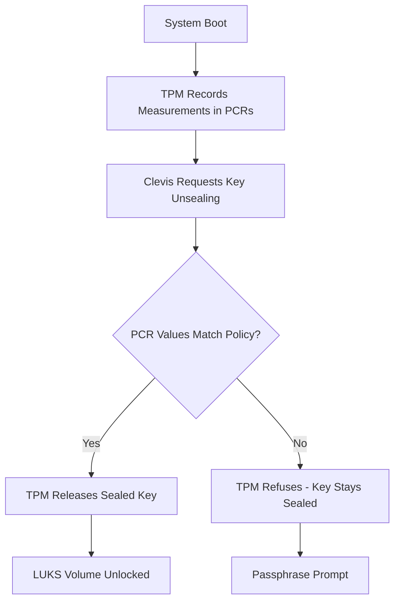

# How to Use TPM 2.0 to Automatically Unlock LUKS Volumes on RHEL 9

Author: [nawazdhandala](https://www.github.com/nawazdhandala)

Tags: RHEL, TPM, LUKS, Auto-Unlock, Linux

Description: Configure TPM 2.0-based automatic LUKS volume unlocking on RHEL 9 using Clevis, so encrypted disks unlock only when the system's boot chain is trusted.

---

TPM-based LUKS unlocking ties your disk encryption to the physical hardware and its boot state. The encrypted volume only unlocks if the system boots with the expected firmware, bootloader, and kernel. If someone tampers with the boot chain or moves the disk to a different machine, the TPM refuses to release the key and the data stays encrypted.

## How TPM LUKS Unlocking Works

Clevis can bind a LUKS volume to TPM 2.0 PCR values. During boot, Clevis asks the TPM to unseal the encryption key. The TPM only releases the key if the current PCR values match what was recorded during binding.



## Prerequisites

You need:
- RHEL 9 with a LUKS-encrypted volume
- A TPM 2.0 chip (most modern servers have one)
- Clevis packages installed

```bash
# Install Clevis with TPM2 support
sudo dnf install clevis clevis-luks clevis-dracut tpm2-tools -y

# Verify TPM is available
sudo tpm2_pcrread sha256:7
```

## Binding LUKS to TPM 2.0

The simplest binding uses the default PCR set:

```bash
# Bind LUKS volume to TPM with default PCRs (7 = Secure Boot state)
sudo clevis luks bind -d /dev/sda3 tpm2 '{"pcr_bank":"sha256","pcr_ids":"7"}'
```

You will be prompted for the existing LUKS passphrase.

## Choosing PCR Values

Which PCRs you bind to determines what triggers a re-authentication:

```bash
# Bind to PCR 7 only (Secure Boot state)
# Survives kernel updates and GRUB changes
sudo clevis luks bind -d /dev/sda3 tpm2 '{"pcr_bank":"sha256","pcr_ids":"7"}'

# Bind to PCRs 7 and 8 (Secure Boot + GRUB command line)
# Breaks if kernel command line changes
sudo clevis luks bind -d /dev/sda3 tpm2 '{"pcr_bank":"sha256","pcr_ids":"7,8"}'

# Bind to PCRs 0,7,9 (firmware + Secure Boot + kernel/initramfs)
# Very strict - breaks on kernel update, firmware update
sudo clevis luks bind -d /dev/sda3 tpm2 '{"pcr_bank":"sha256","pcr_ids":"0,7,9"}'
```

For most environments, PCR 7 alone is a good balance. It ensures Secure Boot is intact but does not break on kernel updates.

| PCR Selection | Security Level | Maintenance Impact |
|---------------|---------------|-------------------|
| PCR 7 | Moderate | Low - survives most updates |
| PCR 7,8 | Higher | Medium - breaks on cmdline changes |
| PCR 0,7,9 | Highest | High - breaks on kernel/firmware updates |

## Enabling Early Boot Unlock

Rebuild the initramfs to include Clevis and TPM support:

```bash
# Rebuild initramfs with Clevis TPM support
sudo dracut -fv
```

Verify the modules are included:

```bash
# Check for TPM modules in initramfs
lsinitrd | grep tpm
lsinitrd | grep clevis
```

## Testing the Binding

Reboot and verify the volume unlocks without a passphrase:

```bash
sudo reboot
```

After reboot, check the logs:

```bash
# Verify Clevis TPM unlock worked
sudo journalctl -b | grep -i clevis
sudo journalctl -b | grep -i tpm
```

## Combining TPM with Tang (Belt and Suspenders)

You can require both TPM and Tang for maximum security:

```bash
# Bind with SSS requiring both TPM and Tang
sudo clevis luks bind -d /dev/sda3 sss '{"t":2,"pins":{"tpm2":{"pcr_bank":"sha256","pcr_ids":"7"},"tang":{"url":"http://tang.example.com"}}}'
```

This means the volume only unlocks if the boot chain is trusted (TPM) AND the server is on the correct network (Tang).

## Handling Kernel Updates

If you bind to PCRs that change on kernel update (like PCR 9), you need to re-bind after each update:

```bash
# After kernel update, re-bind to TPM
sudo clevis luks unbind -d /dev/sda3 -s 1
sudo clevis luks bind -d /dev/sda3 tpm2 '{"pcr_bank":"sha256","pcr_ids":"7"}'
sudo dracut -fv
```

This is why binding to PCR 7 only is recommended for most cases - it does not change on kernel updates.

## Verifying the Binding

```bash
# List Clevis bindings
sudo clevis luks list -d /dev/sda3

# Check LUKS key slot usage
sudo cryptsetup luksDump /dev/sda3 | grep "Key Slot"
```

## Removing the TPM Binding

```bash
# List bindings to find the slot
sudo clevis luks list -d /dev/sda3

# Unbind from the specific slot
sudo clevis luks unbind -d /dev/sda3 -s 1
```

## Troubleshooting

If TPM unlock fails at boot:

```bash
# After manual passphrase entry, check what happened
sudo journalctl -b | grep -iE "clevis|tpm"

# Check current PCR values
sudo tpm2_pcrread sha256:7

# Verify TPM device is accessible
ls -la /dev/tpm0

# Check if tpm2-abrmd is running
sudo systemctl status tpm2-abrmd
```

Common causes of failure:
- UEFI firmware update changed PCR values
- Secure Boot was toggled
- TPM was cleared in firmware settings
- Kernel update changed PCR 9 (if bound to it)

## Important: Keep Your Passphrase

TPM bindings can break for various reasons. Always maintain a working LUKS passphrase as a fallback:

```bash
# Verify your passphrase still works
sudo cryptsetup luksOpen --test-passphrase /dev/sda3
```

Store it securely and test it periodically. The TPM binding is a convenience and security feature, not a replacement for your recovery passphrase.
