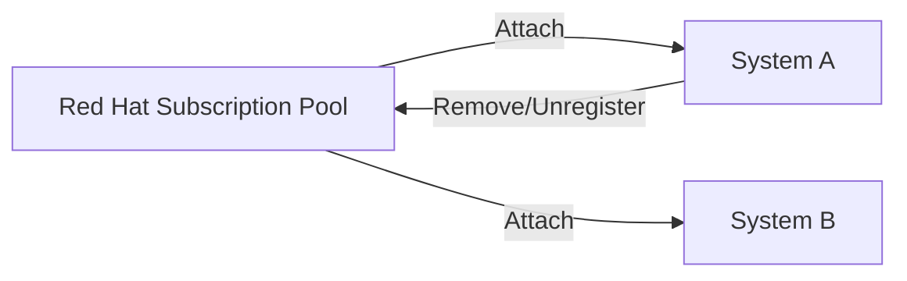
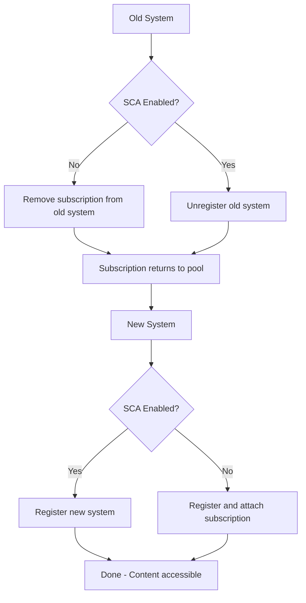

# How to Transfer a RHEL Subscription Between Systems

Author: [nawazdhandala](https://www.github.com/nawazdhandala)

Tags: RHEL, Subscription Transfer, Red Hat, Linux

Description: A step-by-step guide to moving a RHEL subscription from one system to another, covering the process for both traditional entitlements and Simple Content Access environments.

---

Hardware refreshes, system migrations, decommissions - there are plenty of reasons you might need to move a RHEL subscription from one system to another. The process is not complicated, but doing it correctly ensures you do not waste subscriptions or end up with systems in a non-compliant state. This guide covers how to transfer subscriptions properly.

## Understanding RHEL Subscription Licensing

Before getting into the mechanics, it helps to understand how RHEL subscriptions work. A RHEL subscription is tied to your Red Hat account, not permanently locked to a specific system. When you register a system and attach a subscription, you are consuming one unit from your subscription pool. When you remove that subscription or unregister the system, the unit goes back to the pool and can be used elsewhere.



## Simple Content Access vs. Traditional Entitlements

The transfer process differs slightly depending on your subscription mode:

- **With SCA**: Systems do not have individually attached subscriptions. You just unregister the old system and register the new one. Subscription consumption is tracked at the account level.
- **Without SCA (traditional)**: You need to explicitly remove the subscription from the old system before it becomes available for the new one.

## Transferring with Simple Content Access (SCA)

If SCA is enabled on your account, the process is straightforward:

### Step 1 - Unregister the Old System

```bash
# On the old system, unregister it
sudo subscription-manager unregister
```

This removes the system from your Red Hat account and frees up one registration slot.

### Step 2 - Register the New System

```bash
# On the new system, register it
sudo subscription-manager register --username=your_username --password=your_password
```

Or with an activation key:

```bash
# Register with an activation key
sudo subscription-manager register --activationkey=my-key --org=my-org
```

That is it. With SCA, there are no pool IDs or subscription attachments to manage.

## Transferring with Traditional Entitlements

Without SCA, you need to handle the subscription detachment explicitly.

### Step 1 - Identify the Subscription on the Old System

```bash
# List consumed subscriptions on the old system
sudo subscription-manager list --consumed
```

Note the Serial number and Pool ID of the subscription you want to transfer.

### Step 2 - Remove the Subscription from the Old System

You have two options:

Option A - Remove just the subscription (keep the system registered):

```bash
# Remove a specific subscription by serial number
sudo subscription-manager remove --serial=1234567890
```

Option B - Unregister the system entirely:

```bash
# Unregister the old system completely
sudo subscription-manager unregister
```

### Step 3 - Register and Attach on the New System

```bash
# Register the new system
sudo subscription-manager register --username=your_username --password=your_password

# Attach the specific subscription by pool ID
sudo subscription-manager attach --pool=abc123def456

# Or use auto-attach to let subscription-manager choose
sudo subscription-manager attach --auto
```

### Step 4 - Verify on the New System

```bash
# Confirm the subscription is attached
sudo subscription-manager list --consumed

# Verify repos are available
sudo subscription-manager repos --list-enabled

# Test package access
sudo dnf check-update
```

## Transfer Workflow



## Transferring When the Old System Is Gone

Sometimes you need to transfer a subscription from a system that no longer exists, maybe it suffered a hardware failure, or it was decommissioned without being unregistered. In this case, remove the system from the Customer Portal manually:

1. Log in to access.redhat.com
2. Navigate to Subscriptions, then Systems
3. Find the old system in the list
4. Click on it and select "Delete"

This frees up the subscription slot. Then register the new system normally.

If you use Satellite Server, remove the host from the Satellite web UI:

1. Go to Hosts, then All Hosts
2. Find the old system
3. Select "Delete Host"

## Transferring Subscriptions Between Organizations

If the old and new systems belong to different Red Hat organizations, a direct subscription transfer is not possible. You will need to:

1. Contact Red Hat support to move subscription allocations between organizations
2. Or purchase separate subscriptions for the new organization

## Handling Virtual Machines

For virtual environments, RHEL subscriptions come in different flavors:

- **Per-socket subscriptions**: Cover a physical host and its guests
- **Virtual data center subscriptions**: Cover all guests on a physical host with unlimited VMs
- **Individual VM subscriptions**: Cover a single virtual machine

When transferring subscriptions for VMs, make sure the new system matches the subscription type. A per-socket subscription tied to a physical host's socket count cannot be moved to a host with a different socket configuration.

```bash
# Check the number of sockets on the system
lscpu | grep "Socket(s)"

# Check if running on a virtual machine
sudo virt-what
```

## Bulk Transfers

For large-scale migrations (such as a data center move), transferring subscriptions one at a time is impractical. Options include:

### Using Ansible for Bulk Unregistration

```yaml
# Unregister old systems
- name: Unregister decommissioned systems
  hosts: old_systems
  become: true
  tasks:
    - name: Unregister from Red Hat
      community.general.redhat_subscription:
        state: absent
```

### Using Ansible for Bulk Registration

```yaml
# Register new systems
- name: Register new systems
  hosts: new_systems
  become: true
  tasks:
    - name: Register with Red Hat
      community.general.redhat_subscription:
        activationkey: rhel9-production
        org_id: my-org
        state: present
```

## Keeping Track of Transfers

For audit and compliance purposes, document subscription transfers:

```bash
# Before unregistering, capture the system's subscription info
sudo subscription-manager identity > /tmp/old-system-identity.txt
sudo subscription-manager list --consumed > /tmp/old-system-subscriptions.txt
```

Keep these records as part of your change management process.

## Timing Considerations

Subscription transfers are not instantaneous in the Customer Portal. After unregistering the old system:

- The subscription may take a few minutes to appear back in the available pool
- If you do not see it immediately, wait 5-10 minutes and refresh the portal
- Use `subscription-manager refresh` on the new system to force a data update

## Common Mistakes to Avoid

- **Not unregistering the old system**: The subscription stays consumed, and you may exceed your entitlement count
- **Forgetting about Satellite**: If the system was registered to Satellite, remove it from Satellite too
- **Ignoring system purpose**: Set the correct role, SLA, and usage on the new system to ensure the right subscription is attached

## Summary

Transferring a RHEL subscription between systems boils down to: unregister (or remove the subscription from) the old system, then register the new one. With SCA, it is as simple as running two commands. Without SCA, you need to handle pool IDs and attachment. For decommissioned systems that were not properly unregistered, clean them up through the Customer Portal. And for bulk migrations, Ansible makes the process manageable at scale.
