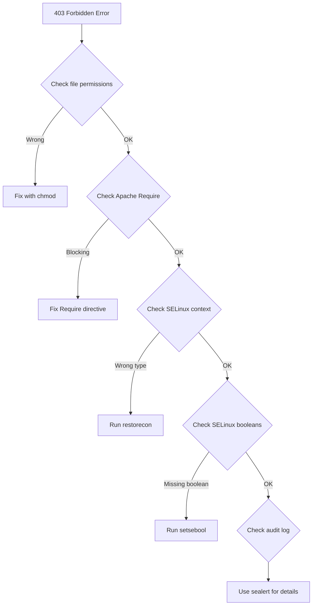

# How to Troubleshoot Apache 403 Forbidden Errors and SELinux on RHEL

Author: [nawazdhandala](https://www.github.com/nawazdhandala)

Tags: RHEL, Apache, SELinux, 403, Troubleshooting, Linux

Description: A troubleshooting guide for the most common causes of 403 Forbidden errors on Apache httpd in RHEL, with a focus on SELinux.

---

## The Dreaded 403

You have Apache running, your files are in place, but the browser shows "403 Forbidden". This is one of the most common Apache issues on RHEL, and SELinux is usually the culprit people miss. Let us walk through every cause and how to fix it.

## The Usual Suspects

Before diving into SELinux, check the basics first. A 403 can come from several sources:

1. File permissions
2. Directory permissions
3. Apache `Require` directives
4. Missing index file
5. SELinux context
6. SELinux booleans

## Step 1 - Check File and Directory Permissions

Apache runs as the `apache` user. It needs read access to files and execute access on directories:

```bash
# Check permissions on the document root
ls -la /var/www/html/

# Check permissions on parent directories
namei -l /var/www/html/index.html
```

Fix permissions if they are wrong:

```bash
# Set correct permissions: 755 for directories, 644 for files
sudo find /var/www/html -type d -exec chmod 755 {} \;
sudo find /var/www/html -type f -exec chmod 644 {} \;
```

The `namei` command is especially useful because it shows permissions on every directory in the path. If any parent directory is missing the execute bit, Apache cannot traverse to the file.

## Step 2 - Check Apache Configuration

Look for `Require` directives that might be blocking access:

```bash
# Search for Require directives in all config files
grep -r "Require" /etc/httpd/conf/ /etc/httpd/conf.d/
```

Common mistakes:

```apache
# This blocks everyone
Require all denied

# This allows only specific IPs
Require ip 10.0.0.0/24
```

Make sure your directory block has:

```apache
<Directory /var/www/html>
    Require all granted
</Directory>
```

## Step 3 - Check for a Missing Index File

If directory listing is disabled (which it should be) and there is no index file, Apache returns 403:

```bash
# Check if an index file exists
ls -la /var/www/html/index.*
```

If there is no index file, create one or check your `DirectoryIndex` directive.

## Step 4 - Check SELinux Context Labels

This is the most common cause of 403 errors on RHEL that people do not expect. Check the SELinux labels:

```bash
# View SELinux labels on web files
ls -laZ /var/www/html/
```

Web content should have the `httpd_sys_content_t` type. If you see something else, like `default_t` or `user_home_t`, that is your problem:

```bash
# Restore the correct SELinux labels
sudo restorecon -Rv /var/www/html/
```

If you are serving content from a non-standard location, you need to set the context manually:

```bash
# Set SELinux context for a custom document root
sudo semanage fcontext -a -t httpd_sys_content_t "/srv/website(/.*)?"
sudo restorecon -Rv /srv/website/
```

If Apache needs to write to a directory (uploads, cache, etc.), use `httpd_sys_rw_content_t`:

```bash
# Allow Apache to write to an uploads directory
sudo semanage fcontext -a -t httpd_sys_rw_content_t "/var/www/html/uploads(/.*)?"
sudo restorecon -Rv /var/www/html/uploads/
```

## Step 5 - Check SELinux Booleans

SELinux booleans control what Apache is allowed to do. List the relevant ones:

```bash
# Show all httpd-related SELinux booleans
getsebool -a | grep httpd
```

Common booleans you might need:

| Boolean | Purpose |
|---------|---------|
| `httpd_can_network_connect` | Allow outgoing network connections |
| `httpd_can_network_connect_db` | Allow database connections |
| `httpd_enable_homedirs` | Allow serving user home directories |
| `httpd_read_user_content` | Allow reading user content |
| `httpd_unified` | Simplify content access rules |

Enable a boolean:

```bash
# Enable a boolean persistently
sudo setsebool -P httpd_can_network_connect on
```

## Step 6 - Use the Audit Log

When SELinux blocks something, it writes to the audit log. This is your best friend for diagnosing SELinux issues:

```bash
# Check for recent SELinux denials related to httpd
sudo ausearch -m avc -ts recent | grep httpd
```

For a more readable output, use `sealert`:

```bash
# Install the SELinux troubleshooting tools if not present
sudo dnf install -y setroubleshoot-server

# Check for SELinux alerts
sudo sealert -a /var/log/audit/audit.log | grep httpd
```

The `sealert` output is excellent because it tells you exactly what was blocked and suggests the command to fix it.

## Troubleshooting Decision Tree



## Step 7 - Common Gotcha: Home Directory Content

If you copy files from your home directory, they often carry the wrong SELinux label:

```bash
# Files copied from home will have the wrong context
cp ~/mysite/* /var/www/html/

# Fix it
sudo restorecon -Rv /var/www/html/
```

Always use `restorecon` after copying or moving files into the web directory.

## Step 8 - Verify the Fix

After making changes, test:

```bash
# Test from the command line
curl -I http://localhost/

# Check the Apache error log for details
sudo tail -20 /var/log/httpd/error_log
```

A 200 response means you are good. If you still get 403, work through the steps again. The error log often has a more specific message about what is being denied.

## Never Do This

It is tempting to just disable SELinux:

```bash
# DO NOT DO THIS in production
# sudo setenforce 0
```

Disabling SELinux removes an entire layer of security. Take the time to find the right context or boolean instead.

## Wrap-Up

When you hit a 403 on RHEL, work through the issue systematically: permissions first, then Apache config, then SELinux contexts, then SELinux booleans. The audit log with `sealert` will usually tell you exactly what to do. Keep SELinux in enforcing mode and learn to work with it rather than fighting against it.
