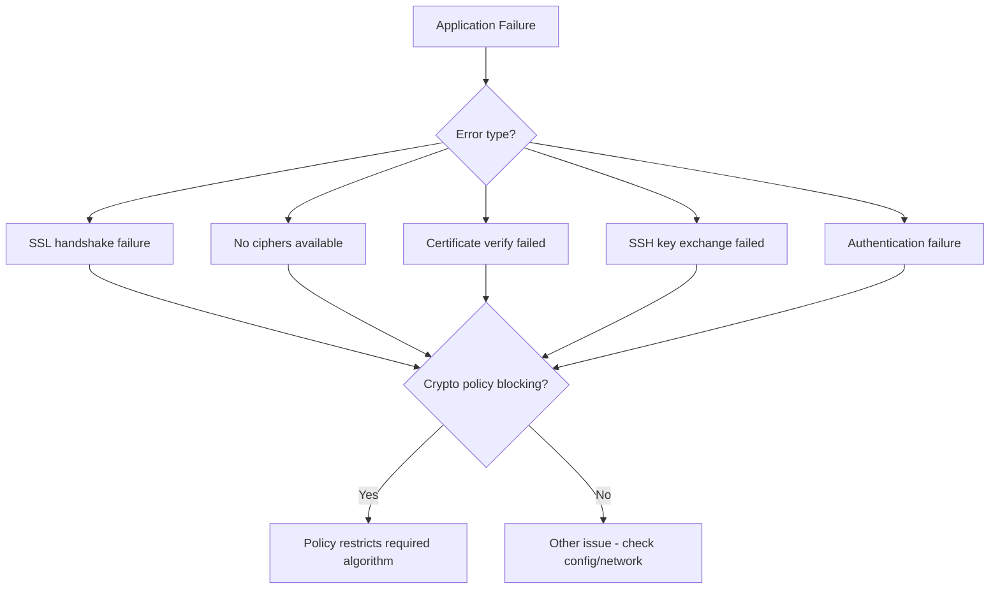

# How to Troubleshoot Application Failures Caused by Crypto Policies on RHEL 9

Author: [nawazdhandala](https://www.github.com/nawazdhandala)

Tags: RHEL, Crypto Policies, Troubleshooting, TLS, Application Errors, Linux

Description: Diagnose and fix application failures on RHEL 9 caused by system-wide crypto policies blocking required algorithms, ciphers, or protocol versions.

---

When RHEL 9's system-wide crypto policy blocks an algorithm or protocol version that an application needs, the application will fail with cryptographic errors. These failures can be confusing because the error messages often do not directly mention the crypto policy. This guide helps you identify when the crypto policy is the cause and shows you how to fix the problem without undermining system security.

## Common Symptoms



## Step 1: Identify the Error

### Common Error Messages

**OpenSSL / TLS errors:**
```bash
SSL: error:0A000086:SSL routines::certificate verify failed
SSL: error:0A000410:SSL routines::sslv3 alert handshake failure
SSL: error:0A0000C1:SSL routines::no shared cipher
```

**SSH errors:**
```bash
no matching key exchange method found
no matching cipher found
no matching host key type found
Unable to negotiate a key exchange method
```

**Java/HTTPS errors:**
```bash
javax.net.ssl.SSLHandshakeException: Received fatal alert: handshake_failure
```

**curl/wget errors:**
```bash
curl: (35) error:0A000152:SSL routines::unsafe legacy renegotiation disabled
```

## Step 2: Determine if the Crypto Policy is the Cause

### Quick Test

The fastest way to determine if the crypto policy is causing the failure is to temporarily switch to the LEGACY policy:

```bash
# Check current policy
update-crypto-policies --show

# Temporarily switch to LEGACY
sudo update-crypto-policies --set LEGACY

# Restart the affected service
sudo systemctl restart affected-service

# Test the operation
# If it works now, the crypto policy was the cause

# IMPORTANT: Switch back immediately after testing
sudo update-crypto-policies --set DEFAULT
sudo systemctl restart affected-service
```

### Detailed Diagnosis

For a more targeted diagnosis without changing the system policy:

```bash
# Test TLS connection with verbose output
openssl s_client -connect remote-server:443 -debug < /dev/null 2>&1 | \
    grep -E "error|alert|cipher|Protocol|Verify"

# Check what cipher the remote server requires
openssl s_client -connect remote-server:443 < /dev/null 2>/dev/null | \
    grep -E "Protocol|Cipher"

# Test with specific TLS version
openssl s_client -connect remote-server:443 -tls1_2 < /dev/null 2>&1
openssl s_client -connect remote-server:443 -tls1 < /dev/null 2>&1
```

### For SSH Issues

```bash
# Test SSH with verbose output
ssh -vvv user@remote-server 2>&1 | grep -i "kex\|cipher\|mac\|error\|algorithm"

# Check what algorithms the remote server offers
ssh -vvv user@remote-server 2>&1 | grep "peer server"
```

## Step 3: Identify the Specific Algorithm Needed

### TLS Cipher Mismatch

```bash
# See what ciphers are currently allowed
openssl ciphers -v 2>/dev/null

# See what cipher the remote server wants
openssl s_client -connect remote-server:443 < /dev/null 2>&1 | grep "Cipher is"

# Test specific ciphers
openssl s_client -connect remote-server:443 -cipher "AES128-SHA" < /dev/null 2>&1
```

### Certificate Key Size

```bash
# Check the remote server's certificate key size
openssl s_client -connect remote-server:443 < /dev/null 2>/dev/null | \
    openssl x509 -noout -text | grep "Public-Key:"
```

If the key is smaller than what the policy allows (e.g., 1024-bit RSA on the DEFAULT policy), that is the problem.

### SSH Algorithm Mismatch

```bash
# See what algorithms your SSH client supports
ssh -Q cipher
ssh -Q kex
ssh -Q key

# Compare with what the remote server offers (from verbose output)
```

## Step 4: Fix the Problem

### Option A: Fix the Remote System (Best)

The best solution is to update the remote system to support modern cryptography:

- Upgrade TLS certificates to 2048-bit RSA or better
- Enable TLS 1.2 and 1.3
- Configure modern cipher suites

### Option B: Per-Application Override (Good)

Override the policy for a specific application only:

**For SSH (specific host):**

```bash
cat >> ~/.ssh/config << 'EOF'
Host legacy-server.example.com
    KexAlgorithms +diffie-hellman-group14-sha1
    HostKeyAlgorithms +ssh-rsa
    PubkeyAcceptedAlgorithms +ssh-rsa
    Ciphers +aes128-ctr
EOF
```

**For curl:**

```bash
# Allow insecure TLS for a specific request
curl --tls-max 1.0 --ciphers DEFAULT@SECLEVEL=0 https://legacy-server/
```

**For Python applications:**

```python
import ssl
import urllib.request

# Create a custom SSL context that allows legacy settings
ctx = ssl.create_default_context()
ctx.set_ciphers('DEFAULT:@SECLEVEL=0')
ctx.minimum_version = ssl.TLSVersion.TLSv1

response = urllib.request.urlopen('https://legacy-server/', context=ctx)
```

### Option C: Custom Crypto Policy Module (Acceptable)

Create a targeted policy module that only loosens what is needed:

```bash
# Example: Allow SHA-1 and TLS 1.0 for a specific need
sudo tee /etc/crypto-policies/policies/modules/COMPAT-FIX.pmod << 'EOF'
# Targeted compatibility fix
# Document: needed for legacy-server.example.com
# Remove when server is upgraded (target date: YYYY-MM-DD)

hash = SHA1+
sign = RSA-SHA1+
protocol = TLS1.0+
min_rsa_size = 1024
EOF

sudo update-crypto-policies --set DEFAULT:COMPAT-FIX
```

### Option D: LEGACY Policy (Last Resort)

Only if the other options are not feasible:

```bash
sudo update-crypto-policies --set LEGACY
```

## Step 5: Verify the Fix

```bash
# Test the operation that was failing
# For TLS:
openssl s_client -connect remote-server:443 < /dev/null 2>/dev/null | \
    grep "Verify return code"

# For SSH:
ssh user@remote-server echo "Connection successful"

# For applications:
systemctl restart affected-application
# Test the application functionality
```

## Common Scenarios and Fixes

### Java Application Cannot Connect

```bash
# Java uses its own security settings but respects the crypto policy
# Check the effective Java crypto settings
cat /etc/crypto-policies/back-ends/java.config

# Common fix: Create a module that allows the needed algorithm
sudo tee /etc/crypto-policies/policies/modules/JAVA-COMPAT.pmod << 'EOF'
# Allow algorithms needed by Java application
sign = RSA-SHA1+
protocol = TLS1.0+
EOF

sudo update-crypto-policies --set DEFAULT:JAVA-COMPAT
```

### Database Connection Failure

```bash
# PostgreSQL/MySQL clients use OpenSSL
# Test the database TLS connection
openssl s_client -connect dbserver:5432 -starttls postgres < /dev/null 2>&1

# If the database uses a weak certificate, the fix is the same:
# Update the database certificate (best)
# Or loosen the crypto policy for that specific need
```

### LDAP/Active Directory Connection Failure

```bash
# Test LDAPS connection
openssl s_client -connect ldapserver:636 < /dev/null 2>&1

# AD servers may use older certificates
# Common fix: allow SHA-1 for LDAP certificates
```

## Diagnostic Checklist

| Check | Command |
|-------|---------|
| Current policy | `update-crypto-policies --show` |
| Allowed TLS ciphers | `openssl ciphers -v` |
| Remote server cipher | `openssl s_client -connect host:port` |
| SSH algorithms | `ssh -Q cipher; ssh -Q kex; ssh -Q key` |
| Service errors | `journalctl -u service-name` |
| OpenSSL errors | Check stderr of failing command |
| Policy back-ends | `ls /etc/crypto-policies/back-ends/` |

## Summary

When applications fail due to crypto policies on RHEL 9, the troubleshooting process involves identifying the error, determining if the crypto policy is the cause (by temporarily testing with LEGACY), finding the specific algorithm that is needed, and applying the most targeted fix possible. Prefer per-application overrides or custom policy modules over switching the entire system to LEGACY. Always document why exceptions are needed and plan for their removal when the legacy dependency is resolved.
