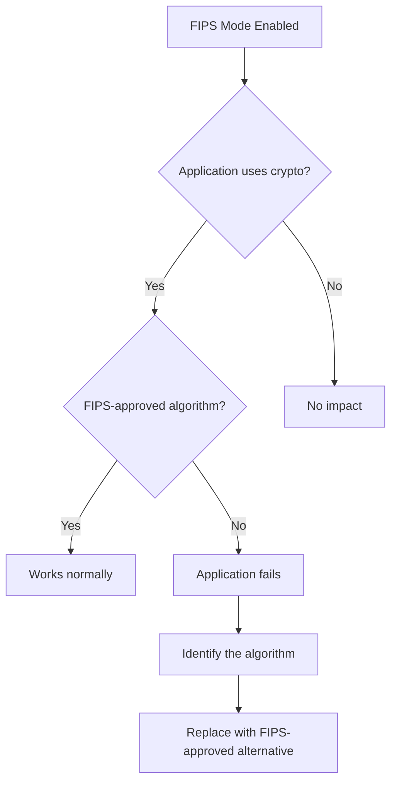

# How to Troubleshoot Application Failures After Enabling FIPS Mode on RHEL

Author: [nawazdhandala](https://www.github.com/nawazdhandala)

Tags: RHEL, FIPS, Troubleshooting, Linux

Description: Diagnose and fix common application failures that occur after enabling FIPS mode on RHEL, including issues with Java, Python, databases, and web servers.

---

Enabling FIPS mode on RHEL is the easy part. The hard part comes when applications start failing because they relied on cryptographic algorithms that FIPS does not allow. I have seen this happen with everything from Java applications to Python scripts to database connections. This guide covers the most common failures and how to fix them.

## Understanding Why Applications Break

FIPS mode disables all non-approved cryptographic algorithms system-wide. Applications that worked fine before will fail if they:

- Use MD5 for checksums or hashing
- Use SHA-1 for digital signatures
- Use DES or 3DES encryption
- Use RC4 ciphers
- Connect to services that only support non-FIPS protocols
- Use custom cryptographic implementations



## General Troubleshooting Steps

### Step 1: Check the logs

```bash
# Check system logs for crypto-related errors
journalctl -b | grep -iE "fips|crypto|cipher|ssl|tls" | tail -30

# Check application-specific logs
tail -100 /var/log/messages | grep -i error

# Check audit logs for denied operations
ausearch -m CRYPTO_KEY_USER -ts recent
```

### Step 2: Identify the failing algorithm

```bash
# Trace the application to see what crypto calls it makes
strace -e trace=openat -f your-application 2>&1 | grep -i ssl

# Check if OpenSSL is throwing FIPS errors
openssl errstr 0x00000000
```

## Java Application Failures

Java applications are the most common source of FIPS-related problems.

### Symptoms

- `java.security.NoSuchAlgorithmException: MD5`
- `javax.net.ssl.SSLHandshakeException`
- `java.security.InvalidKeyException: Illegal key size`

### Fixes

```bash
# Check Java's FIPS configuration
cat /etc/crypto-policies/back-ends/java.config

# Verify Java is using the system crypto policy
java -XshowSettings:security 2>&1 | grep -i fips

# If using a custom JDK, configure FIPS providers
# Edit the java.security file in your JDK
JAVA_HOME=$(dirname $(dirname $(readlink -f $(which java))))
echo "Java home: $JAVA_HOME"

# Check which security providers are loaded
java -XshowSettings:security 2>&1 | head -30
```

For applications that use MD5 for non-security purposes (like cache keys or checksums):

```java
// In Java code, use MessageDigest with the right provider
// For non-security use, you may need to use a workaround
// Check if your framework supports configuring the hash algorithm
```

```bash
# Some frameworks let you override the hash algorithm via system properties
java -Ddigest.algorithm=SHA-256 -jar your-app.jar
```

## Python Application Failures

### Symptoms

- `ValueError: [digital envelope routines: EVP_DigestInit_ex] disabled for FIPS`
- `hashlib.md5()` fails

### Fixes

```bash
# Python 3.9+ supports the usedforsecurity parameter
# For non-security uses of MD5 (like cache keys):
python3 -c "import hashlib; print(hashlib.md5(b'test', usedforsecurity=False).hexdigest())"

# For security-sensitive uses, switch to SHA-256:
python3 -c "import hashlib; print(hashlib.sha256(b'test').hexdigest())"
```

If you cannot modify the application code, check if the library has a FIPS-compatible version or configuration option.

## Database Connection Failures

### PostgreSQL

```bash
# Check PostgreSQL SSL settings
grep "ssl" /var/lib/pgsql/data/postgresql.conf

# Ensure PostgreSQL uses FIPS-approved ciphers
# In postgresql.conf:
# ssl_ciphers = 'PROFILE=SYSTEM'
# This tells PostgreSQL to use the system crypto policy

# Restart PostgreSQL
systemctl restart postgresql

# Test the connection
psql -h localhost -U postgres -c "SELECT version();"
```

### MariaDB/MySQL

```bash
# Check SSL cipher in use
mysql -e "SHOW GLOBAL STATUS LIKE 'Ssl_cipher';"

# If connections fail, check the server's SSL configuration
grep -i ssl /etc/my.cnf.d/mariadb-server.cnf

# Ensure FIPS-compatible ciphers
# Add or modify in the [mysqld] section:
# ssl-cipher = AES256-SHA256:AES128-SHA256
```

## Web Server Issues

### Apache HTTPD

```bash
# Check for SSL errors
journalctl -u httpd | grep -i ssl

# Update Apache SSL configuration for FIPS
cat > /etc/httpd/conf.d/ssl-fips.conf << 'EOF'
# Use system crypto policy for cipher selection
SSLCipherSuite PROFILE=SYSTEM
SSLProxyCipherSuite PROFILE=SYSTEM
SSLProtocol -all +TLSv1.2 +TLSv1.3
EOF

# Test configuration
httpd -t

# Restart Apache
systemctl restart httpd
```

### Nginx

```bash
# Update Nginx SSL configuration
# In your server block:
# ssl_protocols TLSv1.2 TLSv1.3;
# ssl_ciphers PROFILE=SYSTEM;

nginx -t
systemctl restart nginx
```

## LDAP/Active Directory Authentication

```bash
# SSSD may fail to connect if the LDAP server uses non-FIPS ciphers
journalctl -u sssd | grep -i "tls\|ssl\|cipher"

# Check SSSD configuration
grep -i "tls\|cipher\|crypto" /etc/sssd/sssd.conf

# Ensure the LDAP server supports FIPS-approved ciphers
# Test the connection
openssl s_client -connect ldap.example.com:636 -tls1_2

# If the LDAP server does not support FIPS ciphers,
# you will need to update the LDAP server first
```

## Samba/CIFS Issues

Samba in FIPS mode has known compatibility limitations:

```bash
# Check Samba logs
tail -50 /var/log/samba/log.smbd

# Samba with NTLM authentication does not work in FIPS mode
# because NTLM uses MD4/MD5

# Use Kerberos authentication instead
# In /etc/samba/smb.conf:
# [global]
#   kerberos method = secrets and keytab
#   security = ads
```

## Create a Pre-FIPS Compatibility Checklist

Before enabling FIPS, test your applications:

```bash
cat > /usr/local/bin/fips-readiness-check.sh << 'SCRIPT'
#!/bin/bash
echo "=== FIPS Readiness Check ==="
echo ""

echo "1. Checking for MD5 usage in configs..."
grep -rl "MD5\|md5" /etc/ 2>/dev/null | grep -v ".bak"

echo ""
echo "2. Checking for SHA-1 usage in configs..."
grep -rl "SHA1\|sha1\|SHA-1" /etc/ 2>/dev/null | grep -v ".bak"

echo ""
echo "3. Checking installed packages for known FIPS issues..."
rpm -qa | grep -iE "java|python|php|ruby|perl|node" | sort

echo ""
echo "4. Checking listening services..."
ss -tlnp | awk '{print $4, $6}'

echo ""
echo "5. Checking SSL certificates for non-FIPS algorithms..."
find /etc/pki -name "*.pem" -o -name "*.crt" 2>/dev/null | while read cert; do
    ALG=$(openssl x509 -in "$cert" -text -noout 2>/dev/null | grep "Signature Algorithm" | head -1)
    if echo "$ALG" | grep -qiE "md5|sha1"; then
        echo "  WARNING: $cert uses $ALG"
    fi
done
SCRIPT
chmod +x /usr/local/bin/fips-readiness-check.sh
```

Run this before enabling FIPS to identify potential issues proactively. It is always easier to fix compatibility problems before you flip the switch than to troubleshoot them in production under pressure.
