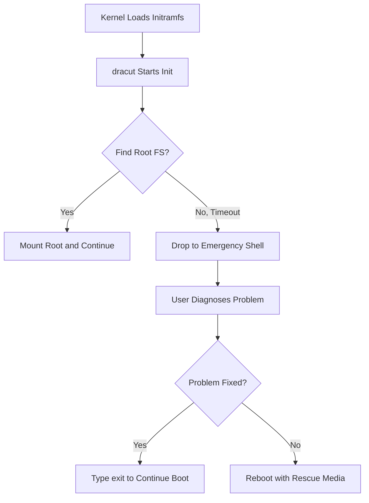

# How to Troubleshoot Boot Failures Using the dracut Emergency Shell on RHEL

Author: [nawazdhandala](https://www.github.com/nawazdhandala)

Tags: RHEL, dracut, Boot, Troubleshooting, Emergency Shell, Linux

Description: Learn how to use the dracut emergency shell to diagnose and fix boot failures on RHEL when the system cannot mount the root filesystem.

---

When RHEL cannot find or mount its root filesystem during boot, dracut drops you into an emergency shell. This shell runs from the initramfs and gives you a minimal environment to diagnose and fix the problem. Knowing how to navigate it can save you from needing a rescue disk.

## Understanding the dracut Emergency Shell



## Entering the Emergency Shell Intentionally

Sometimes you want to enter the emergency shell on purpose to debug boot issues:

```bash
# Add rd.break to the kernel command line in GRUB
# At the GRUB menu, press 'e' to edit, find the linux line, and add:
rd.break

# This drops you into the shell before the root FS is mounted
# The root filesystem will be available at /sysroot (if it can be found)

# For the emergency shell after timeout, add:
rd.shell

# To enable verbose dracut debug output during boot:
rd.debug
```

## Common Scenarios and Fixes

### Root Filesystem Not Found

```bash
# In the emergency shell, check available block devices
blkid

# Check if LVM volumes are visible
lvm vgscan
lvm lvscan

# If LVM volumes are not activated, activate them
lvm vgchange -ay

# Check for the root filesystem
ls /dev/mapper/
ls /dev/sd* /dev/nvme*

# Try mounting the root filesystem manually
mount /dev/mapper/rhel-root /sysroot

# If successful, exit to continue boot
exit
```

### Wrong Root Device in GRUB

```bash
# Check what root device the kernel is looking for
cat /proc/cmdline
# Look for the root= parameter

# Compare with actual device UUIDs
blkid

# If the UUID does not match, you need to fix GRUB
# Mount the root filesystem
mount /dev/mapper/rhel-root /sysroot
mount -o bind /dev /sysroot/dev
mount -o bind /proc /sysroot/proc
mount -o bind /sys /sysroot/sys

# Chroot into the real system
chroot /sysroot

# Fix the GRUB configuration
grub2-mkconfig -o /boot/grub2/grub.cfg

# Exit chroot and reboot
exit
reboot
```

### Missing Storage Drivers

```bash
# Check which modules are loaded
lsmod

# Check if the storage controller is detected
lspci -k

# Try loading the missing module manually
modprobe mpt3sas    # or whatever driver your hardware needs
modprobe nvme

# Check if the devices appear now
ls /dev/sd* /dev/nvme*

# If loading the module fixes it, you need to add it to the initramfs
# Mount root and chroot
mount /dev/mapper/rhel-root /sysroot
chroot /sysroot

# Add the module to dracut config
echo 'force_drivers+=" mpt3sas "' > /etc/dracut.conf.d/storage.conf

# Rebuild the initramfs
dracut --force

exit
reboot
```

### LUKS Encrypted Root Not Unlocking

```bash
# Check if the LUKS device is detected
ls /dev/sd* /dev/nvme*

# Try unlocking manually
cryptsetup luksOpen /dev/sda3 luks-root
# Enter the passphrase when prompted

# Activate LVM on top of LUKS
lvm vgscan
lvm vgchange -ay

# Mount and continue
mount /dev/mapper/rhel-root /sysroot
exit
```

## Collecting Debug Information

```bash
# Get full dracut debug logs
# Add these to kernel command line:
rd.debug rd.udev.debug

# In the emergency shell, the debug log is at:
cat /run/initramfs/rdsosreport.txt

# This contains detailed information about:
# - Module loading attempts
# - Device detection
# - Mount attempts
# - Error messages

# Save it to a USB drive for analysis
mount /dev/sdb1 /mnt
cp /run/initramfs/rdsosreport.txt /mnt/
umount /mnt
```

## Network Debugging from the Emergency Shell

If you need network access to download tools or copy files:

```bash
# Check if network interfaces are available
ip link show

# Bring up an interface with DHCP
ip link set eth0 up
dhclient eth0

# Or set a static IP
ip addr add 192.168.1.100/24 dev eth0
ip link set eth0 up
ip route add default via 192.168.1.1
```

## Preventing Future Boot Failures

```bash
# After fixing the immediate problem, take preventive steps:

# Always keep a rescue initramfs
sudo dracut --force /boot/initramfs-rescue.img $(uname -r)

# Enable dracut's fallback mechanism
echo 'hostonly="yes"' | sudo tee /etc/dracut.conf.d/hostonly.conf
echo 'hostonly_cmdline="yes"' | sudo tee -a /etc/dracut.conf.d/hostonly.conf

# Verify the initramfs contains all needed drivers
lsinitrd /boot/initramfs-$(uname -r).img | grep -E "\.ko" | sort
```

## Conclusion

The dracut emergency shell is your lifeline when RHEL will not boot. The most common causes are missing storage drivers, incorrect root device references, and LVM activation failures. The key tools available in the shell are blkid, lvm commands, modprobe, and mount. Once you fix the immediate problem, always rebuild the initramfs and verify GRUB configuration to prevent the issue from recurring.
