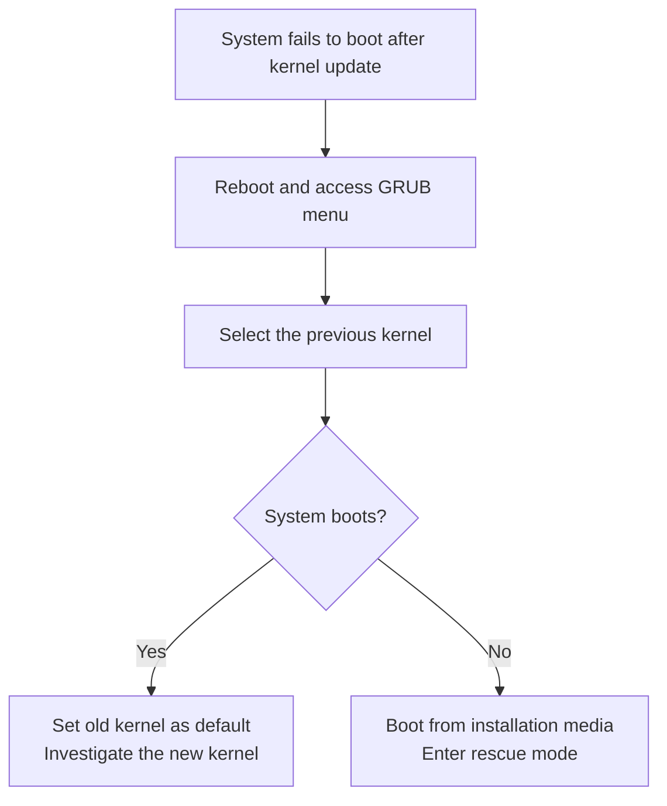

# How to Troubleshoot Boot Failures After a Kernel Update on RHEL

Author: [nawazdhandala](https://www.github.com/nawazdhandala)

Tags: RHEL, Boot Failures, Kernel, Troubleshooting, Linux

Description: A systematic guide to diagnosing and fixing boot failures that occur after a kernel update on RHEL, covering GRUB fallback, initramfs issues, driver problems, and recovery procedures.

---

## Why Kernel Updates Can Break Boot

Most kernel updates on RHEL are uneventful. But occasionally, a new kernel introduces a problem: a driver regression, a missing module in the initramfs, an incompatibility with your hardware, or a conflict with third-party kernel modules like NVIDIA drivers. When this happens, the system either fails to boot entirely or boots into a degraded state.

The good news is that RHEL keeps the previous kernel installed, so you always have a fallback.

## Immediate Recovery: Boot the Old Kernel

The fastest fix is to boot the previous kernel from the GRUB menu.



### Steps

1. Reboot the system
2. When the GRUB menu appears (press `Esc` if it auto-boots), select the older kernel
3. Press Enter to boot
4. Once booted, set the old kernel as the permanent default:

```bash
# Set the previous kernel as default
sudo grubby --set-default=/boot/vmlinuz-<previous-version>

# Verify
sudo grubby --default-kernel
```

## Diagnosing the Boot Failure

Once you are booted on the old kernel, investigate why the new kernel fails.

### Check for Missing Modules

```bash
# Compare modules between the working and broken kernels
ls /lib/modules/<old-version>/kernel/ > /tmp/old-modules.txt
ls /lib/modules/<new-version>/kernel/ > /tmp/new-modules.txt
diff /tmp/old-modules.txt /tmp/new-modules.txt
```

### Check DKMS Module Status

Third-party modules built with DKMS may not have been rebuilt for the new kernel.

```bash
# Check DKMS status
dkms status

# If modules are missing for the new kernel, rebuild them
sudo dkms autoinstall -k <new-kernel-version>
```

### Check the initramfs

The initramfs image for the new kernel may be corrupt or missing required modules.

```bash
# Verify the initramfs exists
ls -la /boot/initramfs-<new-version>.img

# List its contents to check for missing drivers
lsinitrd /boot/initramfs-<new-version>.img | grep -E "\.ko" | head -20

# Compare with the working initramfs
lsinitrd /boot/initramfs-<old-version>.img | wc -l
lsinitrd /boot/initramfs-<new-version>.img | wc -l

# Rebuild the initramfs for the new kernel
sudo dracut --force /boot/initramfs-<new-version>.img <new-version>
```

### Check Boot Logs

If the new kernel partially boots, check the logs:

```bash
# View logs from the failed boot (if journald captured them)
journalctl --list-boots
journalctl -b -1 --priority=err

# Check for kernel panic messages
journalctl -b -1 | grep -i "panic\|oops\|bug\|error"
```

## Common Boot Failure Scenarios

### Scenario 1: Black Screen After GRUB

The kernel loads but the display output fails. This is often a graphics driver issue.

```bash
# Boot with basic video mode
# Edit the GRUB entry and add:
nomodeset

# If that works, the issue is with the graphics driver
# Check for NVIDIA/AMD driver issues
```

### Scenario 2: Kernel Panic During Boot

```bash
# Boot with verbose output to see the panic message
# Remove 'quiet' and 'rhgb' from the kernel line in GRUB
# Add 'systemd.log_level=debug' for more information

# If panic mentions a specific module, try blacklisting it
sudo grubby --update-kernel=/boot/vmlinuz-<new-version> --args="modprobe.blacklist=problematic_module"
```

### Scenario 3: Root Filesystem Not Found

```bash
# The initramfs may be missing the storage driver
# Rebuild the initramfs with force-add for your storage driver
sudo dracut --force --add-drivers "megaraid_sas mpt3sas" /boot/initramfs-<new-version>.img <new-version>
```

### Scenario 4: System Boots but Network Is Down

```bash
# Check if the network driver changed
# Compare loaded modules
lsmod | grep -E "e1000|ixgbe|i40e|mlx"

# Check if the driver exists in the new kernel
modinfo -k <new-version> <driver-name>
```

## Removing a Broken Kernel

If the new kernel is confirmed broken and you want to remove it:

```bash
# Remove the broken kernel
sudo dnf remove kernel-core-<broken-version>

# This also removes the BLS entry and initramfs
# Verify
rpm -qa kernel-core
sudo grubby --info=ALL
```

## Preventing Future Issues

```bash
# Test kernel updates on a staging system first
# Keep more kernels available for fallback
sudo sed -i 's/installonly_limit=.*/installonly_limit=5/' /etc/dnf/dnf.conf

# Exclude specific kernel versions if needed
# Add to /etc/dnf/dnf.conf:
# exclude=kernel-core-<broken-version>

# Use dnf-automatic to download but not install automatically
sudo dnf install dnf-automatic -y
```

## Recovery from Installation Media

If you cannot access the GRUB menu (both kernels are broken):

```bash
# Boot from RHEL installation media
# Select Troubleshooting > Rescue
# Mount the system under /mnt/sysimage

chroot /mnt/sysimage

# Set the working kernel as default
grubby --set-default=/boot/vmlinuz-<working-version>

# Or remove the broken kernel
dnf remove kernel-core-<broken-version>

# Rebuild initramfs if needed
dracut --force

exit
reboot
```

## Wrapping Up

Boot failures after kernel updates are stressful but manageable. The most important thing is having a fallback kernel available, which RHEL provides by default. When a new kernel breaks, boot the old one, diagnose the issue from there, and either fix the problem (rebuild initramfs, rebuild DKMS modules, blacklist a driver) or remove the broken kernel. Always test kernel updates on non-production systems first, and keep at least three kernels installed so you always have options.
