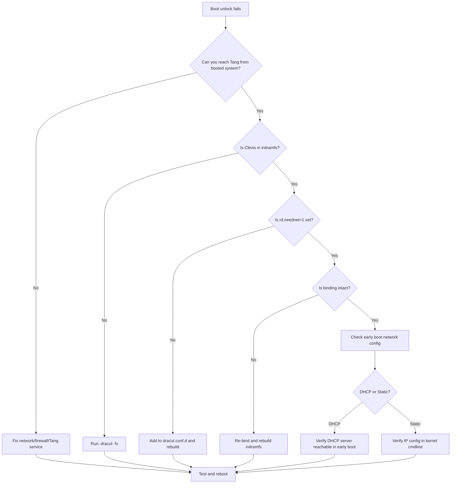

# How to Troubleshoot Clevis Binding Failures with Tang on RHEL

Author: [nawazdhandala](https://www.github.com/nawazdhandala)

Tags: RHEL, Clevis, Tang, Troubleshooting, Linux

Description: Diagnose and fix common Clevis binding failures with Tang servers on RHEL, from network issues to key mismatches and early boot problems.

---

NBDE with Clevis and Tang usually works smoothly once configured, but when it breaks, the symptoms can be confusing. You might get a passphrase prompt at boot when you should not, or bindings fail to create in the first place. This guide covers the most common failure scenarios and how to fix them.

## Common Failure Scenarios

The issues fall into a few categories:

1. Binding creation fails
2. Boot-time unlock fails (passphrase prompt appears)
3. Binding stops working after Tang key rotation
4. Network issues during early boot

## Diagnosing Binding Creation Failures

When `clevis luks bind` fails, start with the basics:

### Check Tang Server Connectivity

```bash
# Test if Tang is reachable from the client
curl -sf http://tang.example.com/adv
```

If this returns nothing or errors out:

```bash
# Check DNS resolution
dig tang.example.com

# Try by IP address
curl -sf http://10.0.1.10/adv

# Check if the port is open
nc -zv 10.0.1.10 80
```

### Check Firewall on Tang Server

```bash
# On the Tang server, verify the firewall allows HTTP
sudo firewall-cmd --list-services

# If HTTP is missing, add it
sudo firewall-cmd --add-service=http --permanent
sudo firewall-cmd --reload
```

### Check Tang Service Status

```bash
# On the Tang server
sudo systemctl status tangd.socket

# If it is not running, enable and start it
sudo systemctl enable --now tangd.socket

# Check for errors in the journal
sudo journalctl -u tangd.socket -u tangd.service --since "1 hour ago"
```

### Verify LUKS Device

```bash
# Make sure the device is actually LUKS
sudo cryptsetup isLuks /dev/sda3 && echo "LUKS device" || echo "Not LUKS"

# Check LUKS header
sudo cryptsetup luksDump /dev/sda3

# Check available key slots
sudo cryptsetup luksDump /dev/sda3 | grep "Key Slot"
```

If all 8 LUKS key slots are in use (LUKS1) or all slots are occupied (LUKS2), you need to free one before Clevis can add a binding:

```bash
# Remove a key slot if needed (make sure you know which slot to remove)
sudo cryptsetup luksKillSlot /dev/sda3 7
```

### Wrong Passphrase

If the binding creation prompts for a passphrase and then fails:

```bash
# Verify your passphrase works
sudo cryptsetup luksOpen --test-passphrase /dev/sda3
```

## Diagnosing Boot-Time Unlock Failures

When the server prompts for a passphrase at boot instead of unlocking automatically:

### Check Boot Logs After Manual Unlock

After entering the passphrase manually and booting:

```bash
# Look for Clevis-related messages during boot
sudo journalctl -b | grep -i clevis

# Look for network-related early boot messages
sudo journalctl -b | grep -iE "network|dhcp|dracut|rd.neednet"

# Check for Tang connection attempts
sudo journalctl -b | grep -i tang
```

### Verify initramfs Contains Clevis

```bash
# Check if Clevis modules are in the initramfs
lsinitrd | grep clevis

# Check for network modules
lsinitrd | grep network-manager
```

If Clevis is missing from the initramfs:

```bash
# Rebuild the initramfs with Clevis support
sudo dracut -fv --regenerate-all
```

### Verify Network Configuration in initramfs

```bash
# Check the dracut configuration
cat /etc/dracut.conf.d/*.conf

# Verify rd.neednet is set
cat /proc/cmdline | grep neednet
```

If `rd.neednet=1` is missing:

```bash
# Add it to the dracut configuration
sudo tee /etc/dracut.conf.d/nbde-network.conf << 'EOF'
kernel_cmdline="rd.neednet=1"
EOF

# Rebuild initramfs
sudo dracut -fv
```

### Verify the Binding is Intact

```bash
# List current bindings
sudo clevis luks list -d /dev/sda3
```

If the binding shows as empty or corrupt:

```bash
# Remove the bad binding and re-bind
sudo clevis luks unbind -d /dev/sda3 -s 1
sudo clevis luks bind -d /dev/sda3 tang '{"url":"http://tang.example.com"}'
sudo dracut -fv
```

## Troubleshooting Workflow



## Tang Key Rotation Issues

After rotating keys on the Tang server, existing bindings might stop working if old keys were removed:

```bash
# On Tang server, check if old keys are still present
sudo ls -la /var/db/tang/

# If old keys were renamed with a dot prefix, they are hidden but still available
# If they were deleted, clients need to re-bind
```

To fix clients after key removal:

```bash
# On each affected client
sudo clevis luks unbind -d /dev/sda3 -s 1
sudo clevis luks bind -d /dev/sda3 tang '{"url":"http://tang.example.com"}'
sudo dracut -fv
```

## SSS Pin Troubleshooting

If you are using Shamir's Secret Sharing:

```bash
# List the SSS binding details
sudo clevis luks list -d /dev/sda3
```

Make sure the threshold (`t` value) is achievable. If you set `t=2` and only 1 Tang server is reachable, it will fail by design.

```bash
# Test each Tang server individually
curl -sf http://10.0.1.10/adv > /dev/null && echo "Tang A: OK" || echo "Tang A: FAIL"
curl -sf http://10.0.1.11/adv > /dev/null && echo "Tang B: OK" || echo "Tang B: FAIL"
```

## Debugging with Verbose Output

For deeper debugging, run Clevis with verbose output:

```bash
# Verbose binding attempt
sudo clevis luks bind -d /dev/sda3 tang '{"url":"http://tang.example.com"}' 2>&1 | tee /tmp/clevis-debug.log
```

## Recovery When All Else Fails

If you cannot get automatic unlock working and need the system running:

```bash
# Boot with the passphrase manually
# Then verify and rebuild the Clevis configuration

# Remove all Clevis bindings
sudo clevis luks unbind -d /dev/sda3 -s 1

# Start fresh
sudo clevis luks bind -d /dev/sda3 tang '{"url":"http://tang.example.com"}'
sudo dracut -fv --regenerate-all
sudo reboot
```

Always keep a tested, working LUKS passphrase available. It is your ultimate fallback when NBDE is not cooperating. Store it securely and test it periodically.
