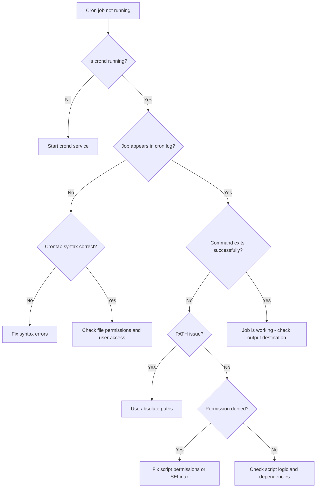

# How to Troubleshoot Cron Jobs That Are Not Running on RHEL 9

Author: [nawazdhandala](https://www.github.com/nawazdhandala)

Tags: RHEL, cron, Troubleshooting, Linux, System Administration

Description: A systematic approach to diagnosing and fixing cron jobs that refuse to run on RHEL 9, covering the most common causes from service issues to SELinux denials.

---

## The Frustration of Silent Failures

Few things are more annoying than a cron job that simply does not run. No errors, no output, no indication of what went wrong. You set it up, you tested the script manually, it worked fine, and then cron just ignores it. I have been there more times than I care to admit, and over the years I have built up a mental checklist that catches the problem almost every time.

Let me walk you through that checklist.

## Step 1: Is crond Actually Running?

This sounds obvious, but start here. If the cron daemon is not running, nothing will execute.

```bash
# Check the crond service status
sudo systemctl status crond
```

If it is not running or not enabled:

```bash
# Start and enable crond
sudo systemctl enable --now crond
```

Check for any error messages in the status output. If crond crashed, the journal will have details.

```bash
# Check journal logs for crond issues
sudo journalctl -u crond --since "1 hour ago"
```

## Step 2: Check the Cron Log

RHEL 9 logs cron activity to `/var/log/cron`. This is your best friend when debugging.

```bash
# Look at recent cron log entries
sudo tail -50 /var/log/cron
```

You should see entries showing when crond loaded crontabs and when it executed jobs. If your job does not appear here at all, the issue is with how the job is defined, not with its execution.

```bash
# Search for your specific user's cron activity
sudo grep "your_username" /var/log/cron | tail -20

# Search for a specific command
sudo grep "backup" /var/log/cron | tail -20
```

## Step 3: Verify the Crontab Syntax

A single syntax error can prevent the entire crontab from loading. Check your crontab carefully.

```bash
# View your current crontab
crontab -l
```

Common syntax mistakes:

```bash
# WRONG - missing the command field
30 2 * * *

# WRONG - using commas wrong in ranges
30 2 1-15, * *

# CORRECT - basic format
# minute hour day-of-month month day-of-week command
30 2 * * * /usr/local/bin/backup.sh

# CORRECT - using ranges and lists
30 2 1,15 * * /usr/local/bin/backup.sh
*/5 * * * * /usr/local/bin/health-check.sh
```

Also check that your crontab file ends with a newline. This is a classic issue - if the last line does not have a trailing newline character, cron may not execute it.

## Step 4: PATH Problems

This is the number one reason cron jobs fail when they work fine from the command line. Your interactive shell has a rich PATH variable with lots of directories. Cron's default PATH is minimal.

```bash
# Check what PATH cron uses by default
# Add this to your crontab temporarily to see the environment
* * * * * env > /tmp/cron-env.txt
```

Wait a minute, then check:

```bash
# See the actual cron environment
cat /tmp/cron-env.txt | grep PATH
```

You will likely see something like `PATH=/usr/bin:/bin`, which is far less than your login shell. Fix this by setting PATH in your crontab or using absolute paths.

```bash
# Option 1: Set PATH at the top of your crontab
PATH=/usr/local/sbin:/usr/local/bin:/usr/sbin:/usr/bin:/sbin:/bin

30 2 * * * backup.sh

# Option 2: Use absolute paths in commands (preferred)
30 2 * * * /usr/local/bin/backup.sh
```

Here is a troubleshooting flowchart for the most common cron issues:



## Step 5: File Permissions

The script that cron is supposed to execute must be executable.

```bash
# Check permissions on your script
ls -la /usr/local/bin/backup.sh

# Make it executable if it is not
sudo chmod +x /usr/local/bin/backup.sh
```

Also check the crontab file permissions themselves.

```bash
# User crontabs are stored here on RHEL 9
ls -la /var/spool/cron/

# They should be owned by the respective user, mode 600
```

## Step 6: Check for User Restrictions

RHEL 9 uses `/etc/cron.allow` and `/etc/cron.deny` to control who can use cron.

```bash
# Check if cron.allow exists (if it does, only listed users can use cron)
ls -la /etc/cron.allow 2>/dev/null

# Check if cron.deny exists
ls -la /etc/cron.deny 2>/dev/null

# If cron.allow exists, make sure your user is in it
cat /etc/cron.allow 2>/dev/null
```

If `/etc/cron.allow` exists and your user is not listed, cron will silently refuse to run your jobs.

## Step 7: SELinux Denials

SELinux is often the hidden culprit on RHEL 9. Your script might work perfectly when run manually but fail under cron because SELinux restricts what the cron context can do.

```bash
# Check for recent SELinux denials related to cron
sudo ausearch -m AVC -ts recent | grep cron

# Or use sealert if setroubleshoot is installed
sudo sealert -a /var/log/audit/audit.log | grep cron
```

If you find denials, you have a few options:

```bash
# Check what SELinux booleans are available for cron
sudo getsebool -a | grep cron

# Common fix: allow cron to access user home directories
sudo setsebool -P cron_userdomain_transition on

# If your script accesses network resources
sudo setsebool -P cron_can_relabel off

# Generate a custom policy module from the denial
sudo ausearch -m AVC -ts recent | audit2allow -M mycronfix
sudo semodule -i mycronfix.pp
```

Before disabling SELinux or setting it to permissive, always try to create a targeted policy first. Running in permissive mode temporarily can help confirm whether SELinux is the problem.

```bash
# Temporarily set SELinux to permissive to test (revert after testing)
sudo setenforce 0

# Run your cron job manually or wait for it to trigger
# If it works now, SELinux was blocking it

# Set back to enforcing
sudo setenforce 1
```

## Step 8: Check Mail for Error Output

By default, cron emails the job's output (both stdout and stderr) to the user. If your job produces errors, they might be sitting in local mail.

```bash
# Check local mail for cron output
mail

# Or check the mail spool directly
cat /var/spool/mail/$(whoami)
```

If you do not have local mail configured, you are losing this error output. Set up a MAILTO variable or redirect output explicitly.

```bash
# Disable mail and log to a file instead
30 2 * * * /usr/local/bin/backup.sh > /var/log/backup-cron.log 2>&1

# Or set MAILTO at the top of your crontab
MAILTO=admin@example.com
```

## Step 9: Script-Specific Issues

Sometimes the script itself is the problem when run in cron's restricted environment.

```bash
# Test your script with a minimal environment (simulates cron)
env -i HOME=$HOME LOGNAME=$USER PATH=/usr/bin:/bin SHELL=/bin/sh /usr/local/bin/backup.sh
```

Common script issues in cron:

- Relying on environment variables that are not set
- Using relative paths instead of absolute paths
- Depending on a specific working directory
- Using features that require a terminal (like interactive prompts)

```bash
# Add explicit directory changes in your script
#!/bin/bash
cd /opt/myapp || exit 1

# Use absolute paths for everything
/usr/bin/python3 /opt/myapp/process.py

# Do not use ~ for home directory - use $HOME or the full path
cp file.txt /home/admin/backups/
```

## Step 10: Timing Issues

Double-check that your schedule actually means what you think it means.

```bash
# This runs at 2:30 AM every day
30 2 * * * /usr/local/bin/job.sh

# This runs at minute 0, every 2 hours - NOT every 2 minutes
0 */2 * * * /usr/local/bin/job.sh

# This runs every 5 minutes
*/5 * * * * /usr/local/bin/job.sh

# Be careful with day-of-month AND day-of-week
# This runs on the 1st AND every Monday (OR logic, not AND)
0 3 1 * 1 /usr/local/bin/job.sh
```

## Quick Diagnostic Script

Here is a script you can run to check all the common issues at once.

```bash
# Quick cron health check
echo "=== crond status ==="
systemctl is-active crond

echo "=== Your crontab ==="
crontab -l 2>&1

echo "=== Cron access control ==="
echo "cron.allow: $(cat /etc/cron.allow 2>/dev/null || echo 'does not exist')"
echo "cron.deny: $(cat /etc/cron.deny 2>/dev/null || echo 'does not exist')"

echo "=== Recent cron log entries ==="
sudo tail -10 /var/log/cron

echo "=== SELinux status ==="
getenforce

echo "=== Recent SELinux denials for cron ==="
sudo ausearch -m AVC -ts recent 2>/dev/null | grep -c cron
```

## Summary

When a cron job is not running on RHEL 9, work through the problem systematically. Start with the basics (is crond running?), check the logs, verify syntax and PATH, look at permissions and SELinux, and test the script in an environment that mimics cron's restricted setup. Nine times out of ten, it is either a PATH issue or SELinux. The tenth time, it is a missing newline at the end of the crontab.
