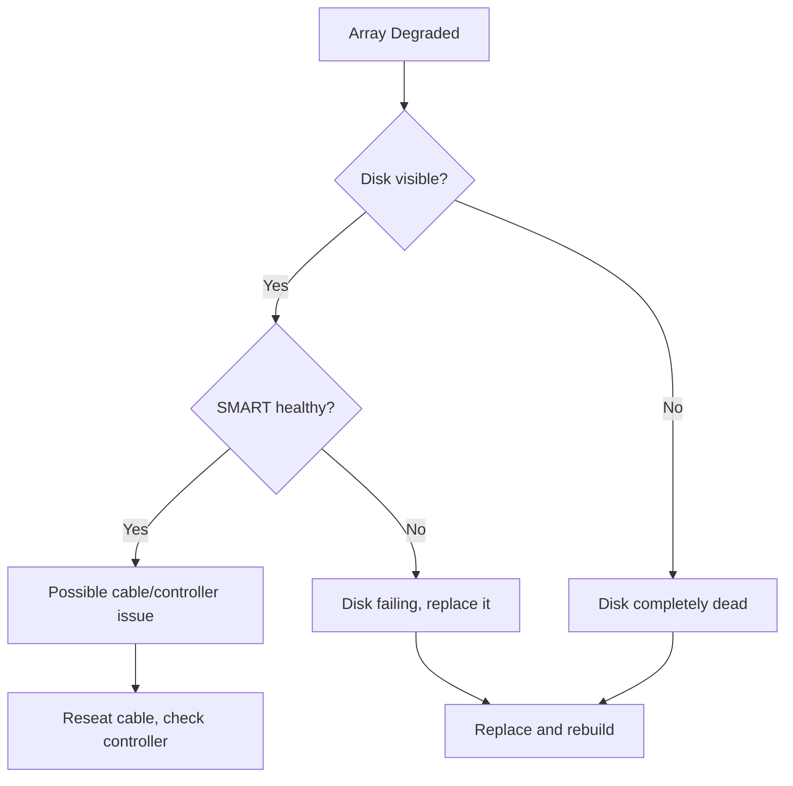

# How to Troubleshoot Degraded mdadm RAID Arrays on RHEL

Author: [nawazdhandala](https://www.github.com/nawazdhandala)

Tags: RHEL, RAID, mdadm, Troubleshooting, Linux

Description: A systematic approach to diagnosing and fixing degraded mdadm RAID arrays on RHEL, covering common failure scenarios and recovery steps.

---

## What Does "Degraded" Mean?

A degraded RAID array is one that has lost one or more member disks but is still operational. The array continues to serve data, but your fault tolerance is reduced or gone entirely. Depending on the RAID level:

- **RAID 1**: Can lose all mirrors except one
- **RAID 5**: Can lose one disk
- **RAID 6**: Can lose two disks
- **RAID 10**: Can lose one disk per mirror pair

Once degraded, another failure could mean total data loss. Treat every degraded state as urgent.

## Step 1 - Assess the Damage

```bash
# Quick overview of all arrays
cat /proc/mdstat
```

A healthy RAID 5 with three disks shows `[UUU]`. A degraded one shows `[UU_]` or similar.

```bash
# Detailed status
sudo mdadm --detail /dev/md5
```

Look for:
- **State**: "clean, degraded" or "active, degraded"
- **Failed Devices**: Count of failed members
- **Removed/Faulty disks**: Listed at the bottom

## Step 2 - Check System Logs

```bash
# Search for disk errors in the journal
journalctl -k --since "24 hours ago" | grep -i -E "error|fail|md[0-9]"

# Check for specific I/O errors
journalctl -k | grep -i "I/O error"
```

Common log messages include:
- "md/raid: md5: Disk failure on sdc"
- "blk_update_request: I/O error"
- "ata3: COMRESET failed"

## Step 3 - Identify the Failed Disk

```bash
# Show which disks are in the array and their state
sudo mdadm --detail /dev/md5

# Check if the disk is still visible to the system
lsblk

# Check SMART health of the suspected disk
sudo smartctl -H /dev/sdc
sudo smartctl -a /dev/sdc | grep -E "Reallocated|Current_Pending|Offline_Uncorrectable"
```

High counts in Reallocated_Sector_Ct, Current_Pending_Sector, or Offline_Uncorrectable are strong indicators of a dying drive.

## Common Degraded Scenarios



## Scenario 1 - Disk Completely Gone

If the disk is no longer visible to the system:

```bash
# Try to rescan SCSI buses
echo "- - -" | sudo tee /sys/class/scsi_host/host*/scan

# Check if the disk reappears
lsblk
```

If it does not reappear, the disk is dead. Proceed with physical replacement.

## Scenario 2 - Disk Present but Kicked from Array

Sometimes a temporary I/O error causes mdadm to remove a disk that is actually fine.

```bash
# Check if the disk still has a valid RAID superblock
sudo mdadm --examine /dev/sdc

# If the superblock is intact and the disk is healthy, re-add it
sudo mdadm --manage /dev/md5 --re-add /dev/sdc
```

The `--re-add` flag is important here. It tells mdadm to try a fast resync using the bitmap, which is much faster than a full rebuild.

```bash
# Verify the re-add triggered a resync
cat /proc/mdstat
```

## Scenario 3 - Array Won't Assemble on Boot

If the system reboots and the array fails to assemble:

```bash
# Try manual assembly
sudo mdadm --assemble --scan

# If that fails, try forcing assembly
sudo mdadm --assemble --force /dev/md5 /dev/sdb /dev/sdc /dev/sdd
```

The `--force` flag tells mdadm to assemble with whatever devices are available, even if the array is incomplete. Use this cautiously.

## Scenario 4 - Bitmap Out of Sync

Write-intent bitmaps track which regions have been written to. If the bitmap is corrupted:

```bash
# Check bitmap status
sudo mdadm --detail /dev/md5 | grep -i bitmap

# Remove and re-add the bitmap
sudo mdadm --grow /dev/md5 --bitmap=none
sudo mdadm --grow /dev/md5 --bitmap=internal
```

## Rebuilding a Degraded Array

Once you have identified and resolved the root cause:

```bash
# If the failed disk needs replacement
sudo mdadm --manage /dev/md5 --remove /dev/sdc

# Add the replacement
sudo wipefs -a /dev/sdc
sudo mdadm --manage /dev/md5 --add /dev/sdc

# Monitor rebuild progress
watch cat /proc/mdstat
```

## Speeding Up Recovery

During a rebuild, you want it done as fast as possible:

```bash
# Increase rebuild speed limits temporarily
echo 200000 | sudo tee /proc/sys/dev/raid/speed_limit_min
echo 500000 | sudo tee /proc/sys/dev/raid/speed_limit_max
```

Reduce the I/O priority of other workloads if possible. The longer a rebuild takes, the higher the risk of another failure.

## After Recovery Checklist

1. Verify the array is fully synced: `cat /proc/mdstat`
2. Check the state is "clean": `sudo mdadm --detail /dev/md5`
3. Update mdadm.conf: `sudo mdadm --detail --scan | sudo tee /etc/mdadm.conf`
4. Regenerate initramfs: `sudo dracut --regenerate-all --force`
5. Run a SMART self-test on all remaining disks: `sudo smartctl -t short /dev/sdX`
6. Verify backups are current

## Wrap-Up

Troubleshooting a degraded RAID array on RHEL follows a logical sequence: assess the damage, identify the cause, and take corrective action. The most important things are to act quickly, understand what type of failure occurred, and have a replacement process ready. Regular monitoring prevents most surprises, but when something does go wrong, the steps above will get you back to a healthy state.
