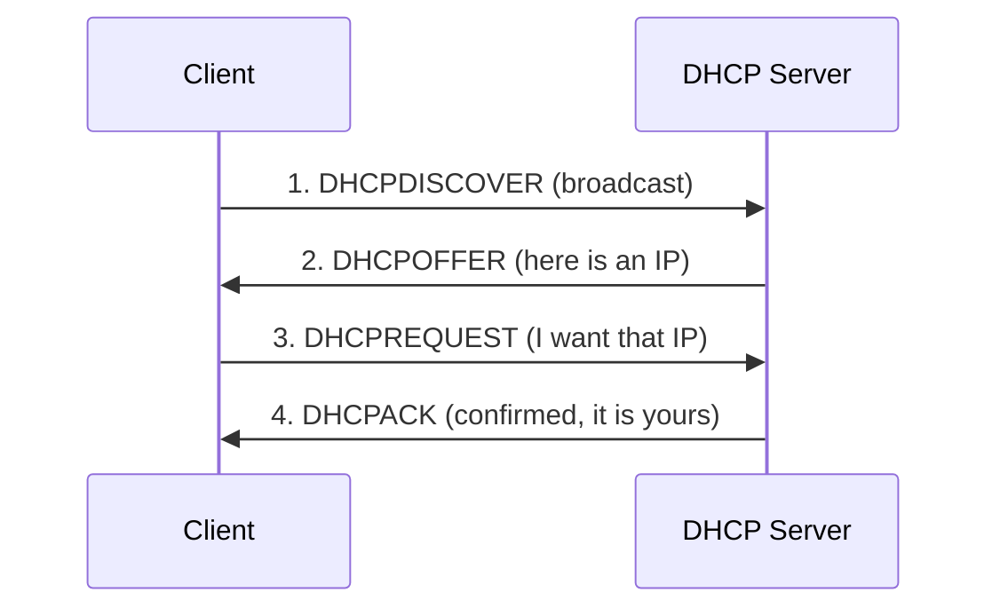

# How to Troubleshoot DHCP Lease Assignment Issues on RHEL

Author: [nawazdhandala](https://www.github.com/nawazdhandala)

Tags: RHEL, DHCP, Troubleshooting, Linux

Description: Diagnose and fix common DHCP lease assignment problems on RHEL, from clients not getting addresses to duplicate IP conflicts.

---

DHCP problems are sneaky. A client doesn't get an IP, or gets the wrong one, or two clients end up with the same address. The symptoms are usually vague - "the network isn't working." This guide helps you systematically narrow down what's going wrong with DHCP lease assignments on RHEL.

## The DHCP Process

Understanding the four-step DHCP handshake is essential for troubleshooting:



Problems can occur at any of these four steps.

## Step 1: Check if the DHCP Server is Running

Start with the basics:

```bash
systemctl status dhcpd
```

If it's not running, check why:

```bash
journalctl -u dhcpd --no-pager -n 30
```

Common startup failures include syntax errors in dhcpd.conf and interface issues:

```bash
dhcpd -t -cf /etc/dhcp/dhcpd.conf
```

## Step 2: Verify the Server is Listening

Confirm dhcpd is listening on the right interface:

```bash
ss -ulnp | grep :67
```

DHCP uses UDP port 67 (server) and 68 (client). If the server isn't listening, check the interface configuration.

## Step 3: Check the Firewall

The firewall must allow DHCP traffic:

```bash
firewall-cmd --list-services | grep dhcp
```

If DHCP isn't listed:

```bash
firewall-cmd --permanent --add-service=dhcp
firewall-cmd --reload
```

## Step 4: Examine Server Logs

The DHCP server logs all transactions. Watch them in real time while a client tries to get an address:

```bash
journalctl -u dhcpd -f
```

What to look for:

- **DHCPDISCOVER** from client - means the server received the request
- **DHCPOFFER** to client - means the server offered an address
- **DHCPREQUEST** from client - means the client accepted
- **DHCPACK** to client - means the lease was finalized
- **No free leases** - the pool is exhausted

If you see nothing when a client tries to connect, the DISCOVER isn't reaching the server.

## Step 5: Client Not Receiving DISCOVER Responses

If the server never sees the client's DISCOVER:

Is the client on the same network segment? DHCP broadcasts don't cross routers unless you have a DHCP relay (ip helper-address) configured on the router.

Check if the client is actually sending DISCOVER packets. On the server, capture DHCP traffic:

```bash
tcpdump -i eth1 port 67 or port 68 -n
```

If you see DISCOVER packets arriving but no OFFER going back, the server is receiving but not responding. Check that the subnet declaration in dhcpd.conf matches the network.

## Step 6: Pool Exhaustion

The most common reason for "no free leases":

```bash
# Check the lease file
cat /var/lib/dhcpd/dhcpd.leases | grep "^lease" | wc -l
```

Compare the number of active leases to your pool size. If you have `range 192.168.1.100 192.168.1.200`, that's only 101 addresses.

Quick fix: expand the range or shorten lease times so addresses recycle faster.

Check for abandoned leases:

```bash
grep -c "binding state abandoned" /var/lib/dhcpd/dhcpd.leases
```

Abandoned leases happen when the server detects a conflict (another device already using the IP). They take up pool space.

## Step 7: Duplicate IP Addresses

If two devices end up with the same IP:

Check for rogue DHCP servers on the network:

```bash
# Listen for DHCP offers from unexpected servers
tcpdump -i eth1 'udp port 68' -n
```

If you see OFFER packets from an IP that isn't your DHCP server, there's a rogue. Common culprits: consumer routers, misconfigured VMs, and badly configured network equipment.

Also check for statically configured devices using IPs from the DHCP pool. Either move the static devices outside the pool range or create reservations for them.

## Step 8: Client Gets Wrong Options

The client gets an IP but has the wrong DNS server or gateway:

Check which options are being served:

```bash
# On the client (if using dhclient)
cat /var/lib/dhclient/dhclient.leases
```

On the server, verify the subnet options:

```bash
grep -A 10 "subnet" /etc/dhcp/dhcpd.conf
```

Remember that host-specific options override subnet options, and subnet options override global options.

## Step 9: Lease File Corruption

If the lease file gets corrupted, the server may not start or may behave strangely.

Check the lease file for obvious problems:

```bash
head -20 /var/lib/dhcpd/dhcpd.leases
tail -20 /var/lib/dhcpd/dhcpd.leases
```

If it's corrupted, you can recreate it from the backup:

```bash
systemctl stop dhcpd
cp /var/lib/dhcpd/dhcpd.leases /var/lib/dhcpd/dhcpd.leases.corrupt
cp /var/lib/dhcpd/dhcpd.leases~ /var/lib/dhcpd/dhcpd.leases
systemctl start dhcpd
```

The `~` file is the backup that dhcpd maintains.

As a last resort, create an empty lease file:

```bash
systemctl stop dhcpd
mv /var/lib/dhcpd/dhcpd.leases /var/lib/dhcpd/dhcpd.leases.old
touch /var/lib/dhcpd/dhcpd.leases
chown dhcpd:dhcpd /var/lib/dhcpd/dhcpd.leases
systemctl start dhcpd
```

This means all clients will get new leases, which may cause temporary disruption.

## Step 10: Client-Side Troubleshooting

On the client, you can run dhclient in verbose mode:

```bash
dhclient -v eth0
```

This shows the full DHCP conversation from the client's perspective. Look for:
- Whether DISCOVER is sent
- Whether an OFFER is received
- Whether the ACK is received

If using NetworkManager:

```bash
nmcli device disconnect eth0
nmcli device connect eth0
journalctl -u NetworkManager --no-pager -n 20
```

## Quick Diagnostic Commands

| Check | Command |
|-------|---------|
| Server running? | `systemctl status dhcpd` |
| Listening on port 67? | `ss -ulnp \| grep :67` |
| Firewall allows DHCP? | `firewall-cmd --list-services` |
| Active leases | `cat /var/lib/dhcpd/dhcpd.leases` |
| Live traffic | `tcpdump -i eth1 port 67 or port 68 -n` |
| Config syntax OK? | `dhcpd -t -cf /etc/dhcp/dhcpd.conf` |
| Server logs | `journalctl -u dhcpd -f` |

Most DHCP problems come down to one of a few things: the server isn't running, the firewall is blocking, the pool is full, or there's a rogue server on the network. Work through the checklist systematically and you'll find the problem.
