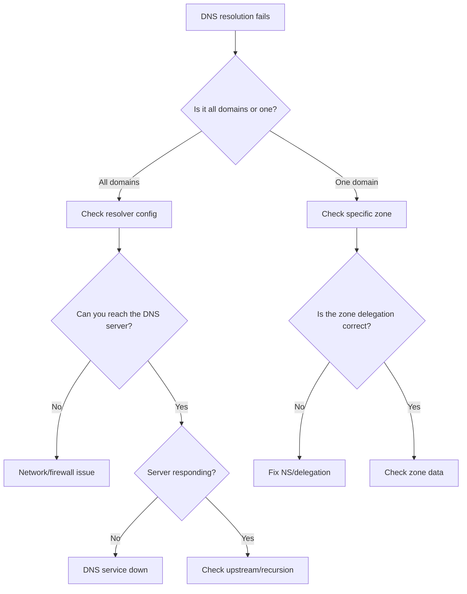

# How to Troubleshoot DNS Resolution Failures on RHEL 9

Author: [nawazdhandala](https://www.github.com/nawazdhandala)

Tags: RHEL, DNS, Troubleshooting, Linux

Description: A systematic approach to diagnosing and fixing DNS resolution failures on RHEL 9, from client-side configuration to server-side issues.

---

DNS resolution failures are one of the most common network problems you'll deal with. The symptoms range from "I can't reach google.com" to applications timing out for no obvious reason. The trick is having a systematic approach to narrow down where things are breaking. This guide walks through the process from start to finish.

## The Troubleshooting Flow



## Step 1: Check What DNS Server You're Using

First, find out which DNS server your system is querying:

```bash
cat /etc/resolv.conf
```

On RHEL 9 with NetworkManager, this file is often managed automatically. Check the actual configuration:

```bash
nmcli device show | grep DNS
```

If you're using systemd-resolved:

```bash
resolvectl status
```

## Step 2: Test Basic Resolution

Try resolving a well-known domain:

```bash
dig google.com
```

If this works but your internal domain doesn't, the problem is specific to that zone. If this fails too, the problem is with your resolver or network.

Test with a specific DNS server to bypass your local config:

```bash
dig @8.8.8.8 google.com
```

If the above works but `dig google.com` doesn't, your configured resolver is the problem.

## Step 3: Check Network Connectivity to the DNS Server

Verify you can reach the DNS server on port 53:

```bash
# Test TCP
ss -tlnp | grep :53

# Test UDP reachability
dig @your-dns-server example.com +timeout=5
```

Check if the firewall is blocking DNS:

```bash
firewall-cmd --list-all | grep dns
```

Test with nc (netcat) to verify port reachability:

```bash
nc -zvu your-dns-server 53
```

## Step 4: Check the DNS Service

If you're running a local BIND server, verify it's running:

```bash
systemctl status named
```

Check for recent errors:

```bash
journalctl -u named --no-pager -n 50
```

Try a direct query to localhost:

```bash
dig @127.0.0.1 example.com
```

## Step 5: Examine the Full Resolution Chain

Use `dig +trace` to follow the full resolution path from root servers down to the authoritative server:

```bash
dig +trace example.com
```

This shows you every step of the resolution. If it fails at a specific level, that tells you exactly where the problem is.

## Step 6: Check for SERVFAIL

A SERVFAIL response means your resolver tried but failed. Common causes:

DNSSEC validation failure:

```bash
# Try with DNSSEC checking disabled
dig example.com +cd
```

If the query works with `+cd` but fails without it, there's a DNSSEC problem.

Upstream server timeout:

```bash
# Check if forwarders are reachable
dig @8.8.8.8 example.com +timeout=5
dig @8.8.4.4 example.com +timeout=5
```

## Step 7: Check /etc/nsswitch.conf

On RHEL 9, the name service switch controls the order of resolution methods:

```bash
grep hosts /etc/nsswitch.conf
```

A typical line looks like:

```
hosts:      files dns myhostname
```

This means it checks `/etc/hosts` first, then DNS. If you see `myhostname` or `resolve` in unexpected places, that could affect behavior.

## Step 8: Check /etc/hosts

Sometimes the problem is a stale entry in /etc/hosts overriding DNS:

```bash
grep your-hostname /etc/hosts
```

## Step 9: NetworkManager DNS Issues

NetworkManager manages DNS configuration on RHEL 9. If DNS settings are wrong:

Check the active connection's DNS:

```bash
nmcli connection show "System eth0" | grep dns
```

Set DNS manually if needed:

```bash
nmcli connection modify "System eth0" ipv4.dns "192.168.1.10 8.8.8.8"
nmcli connection modify "System eth0" ipv4.dns-search "example.com"
nmcli connection up "System eth0"
```

Verify the change took effect:

```bash
cat /etc/resolv.conf
```

## Step 10: Common Error Messages and Fixes

**"connection timed out; no servers could be reached"**

Your resolver is unreachable. Check network connectivity and firewall rules.

```bash
ping your-dns-server
firewall-cmd --list-all
```

**"NXDOMAIN" (Non-Existent Domain)**

The domain doesn't exist in DNS. Verify the name is correct:

```bash
dig example.com ANY
```

Check if the authoritative servers have the record:

```bash
dig @ns1.example.com www.example.com A
```

**"REFUSED"**

The DNS server is refusing your query. It may not allow recursion from your IP:

```bash
dig @dns-server example.com
```

Check the server's `allow-query` and `allow-recursion` settings.

**"SERVFAIL"**

The server encountered an internal error. Check DNSSEC, upstream connectivity, and zone configuration.

## Step 11: Clearing Caches

Sometimes stale cache entries cause issues. Clear the local DNS cache:

If using systemd-resolved:

```bash
resolvectl flush-caches
```

If running a local BIND resolver:

```bash
rndc flush
```

For a specific domain:

```bash
rndc flushname example.com
```

## Step 12: SELinux Considerations

SELinux can block DNS-related operations. Check for denials:

```bash
ausearch -m avc -ts recent | grep named
```

Common SELinux issues with DNS include custom log file paths or non-standard port usage.

## Quick Reference Checklist

1. What DNS server am I using? (`cat /etc/resolv.conf`)
2. Can I reach the DNS server? (`dig @server example.com`)
3. Does the DNS service run? (`systemctl status named`)
4. Is there a firewall issue? (`firewall-cmd --list-all`)
5. Is it a DNSSEC problem? (`dig example.com +cd`)
6. Is it just one domain? (`dig +trace domain.com`)
7. Is /etc/hosts overriding? (`grep hostname /etc/hosts`)
8. Is the cache stale? (`rndc flush` or `resolvectl flush-caches`)

Working through these steps systematically will catch the vast majority of DNS issues. The most important thing is to isolate whether the problem is on the client side, the resolver side, or the authoritative server side, because the fix is completely different in each case.
