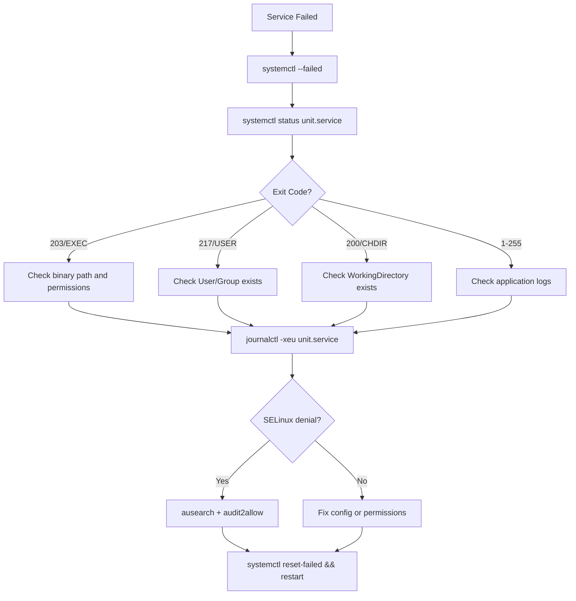

# How to Troubleshoot Failed systemd Services on RHEL 9

Author: [nawazdhandala](https://www.github.com/nawazdhandala)

Tags: RHEL, systemd, Troubleshooting, Services, Linux

Description: A practical guide to diagnosing and fixing failed systemd services on RHEL 9, covering common failure patterns, journal inspection, and real-world fixes.

---

## Why Services Fail (and Why It Matters)

If you have spent any time managing RHEL servers, you have seen it. You reboot a box, or you push a config change, and something that was working five minutes ago is now dead. The service is "failed" and your monitoring is lighting up.

systemd gives you solid tools to figure out what went wrong. The trick is knowing where to look and what the error messages actually mean. This post walks through a systematic approach to troubleshooting failed services on RHEL 9.

## Step 1: Find What is Broken

The first thing to do is get a list of every unit that systemd considers failed.

```bash
# List all units in a failed state
systemctl --failed
```

This gives you a table showing the unit name, load state, active state, and a brief description. If you see something here, that is your starting point.

You can also check a specific service directly:

```bash
# Check the status of a specific service
systemctl status httpd.service
```

The output from `status` is gold. It shows:
- Whether the service is active, inactive, or failed
- The main PID (or the last PID before it died)
- The last several log lines from the journal
- The exit code or signal that killed the process

## Step 2: Read the Journal

The status output only shows a handful of log lines. To get the full picture, you need journalctl.

```bash
# Show the most recent log entries with explanations for the failed service
journalctl -xeu httpd.service
```

The flags break down like this:
- `-x` adds explanatory text (catalog entries) where available
- `-e` jumps to the end of the log so you see the most recent entries first
- `-u httpd.service` filters to just that unit

If you want to see what happened during the last boot specifically:

```bash
# Show logs for the service from the current boot only
journalctl -b -u httpd.service
```

And if the failure happened during a previous boot:

```bash
# Show logs from the previous boot
journalctl -b -1 -u httpd.service
```

## Step 3: Understand Common Failure Reasons

Here is a breakdown of the most frequent causes I run into, organized by the exit code or status you will see.

### Exit Code 203/EXEC - Bad ExecStart Path

This means systemd tried to run the binary specified in `ExecStart` and could not find it or could not execute it.

```bash
# Verify the binary path exists and is executable
ls -l /usr/sbin/httpd
file /usr/sbin/httpd
```

Common causes:
- Typo in the unit file
- The package is not installed
- SELinux is blocking execution (check with `ausearch -m avc -ts recent`)

### Exit Code 217/USER - Bad User/Group

The unit file specifies a `User=` or `Group=` that does not exist on the system.

```bash
# Check if the user specified in the unit file exists
id nginx
```

### Exit Code 200/CHDIR - Bad WorkingDirectory

The `WorkingDirectory=` in the unit file points to a directory that does not exist.

```bash
# Check what WorkingDirectory the unit expects
systemctl cat myapp.service | grep WorkingDirectory
```

### Exit Codes 1-255 - Application-Level Failures

These come from the application itself. The service started but crashed. You need the application logs, not just the systemd journal.

```bash
# Check if the application writes its own log file
ls -la /var/log/httpd/
```

## Step 4: Inspect the Unit File

Sometimes the problem is in the unit file itself. You can view the effective configuration (including overrides) with:

```bash
# Show the full unit file contents as systemd sees them
systemctl cat httpd.service
```

To see every property, including defaults:

```bash
# Show all properties of the unit
systemctl show httpd.service
```

You can filter to specific properties:

```bash
# Check specific properties
systemctl show httpd.service -p ExecStart -p ExecStartPre -p User -p Group
```

## Step 5: ExecStartPre Issues

This is one that trips people up. If your unit file has `ExecStartPre` directives, any failure there prevents the main service from starting.

```bash
# Look for ExecStartPre in the unit configuration
systemctl cat myapp.service | grep ExecStartPre
```

A common pattern is a pre-start script that checks configuration syntax:

```ini
# Example unit snippet where ExecStartPre validates config before starting
[Service]
ExecStartPre=/usr/sbin/nginx -t
ExecStart=/usr/sbin/nginx
```

If the config test fails, nginx never starts. The journal will show the pre-start failure, but you might miss it if you are only looking for the main process.

To test the pre-start command manually:

```bash
# Run the pre-start command by hand to see the error
/usr/sbin/nginx -t
```

## Step 6: Permission Problems

Permissions are behind a huge number of service failures. Here is a checklist.

### File and Directory Permissions

```bash
# Check ownership and permissions on the service's data directory
ls -laZ /var/lib/myapp/
```

The `-Z` flag shows SELinux contexts, which matter on RHEL.

### SELinux Denials

```bash
# Check for recent SELinux denials
ausearch -m avc -ts recent

# Get a human-readable summary
sealert -a /var/log/audit/audit.log
```

If SELinux is the problem, do not just disable it. Use the suggestion from `sealert` to create a proper policy module:

```bash
# Generate and install a policy module to allow the denied action
ausearch -m avc -ts recent | audit2allow -M myapp-fix
semodule -i myapp-fix.pp
```

### Port Binding

If a service needs to bind to a privileged port (below 1024) and runs as a non-root user:

```bash
# Check if the port is already in use
ss -tlnp | grep :80
```

## Step 7: Reset the Failed State

After you fix the problem, systemd still remembers the failure. You need to clear it before restarting.

```bash
# Reset the failed state for a specific unit
systemctl reset-failed httpd.service

# Then restart
systemctl restart httpd.service
```

Or reset all failed units at once:

```bash
# Clear all failed states
systemctl reset-failed
```

## Troubleshooting Flow

Here is how the full troubleshooting process fits together:



## Quick Reference

Here is a summary of the commands you will use most often:

```bash
# The troubleshooting essentials
systemctl --failed                          # What is broken?
systemctl status myservice.service          # Quick look at the failure
journalctl -xeu myservice.service           # Full logs with explanations
systemctl cat myservice.service             # What does the unit file say?
systemctl show myservice.service            # All properties
ausearch -m avc -ts recent                  # SELinux blocking something?
systemctl reset-failed myservice.service    # Clear the failure flag
```

## Wrapping Up

Most failed services on RHEL 9 come down to one of a few things: wrong paths, missing users, bad permissions, or SELinux denials. The pattern is always the same. Check `systemctl --failed`, read the status, dig into the journal, and look at the exit code. Once you know the exit code, you know where to look.

Do not skip SELinux. It is the most common "it works on my dev box but not in production" issue on RHEL. And always check `ExecStartPre` - it is easy to overlook when the real error happened before the main process even tried to start.
