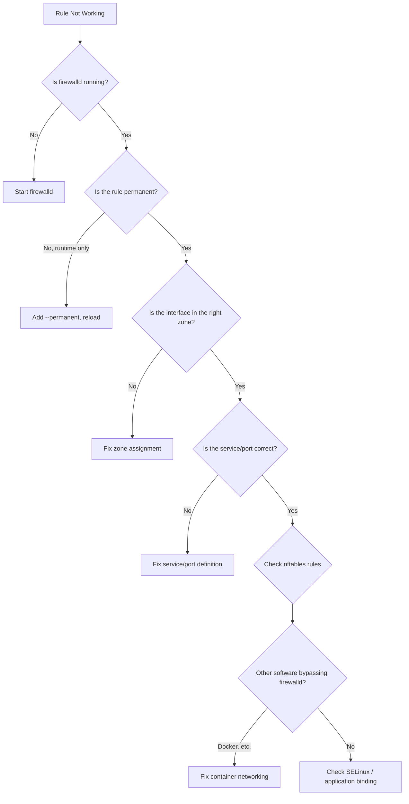

# How to Troubleshoot Firewalld Rules Not Working on RHEL

Author: [nawazdhandala](https://www.github.com/nawazdhandala)

Tags: RHEL, firewalld, Troubleshooting, Linux

Description: A systematic approach to debugging firewalld rules that are not working as expected on RHEL, covering common mistakes, zone issues, and diagnostic techniques.

---

You added a firewall rule, reloaded, and it still does not work. Maybe traffic is getting through when it should be blocked, or a service is unreachable even though you added it. Here is how to figure out what is going wrong.

## Troubleshooting Flow



## Step 1: Is Firewalld Actually Running?

```bash
# Check firewalld status
systemctl status firewalld

# Check firewalld state
firewall-cmd --state
```

If firewalld is not running, no rules are enforced:

```bash
# Start and enable firewalld
systemctl enable --now firewalld
```

## Step 2: Check Runtime vs Permanent

A very common issue: the rule was added with `--permanent` but firewalld was not reloaded.

```bash
# Check runtime config (what is actually active)
firewall-cmd --zone=public --list-all

# Check permanent config (what will be loaded on reload)
firewall-cmd --zone=public --list-all --permanent
```

If the rule appears in permanent but not runtime, reload:

```bash
firewall-cmd --reload
```

If the rule appears in runtime but not permanent, it will disappear on the next reload or reboot.

## Step 3: Verify the Interface Zone

This is one of the most common issues. Your interface might be in a different zone than you think:

```bash
# Check which zone each interface is in
firewall-cmd --get-active-zones

# Check a specific interface
firewall-cmd --get-zone-of-interface=eth0
```

If the interface is in the wrong zone, fix it:

```bash
firewall-cmd --zone=public --change-interface=eth0 --permanent
firewall-cmd --reload
```

## Step 4: Verify the Service or Port Is Added Correctly

```bash
# List services in the zone
firewall-cmd --zone=public --list-services

# List ports
firewall-cmd --zone=public --list-ports

# List rich rules
firewall-cmd --zone=public --list-rich-rules

# Check if a specific service is active
firewall-cmd --zone=public --query-service=http
```

## Step 5: Check the Application

Sometimes the problem is not the firewall at all:

```bash
# Is the application actually listening?
ss -tlnp | grep 8080

# Is it listening on the right interface?
# 0.0.0.0:8080 means all interfaces
# 127.0.0.1:8080 means localhost only (firewall irrelevant)
ss -tlnp | grep LISTEN
```

If the application binds to 127.0.0.1, no firewall rule will make it accessible from outside.

## Step 6: Check nftables Rules

Firewalld generates nftables rules. Check what is actually in the kernel:

```bash
# Show all nftables rules
nft list ruleset

# Filter for a specific zone's input chain
nft list chain inet firewalld filter_IN_public

# Count rules
nft list ruleset | wc -l
```

If the nftables output does not match what you expect from your firewalld config, there might be a conflict with another tool modifying nftables.

## Step 7: Check for External Rule Modifications

Docker, Podman, libvirt, and other tools can add their own nftables/iptables rules:

```bash
# Check for iptables rules (some tools still use iptables)
iptables -L -n -v

# Check for Docker-specific chains
iptables -L DOCKER -n 2>/dev/null

# Check for other nftables tables
nft list tables
```

## Step 8: Check SELinux

SELinux can block network access independently of the firewall:

```bash
# Check for SELinux denials
ausearch -m avc --start recent

# Check SELinux port labels
semanage port -l | grep 8080

# If your app uses a non-standard port, you may need to add it
semanage port -a -t http_port_t -p tcp 8080
```

## Step 9: Test with Firewalld Disabled

As a diagnostic step (not for production), temporarily stop firewalld to see if it is actually the problem:

```bash
# Stop firewalld temporarily
systemctl stop firewalld

# Test your connection
curl http://your-server:8080

# Start firewalld again immediately
systemctl start firewalld
```

If it works with firewalld stopped, the issue is definitely in your firewall rules.

## Step 10: Check Source-Based Zone Rules

Source-based rules take precedence over interface-based rules:

```bash
# Check if any sources are assigned to zones
firewall-cmd --get-active-zones

# Look for source entries
firewall-cmd --zone=drop --list-sources
firewall-cmd --zone=trusted --list-sources
```

If your client IP matches a source-based zone assignment, it will use that zone's rules instead of the interface zone.

## Common Mistakes and Fixes

### Mistake: Adding Service to Wrong Zone

```bash
# You added http to internal but your interface is in public
firewall-cmd --zone=internal --add-service=http --permanent  # Wrong zone!

# Fix: add to the correct zone
firewall-cmd --zone=public --add-service=http --permanent
firewall-cmd --reload
```

### Mistake: Port Number Typo

```bash
# Check your port is correct
firewall-cmd --zone=public --list-ports
# Shows: 8008/tcp  (but your app is on 8080)

# Fix
firewall-cmd --zone=public --remove-port=8008/tcp --permanent
firewall-cmd --zone=public --add-port=8080/tcp --permanent
firewall-cmd --reload
```

### Mistake: Rich Rule Blocking Before Allow

```bash
# Check rich rules that might be dropping traffic
firewall-cmd --zone=public --list-rich-rules

# A rich rule with a lower priority number that drops traffic
# will override a service allow rule
```

## Diagnostic One-Liner

```bash
# Quick diagnostic output
echo "=== State ===" && firewall-cmd --state && echo "=== Default Zone ===" && firewall-cmd --get-default-zone && echo "=== Active Zones ===" && firewall-cmd --get-active-zones && echo "=== Public Zone ===" && firewall-cmd --zone=public --list-all
```

## Summary

When firewalld rules are not working, check in this order: Is firewalld running? Is the rule in both runtime and permanent? Is the interface in the correct zone? Is the service/port added to that zone? Is the application listening on the right address? Are there external tools (Docker, etc.) bypassing firewalld? Is SELinux blocking? Work through these checks systematically, and you will find the issue. Nine times out of ten, it is either a zone mismatch or a missing reload.
