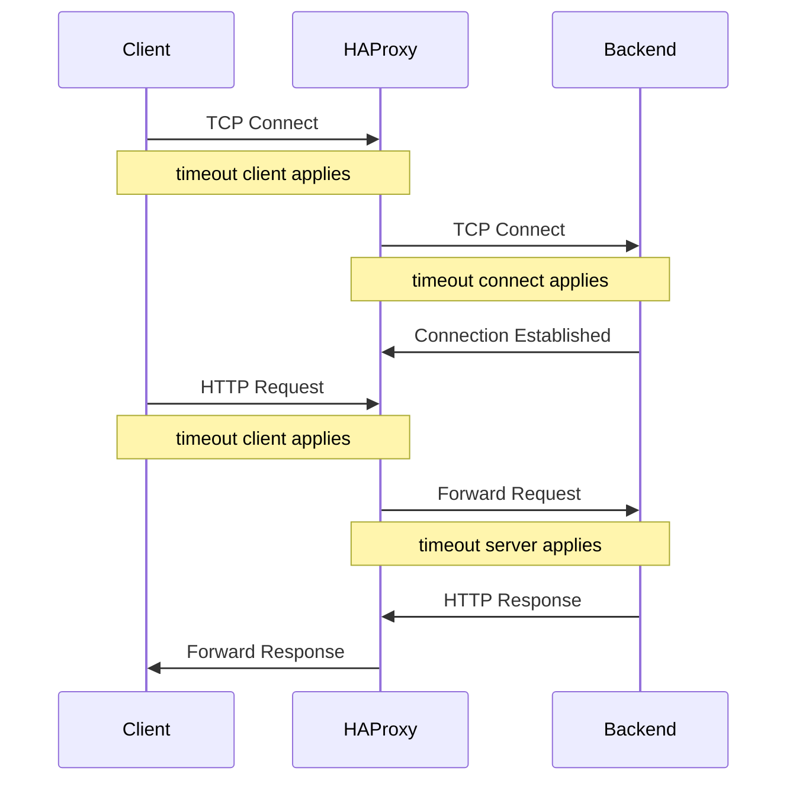
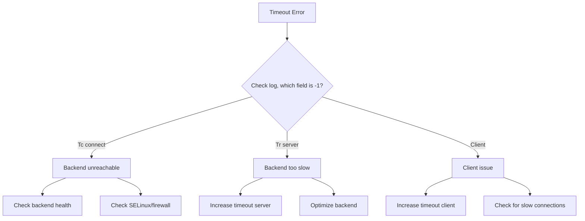

# How to Troubleshoot HAProxy Connection Timeout Issues on RHEL

Author: [nawazdhandala](https://www.github.com/nawazdhandala)

Tags: RHEL, HAProxy, Timeout, Troubleshooting, Linux

Description: A systematic guide to diagnosing and fixing connection timeout issues in HAProxy on RHEL.

---

## Understanding HAProxy Timeouts

HAProxy uses several timeout values that control how long it waits at different stages of a connection. When any of these timeouts expire, HAProxy drops the connection. If you are seeing timeouts, you need to understand which timeout is firing and why.

## The Three Core Timeouts

```bash
defaults
    timeout connect 5s
    timeout client 30s
    timeout server 30s
```

| Timeout | What It Controls |
|---------|-----------------|
| `timeout connect` | How long HAProxy waits to establish a TCP connection to the backend |
| `timeout client` | How long HAProxy waits for data from the client |
| `timeout server` | How long HAProxy waits for data from the backend |

## Timeout Flow



## Step 1 - Check the Logs

```bash
# View recent HAProxy logs
sudo journalctl -u haproxy --since "10 minutes ago" | grep -i timeout

# Or if you have a dedicated log file
sudo tail -100 /var/log/haproxy.log | grep -i -E "timeout|503|504"
```

HAProxy log entries include timing information. The format includes fields like `Tw/Tc/Tr/Tt`:

- **Tw**: Time waiting in queue
- **Tc**: Time to connect to the backend
- **Tr**: Time for the backend to send the response headers
- **Tt**: Total session time

A value of `-1` means a timeout occurred at that stage.

## Step 2 - Identify Which Timeout Is Firing

### timeout connect (-1 in Tc)

HAProxy cannot reach the backend server:

```bash
# Test connectivity to the backend
nc -zv 192.168.1.11 8080

# Check if the backend is listening
ss -tlnp | grep 8080
```

Common causes:
- Backend server is down
- Firewall blocking the connection
- SELinux blocking HAProxy
- Wrong IP or port in the configuration

Fix:

```bash
# Check SELinux
sudo setsebool -P haproxy_connect_any on

# Check firewall on the backend
sudo firewall-cmd --list-all
```

### timeout server (-1 in Tr)

The backend accepted the connection but did not respond in time:

```bash
# Test the backend response time directly
time curl http://192.168.1.11:8080/
```

Common causes:
- Backend application is slow
- Backend is overloaded
- Database queries taking too long

Fix by increasing the timeout or fixing the backend:

```bash
backend web_servers
    timeout server 60s
    server web1 192.168.1.11:8080 check
```

### timeout client (-1 in Tw or client-related)

The client stopped sending data:

Common causes:
- Client has a slow connection
- Client disconnected
- Large file uploads timing out

Fix:

```bash
defaults
    timeout client 60s
```

## Step 3 - Additional Timeout Parameters

Beyond the three core timeouts, there are others you might need:

```bash
defaults
    # Time to wait for a complete HTTP request from the client
    timeout http-request 10s

    # Time a connection can sit idle in keep-alive
    timeout http-keep-alive 10s

    # Time a request waits in the queue when all servers are full
    timeout queue 30s

    # Timeout for health checks
    timeout check 5s
```

### timeout http-request

This is important for preventing slowloris attacks. If the client does not send a complete HTTP request within this time, HAProxy closes the connection:

```bash
defaults
    timeout http-request 10s
```

### timeout queue

When all backend servers are at their connection limit, requests queue up. This timeout controls how long they wait:

```bash
defaults
    timeout queue 30s
```

If you see queue timeouts, you need more backend capacity.

## Step 4 - Check the Stats

Use the stats page or socket to see what is happening:

```bash
# Check current connections and queue depth
echo "show stat" | sudo socat stdio /var/lib/haproxy/stats | \
    awk -F',' '{print $1, $2, "cur_sess:", $5, "queue:", $3}'
```

A non-zero queue depth means requests are waiting for available backend slots.

## Step 5 - Check Backend Health

```bash
# Check backend server status
echo "show stat" | sudo socat stdio /var/lib/haproxy/stats | \
    awk -F',' '$18 != "" {print $1, $2, "status:", $18, "check_status:", $37}'
```

If backends keep going up and down (flapping), your health check timeouts might be too aggressive.

## Step 6 - Network-Level Diagnostics

```bash
# Check for dropped connections at the kernel level
ss -s

# Check for connection tracking table exhaustion
cat /proc/sys/net/netfilter/nf_conntrack_count
cat /proc/sys/net/netfilter/nf_conntrack_max

# Check for TIME_WAIT sockets
ss -s | grep TIME-WAIT
```

If `nf_conntrack_count` is near `nf_conntrack_max`, increase it:

```bash
# Increase the connection tracking table
sudo tee /etc/sysctl.d/99-conntrack.conf > /dev/null <<'EOF'
net.netfilter.nf_conntrack_max = 131072
EOF
sudo sysctl -p /etc/sysctl.d/99-conntrack.conf
```

## Step 7 - MaxConn Limits

Check if you are hitting connection limits:

```bash
global
    maxconn 4096

backend web_servers
    server web1 192.168.1.11:8080 check maxconn 200
```

If the global `maxconn` is reached, new connections are queued. If a server's `maxconn` is reached, HAProxy queues requests for that specific server.

```bash
# Check current vs. max connections
echo "show info" | sudo socat stdio /var/lib/haproxy/stats | \
    grep -E "CurrConns|MaxConn|ConnRate"
```

## Troubleshooting Decision Flow



## A Reasonable Production Configuration

```bash
defaults
    timeout connect 5s
    timeout client 30s
    timeout server 30s
    timeout http-request 10s
    timeout http-keep-alive 10s
    timeout queue 30s
    timeout check 5s
```

These defaults work for most web applications. Increase `timeout server` if your application has slow endpoints (reports, exports, etc.).

## Wrap-Up

Timeout troubleshooting in HAProxy comes down to reading the logs and understanding which timeout is firing. The timing fields in the log tell you exactly where the delay is. Most issues are either a backend that is too slow (increase `timeout server` or fix the application), a backend that is unreachable (check connectivity, SELinux, firewall), or too many connections overwhelming the system (increase `maxconn` or add more backends).
