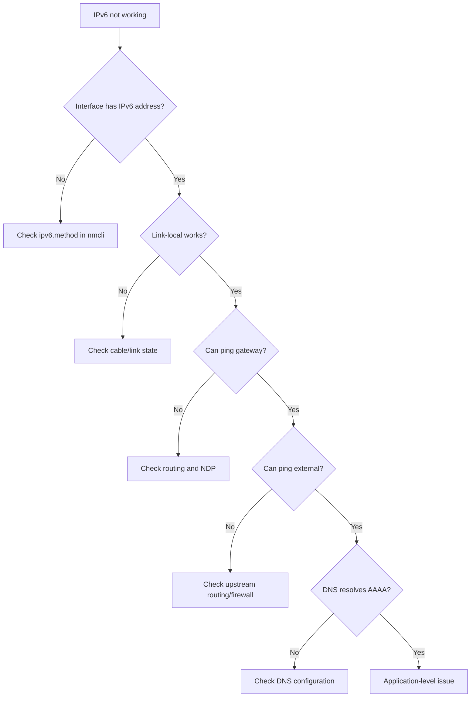

# How to Troubleshoot IPv6 Connectivity Issues on RHEL

Author: [nawazdhandala](https://www.github.com/nawazdhandala)

Tags: RHEL, IPv6, Troubleshooting, Linux

Description: A practical troubleshooting guide for diagnosing and fixing common IPv6 connectivity problems on RHEL, covering address assignment, routing, DNS, firewall, and neighbor discovery issues.

---

IPv6 troubleshooting follows a logical pattern, much like IPv4, but with its own quirks. The protocols are different, the addressing is different, and the tools have different flags. When IPv6 stops working on a RHEL box, here's the systematic approach I use to track down the problem.

## The Troubleshooting Flow



## Step 1: Verify IPv6 Is Enabled

The first thing to check is whether IPv6 is actually enabled on the interface and system-wide.

```bash
# Check if IPv6 is disabled at the kernel level
sysctl net.ipv6.conf.all.disable_ipv6
sysctl net.ipv6.conf.ens192.disable_ipv6

# Both should return 0 (enabled). If they return 1, IPv6 is disabled.

# Check if IPv6 was disabled via GRUB
cat /proc/cmdline | grep ipv6
```

If IPv6 is disabled at the kernel level, re-enable it:

```bash
# Re-enable IPv6 for all interfaces
sudo sysctl -w net.ipv6.conf.all.disable_ipv6=0
sudo sysctl -w net.ipv6.conf.default.disable_ipv6=0
```

## Step 2: Check Address Assignment

```bash
# List all IPv6 addresses
ip -6 addr show

# Check a specific interface
ip -6 addr show dev ens192
```

You should see at least a link-local address (starting with `fe80::`). If you expect a global address (from SLAAC or static config), check that too.

**No link-local address?** The interface might be down or IPv6 is disabled on it.

```bash
# Check interface state
ip link show dev ens192

# Check NetworkManager IPv6 method
nmcli connection show "ens192" | grep ipv6.method
```

**Address shows "tentative"?** Duplicate Address Detection is still running, or it found a conflict.

```bash
# Look for tentative addresses
ip -6 addr show dev ens192 | grep tentative

# Check kernel logs for DAD failures
dmesg | grep -i "DAD"
```

## Step 3: Test Link-Local Connectivity

Link-local should always work between two directly connected hosts. Test it to isolate whether the problem is local or upstream.

```bash
# Ping the link-local address of another host on the same segment
# Note: you must specify the interface with %
ping6 -c 4 fe80::1%ens192

# Check the neighbor table (IPv6 equivalent of ARP table)
ip -6 neigh show dev ens192
```

If link-local pings fail, you likely have a layer 2 problem (cable, switch, VLAN mismatch).

## Step 4: Check Routing

```bash
# Show the IPv6 routing table
ip -6 route show

# Check for a default route
ip -6 route show default
```

You need a default route for external connectivity. If it's missing and you are using SLAAC, you are not receiving Router Advertisements.

```bash
# Check if Router Advertisements are arriving
sudo tcpdump -i ens192 -n icmp6 and 'ip6[40] == 134' -c 3
# Type 134 is Router Advertisement
```

If no RAs are coming in, the problem is either on the router or the network is filtering ICMPv6.

## Step 5: Test Gateway Reachability

```bash
# Ping the default gateway
ping6 -c 4 2001:db8:1::1

# If the gateway is link-local, use the interface specifier
ping6 -c 4 fe80::1%ens192
```

If the gateway doesn't respond, check:
- Is the gateway actually running?
- Is there a firewall blocking ICMPv6?
- Is there a VLAN or subnet mismatch?

## Step 6: Test External Connectivity

```bash
# Ping a well-known IPv6 address
ping6 -c 4 2600::

# Try Google's public DNS over IPv6
ping6 -c 4 2001:4860:4860::8888
```

If this fails but the gateway responds, the problem is upstream. Check with your network team or ISP.

## Step 7: Check DNS Resolution

```bash
# Test AAAA record resolution
dig AAAA example.com

# Check which DNS servers are being used
cat /etc/resolv.conf

# Or check via resolvectl if systemd-resolved is active
resolvectl status
```

If DNS is not resolving AAAA records, your DNS servers might not support IPv6 queries, or your resolv.conf might only list IPv4 DNS servers.

```bash
# Add an IPv6 DNS server
sudo nmcli connection modify "ens192" +ipv6.dns "2001:4860:4860::8888"
sudo nmcli connection up "ens192"
```

## Step 8: Check the Firewall

firewalld on RHEL handles IPv6 automatically, but misconfigurations happen.

```bash
# Check current firewall rules
sudo firewall-cmd --list-all

# Specifically check if ICMPv6 is allowed (it must be for IPv6 to work)
sudo firewall-cmd --list-icmp-blocks

# Make sure essential ICMPv6 types are not blocked
sudo firewall-cmd --info-icmptype=neighbour-solicitation
sudo firewall-cmd --info-icmptype=neighbour-advertisement
sudo firewall-cmd --info-icmptype=router-solicitation
sudo firewall-cmd --info-icmptype=router-advertisement
```

If ICMPv6 is blocked, IPv6 will break in subtle and confusing ways. NDP relies on ICMPv6, and without NDP, nothing works.

```bash
# Temporarily disable the firewall to test if it's the cause
sudo systemctl stop firewalld

# Test connectivity again
ping6 -c 4 2001:4860:4860::8888

# If it works, the firewall is the problem. Re-enable and fix the rules.
sudo systemctl start firewalld
```

## Step 9: Check for Path MTU Issues

IPv6 doesn't allow fragmentation by routers, so Path MTU Discovery must work. If ICMPv6 "Packet Too Big" messages are blocked somewhere, you'll see connections hang or fail for large packets.

```bash
# Test with different packet sizes
ping6 -c 4 -s 1400 2001:4860:4860::8888
ping6 -c 4 -s 1500 2001:4860:4860::8888

# Check interface MTU
ip link show dev ens192 | grep mtu
```

## Step 10: Check for Application-Level Issues

If the network layer works but applications don't use IPv6:

```bash
# Check if the application is listening on IPv6
ss -tlnp | grep ":::"

# Verify /etc/gai.conf address selection preferences
cat /etc/gai.conf

# Test with curl explicitly over IPv6
curl -6 -v https://example.com
```

## Useful Diagnostic Commands Summary

```bash
# Full IPv6 diagnostics in one pass
echo "=== IPv6 Addresses ==="
ip -6 addr show
echo "=== IPv6 Routes ==="
ip -6 route show
echo "=== IPv6 Neighbors ==="
ip -6 neigh show
echo "=== DNS Config ==="
cat /etc/resolv.conf
echo "=== Firewall ==="
sudo firewall-cmd --list-all
echo "=== Sysctl ==="
sysctl net.ipv6.conf.all.disable_ipv6
sysctl net.ipv6.conf.all.forwarding
```

## Wrapping Up

IPv6 troubleshooting on RHEL follows a bottom-up approach: start at the interface level, check addresses, test link-local, verify routing, test external connectivity, and finally check DNS and applications. The most common issues I see are disabled IPv6 (someone set a sysctl and forgot), missing Router Advertisements, and firewalls blocking ICMPv6. Work through each layer systematically and you'll find the problem.
