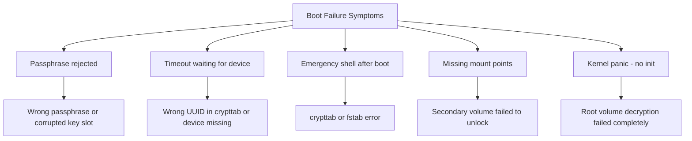

# How to Troubleshoot LUKS Decryption Failures at Boot on RHEL

Author: [nawazdhandala](https://www.github.com/nawazdhandala)

Tags: RHEL, LUKS, Boot Troubleshooting, Encryption, Decryption, Linux

Description: Diagnose and fix LUKS decryption failures at boot on RHEL when encrypted volumes fail to unlock, leaving the system unbootable or with missing mount points.

---

When a LUKS-encrypted volume fails to decrypt during boot, the system may hang at a passphrase prompt, drop to an emergency shell, or boot with missing filesystems. These failures can be caused by incorrect passphrases, corrupted headers, misconfigured crypttab entries, or initramfs issues. This guide provides a systematic approach to diagnosis and repair.

## Common Symptoms



## Step 1: Boot into Rescue Mode

If the system does not boot normally, use rescue mode:

### From GRUB Menu

1. At the GRUB boot menu, press `e` to edit the default entry
2. Find the line starting with `linux` or `linuxefi`
3. Add `rd.break` to the end of that line to drop to the initramfs shell
4. Or add `systemd.unit=emergency.target` for the emergency shell
5. Press Ctrl+X to boot

### From Installation Media

1. Boot from the RHEL installation ISO
2. Select "Troubleshooting" from the boot menu
3. Choose "Rescue a Red Hat Enterprise Linux system"
4. Select "Continue" to mount the existing system

## Step 2: Diagnose the Problem

### Check if the LUKS Device Exists

```bash
# List block devices
lsblk

# Check if the LUKS partition is present
blkid | grep crypto_LUKS

# If the device is not found, the disk may have hardware issues
# or the device name may have changed
```

### Check the LUKS Header

```bash
# Try to read the LUKS header
cryptsetup luksDump /dev/sda3

# If this fails with an error, the header may be corrupted
# You will need to restore from a header backup
```

### Test the Passphrase

```bash
# Test if the passphrase works
cryptsetup luksOpen --test-passphrase /dev/sda3

# If this fails, possible causes:
# - Wrong passphrase
# - Key slot corrupted
# - Header corrupted
```

### Check crypttab Configuration

```bash
# If you can access the root filesystem, check crypttab
cat /etc/crypttab

# Verify the UUID matches the actual device
blkid /dev/sda3

# Compare the UUID in crypttab with the actual device UUID
```

## Step 3: Fix Common Issues

### Wrong Passphrase

If you are sure of the passphrase but it is rejected:

```bash
# Check keyboard layout (boot environment may use US layout)
# Try typing the passphrase carefully

# Check how many key slots are active
cryptsetup luksDump /dev/sda3 | grep -A2 "Keyslots:"

# If you have a keyfile backup, try using it
cryptsetup luksOpen /dev/sda3 root_encrypted --key-file /path/to/backup.keyfile
```

### Corrupted LUKS Header

If the header is corrupted and you have a backup:

```bash
# Restore from header backup
cryptsetup luksHeaderRestore /dev/sda3 \
    --header-backup-file /path/to/header-backup.img

# Test the restored header
cryptsetup luksDump /dev/sda3
cryptsetup luksOpen --test-passphrase /dev/sda3
```

### Wrong UUID in crypttab

```bash
# Get the correct UUID
blkid /dev/sda3

# Mount the root filesystem (from rescue mode)
mount /dev/mapper/root_encrypted /mnt/sysroot

# Edit crypttab
vi /mnt/sysroot/etc/crypttab

# Correct the UUID
```

### Wrong Device Name

Device names can change between boots. Always use UUIDs:

```bash
# Bad: uses device name that may change
# luks-root /dev/sda3 none luks

# Good: uses UUID that is stable
# luks-root UUID=12345678-1234-1234-1234-123456789abc none luks
```

### initramfs Missing LUKS Support

If the initramfs does not include the necessary modules:

```bash
# From rescue mode, chroot into the installed system
chroot /mnt/sysroot

# Rebuild the initramfs with LUKS support
dracut --force --add "crypt dm rootfs-block"

# Or rebuild with verbose output to verify
dracut --force -v 2>&1 | grep -i "crypt\|luks"

# Exit chroot
exit
```

### Missing cryptsetup in initramfs

```bash
# Check if cryptsetup is in the initramfs
lsinitrd /boot/initramfs-$(uname -r).img | grep cryptsetup

# If missing, rebuild with explicit inclusion
dracut --force --install cryptsetup
```

## Step 4: Manual Unlock and Boot

If you need to manually unlock the volume to get the system booted:

```bash
# From the initramfs shell (rd.break)
# Manually open the LUKS device
cryptsetup luksOpen /dev/sda3 root_encrypted

# Mount the root filesystem
mount /dev/mapper/root_encrypted /sysroot
# Or if using LVM:
vgchange -ay
mount /dev/rhel/root /sysroot

# Continue boot
exit
```

## Step 5: Fix GRUB Configuration

Sometimes the GRUB configuration is missing the root device specification:

```bash
# Check the current GRUB configuration
cat /etc/default/grub

# Ensure rd.luks.uuid is present
# It should contain something like:
# GRUB_CMDLINE_LINUX="rd.luks.uuid=luks-UUID-HERE rd.lvm.lv=rhel/root ..."

# If missing, add it
# Get the LUKS UUID
cryptsetup luksDump /dev/sda3 | grep UUID

# Edit GRUB defaults
vi /etc/default/grub
# Add to GRUB_CMDLINE_LINUX: rd.luks.uuid=luks-YOUR-UUID-HERE

# Regenerate GRUB config
grub2-mkconfig -o /boot/grub2/grub.cfg
# For UEFI systems:
# grub2-mkconfig -o /boot/efi/EFI/redhat/grub.cfg
```

## Step 6: Prevent Future Issues

### Set Up a Backup Passphrase

```bash
# Add a second passphrase to a different key slot
cryptsetup luksAddKey /dev/sda3
```

### Back Up the LUKS Header Regularly

```bash
# Create a backup after any key changes
cryptsetup luksHeaderBackup /dev/sda3 \
    --header-backup-file /root/luks-header-backup.img

# Store copies off-system
```

### Document Your Setup

Keep a record of:
- Which devices are encrypted
- Their UUIDs
- Which key slots are in use
- Where header backups are stored

## Quick Troubleshooting Checklist

| Issue | Check | Fix |
|-------|-------|-----|
| Passphrase rejected | `cryptsetup luksOpen --test-passphrase` | Verify correct passphrase, check keyboard layout |
| Header corrupted | `cryptsetup luksDump` shows errors | Restore from header backup |
| Wrong UUID | Compare `blkid` with `/etc/crypttab` | Update UUID in crypttab |
| Missing modules | `lsinitrd \| grep crypt` | Rebuild initramfs with `dracut --force` |
| GRUB misconfigured | Check `rd.luks.uuid` in GRUB | Regenerate GRUB config |

## Summary

LUKS decryption failures at boot on RHEL are usually caused by passphrase issues, header corruption, misconfigured crypttab entries, or missing initramfs modules. Boot into rescue mode to diagnose the problem, fix the configuration, and rebuild the initramfs if needed. Prevent future issues by maintaining header backups, keeping a backup passphrase, and always using UUIDs instead of device names.
