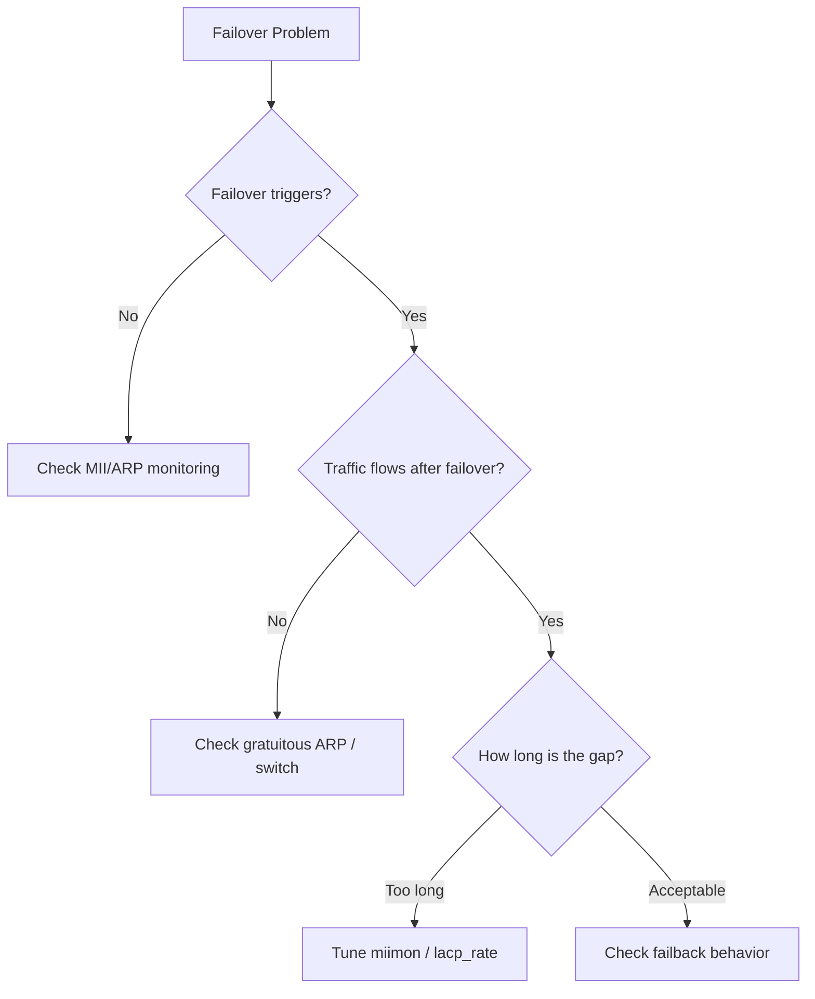

# How to Troubleshoot Network Bond Failover Issues on RHEL 9

Author: [nawazdhandala](https://www.github.com/nawazdhandala)

Tags: RHEL, Network Bonding, Failover, Troubleshooting, Linux

Description: A troubleshooting guide for diagnosing and fixing common network bond failover problems on RHEL 9, from link detection failures to gratuitous ARP issues.

---

Bond failover is supposed to be automatic and invisible to applications. When it does not work as expected, debugging can be frustrating because the problem could be in the bond configuration, the NIC driver, the switch, or the network topology. Here is a systematic approach to diagnosing failover issues.

## Common Failover Symptoms

Before diving in, identify which symptom you are seeing:

1. **Failover does not happen at all** - Active slave goes down, traffic stops
2. **Failover happens but connectivity is lost** - Bond switches slaves but packets do not flow
3. **Failover is slow** - Several seconds of packet loss during switchover
4. **Failback causes problems** - Primary comes back and causes an outage



## Problem 1: Failover Does Not Trigger

If the active slave loses its link and the bond does not switch to a backup, the issue is almost always in link monitoring.

### Check MII Monitoring

```bash
# Verify the bond configuration
cat /proc/net/bonding/bond0 | grep -E "MII|Polling"
```

Look for:
- `MII Polling Interval (ms)`: Should not be 0
- `MII Status`: Should reflect the actual link state

If `miimon` is set to 0, no link monitoring happens:

```bash
# Fix: set miimon to 100ms
nmcli connection modify bond0 bond.options "mode=active-backup,miimon=100"
nmcli connection down bond0 && nmcli connection up bond0
```

### Check If MII Reports Correct Link State

Some NIC drivers do not properly report link state through MII. Verify:

```bash
# Check if ethtool reports the link correctly
ethtool eth0 | grep "Link detected"
ethtool eth1 | grep "Link detected"
```

Pull the cable from the active NIC and check again. If ethtool still shows "Link detected: yes" after the cable is pulled, the driver has a bug. In that case, use ARP monitoring instead:

```bash
# Switch to ARP-based monitoring
nmcli connection modify bond0 bond.options "mode=active-backup,arp_interval=1000,arp_ip_target=10.0.1.1"
nmcli connection down bond0 && nmcli connection up bond0
```

## Problem 2: Failover Happens but No Connectivity

The bond switches slaves, but traffic stops flowing. This usually means the network has not learned the new path.

### Gratuitous ARP Issues

When a failover occurs, the bond sends gratuitous ARP packets to notify switches that the MAC address has moved to a different port. If these ARPs do not work:

```bash
# Check if gratuitous ARPs are being sent
# Watch for ARP packets during a failover test
tcpdump -i bond0 arp -n

# In another terminal, force a failover
nmcli device disconnect eth0
```

You should see gratuitous ARP broadcast frames after the failover. If not, check:

```bash
# Verify num_grat_arp setting (default is 1)
cat /proc/net/bonding/bond0 | grep -i grat
```

Increase the number of gratuitous ARPs sent during failover:

```bash
# Send more gratuitous ARPs to make sure switches learn the new path
nmcli connection modify bond0 bond.options "mode=active-backup,miimon=100,num_grat_arp=3"
nmcli connection down bond0 && nmcli connection up bond0
```

### Switch MAC Table Issues

Some enterprise switches have long MAC address aging timers. Even after receiving a gratuitous ARP, the old entry might stick. Check with your network team if the switch has:

- Port security that limits MAC addresses per port
- MAC address sticky entries
- Long aging timers

You can verify from the server side by checking ARP:

```bash
# Verify ARP table on the server
ip neigh show dev bond0

# Clear and refresh ARP
ip neigh flush dev bond0
ping -c 1 10.0.1.1
```

## Problem 3: Slow Failover

If failover works but takes too long, tune the detection speed.

### Reduce MII Polling Interval

```bash
# Faster link detection at 50ms
nmcli connection modify bond0 bond.options "mode=active-backup,miimon=50"
nmcli connection down bond0 && nmcli connection up bond0
```

### For LACP Bonds, Use Fast Rate

```bash
# Fast LACP rate sends PDUs every second instead of every 30 seconds
nmcli connection modify bond0 bond.options "mode=802.3ad,miimon=100,lacp_rate=fast"
nmcli connection down bond0 && nmcli connection up bond0
```

### Measure Failover Time

Use ping with timestamps to measure the gap:

```bash
# Ping with timestamps to measure failover duration
ping -D -i 0.1 10.0.1.1
```

In another terminal, pull the active slave:

```bash
nmcli device disconnect eth0
```

Count the missed ping replies to calculate the failover duration.

## Problem 4: Failback Causes Outage

The primary slave recovers and the bond switches back to it, causing a brief outage.

### Disable Automatic Failback

```bash
# Do not switch back to primary when it recovers
nmcli connection modify bond0 bond.options "mode=active-backup,miimon=100,primary=eth0,primary_reselect=failure"
nmcli connection down bond0 && nmcli connection up bond0
```

With `primary_reselect=failure`, the bond only uses the primary on initial boot. Once a failover happens, the current active slave remains active even after the primary recovers.

## Checking Bond Events in Logs

The kernel bonding driver logs events to the journal:

```bash
# View recent bonding events
journalctl -k | grep -i bond

# Watch for bonding events in real time
journalctl -kf | grep -i bond
```

Look for messages like:
- `bond0: link status definitely down for interface eth0`
- `bond0: making interface eth1 the new active one`
- `bond0: link status up again after X ms for interface eth0`

## Comprehensive Diagnostic Script

Here is a script that gathers all the information you need for troubleshooting:

```bash
#!/bin/bash
BOND="bond0"

echo "=== Bond Configuration ==="
cat /proc/net/bonding/$BOND

echo ""
echo "=== Interface Status ==="
nmcli device status

echo ""
echo "=== IP Configuration ==="
ip addr show $BOND

echo ""
echo "=== ARP Table ==="
ip neigh show dev $BOND

echo ""
echo "=== Recent Kernel Bond Events ==="
journalctl -k --no-pager | grep -i bond | tail -20

echo ""
echo "=== Slave Interface Details ==="
for slave in $(cat /proc/net/bonding/$BOND | grep "Slave Interface" | awk '{print $3}'); do
    echo "--- $slave ---"
    ethtool $slave | grep -E "Speed|Duplex|Link"
done
```

## Summary

Bond failover problems fall into four categories: detection (MII or ARP monitoring), notification (gratuitous ARP), speed (polling intervals), and failback (primary reselection). Start by identifying which category your issue falls into, check the bond status in `/proc/net/bonding/bond0`, look at kernel logs, and verify the switch side. Most issues trace back to either misconfigured monitoring or switches that do not update their MAC tables quickly enough.
