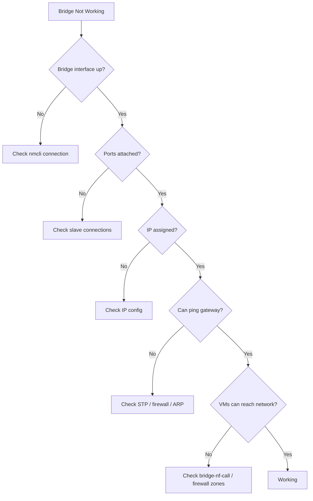

# How to Troubleshoot Network Bridge Connectivity Issues on RHEL

Author: [nawazdhandala](https://www.github.com/nawazdhandala)

Tags: RHEL, Network Bridge, Troubleshooting, Linux

Description: A systematic troubleshooting guide for diagnosing and fixing network bridge connectivity problems on RHEL, covering common issues with STP, firewall, and configuration errors.

---

Bridge networking issues can be maddening because the problem could be in the bridge configuration, the port settings, STP, the firewall, kernel netfilter, or the switch. Here is a structured approach to figuring out what is broken.

## Troubleshooting Flow



## Step 1: Verify Bridge Is Up

```bash
# Check if the bridge interface exists and is up
ip link show br0

# Check if the bridge connection is active
nmcli connection show --active | grep br0

# If the bridge is not active, bring it up
nmcli connection up br0
```

## Step 2: Verify Ports Are Attached

```bash
# List all ports on the bridge
bridge link show

# You should see your physical NIC and any VM tap interfaces
# Example output:
# 2: eth0: <BROADCAST,MULTICAST,UP> mtu 1500 master br0 state forwarding
# 5: vnet0: <BROADCAST,MULTICAST,UP> mtu 1500 master br0 state forwarding
```

If your physical NIC is not listed as a bridge port:

```bash
# Check if the port connection exists
nmcli connection show | grep br0

# If missing, add the port
nmcli connection add type ethernet con-name br0-port ifname eth0 master br0
nmcli connection up br0
```

## Step 3: Check Port States

Bridge ports go through several STP states: disabled, blocking, listening, learning, and forwarding. Only ports in the "forwarding" state pass traffic.

```bash
# Check port states
bridge link show

# If a port is in "blocking" or "listening" state, STP is holding it
```

If STP is causing a 30-second delay:

```bash
# Check STP status
nmcli connection show br0 | grep bridge.stp

# Disable STP if you have a simple topology without loops
nmcli connection modify br0 bridge.stp no
nmcli connection modify br0 bridge.forward-delay 0
nmcli connection down br0 && nmcli connection up br0
```

## Step 4: Check IP Configuration

```bash
# Verify the bridge has an IP address
ip addr show br0

# Make sure the physical NIC does NOT have an IP
# The IP should be on the bridge, not the port
ip addr show eth0
```

If the IP is on eth0 instead of br0, that is the problem. Move it:

```bash
# Remove IP from the physical NIC connection
nmcli connection modify "Wired connection 1" ipv4.method disabled

# Set IP on the bridge
nmcli connection modify br0 ipv4.addresses 192.168.1.100/24
nmcli connection modify br0 ipv4.gateway 192.168.1.1
nmcli connection modify br0 ipv4.method manual
nmcli connection up br0
```

## Step 5: Check ARP Resolution

```bash
# Verify ARP works
arping -I br0 192.168.1.1

# Check the ARP table
ip neigh show dev br0
```

If ARP does not resolve, the problem is at Layer 2. Check:

- Is the physical NIC actually linked up? `ethtool eth0 | grep "Link detected"`
- Is the switch port configured correctly?
- Is there a VLAN mismatch?

## Step 6: Check Firewall

Firewalld can block bridge traffic in multiple ways:

```bash
# Check which zone the bridge is in
firewall-cmd --get-active-zones

# Check if the bridge is in a zone at all
firewall-cmd --get-zone-of-interface=br0
```

If the bridge is in the wrong zone or missing:

```bash
# Add bridge to the appropriate zone
firewall-cmd --zone=trusted --change-interface=br0 --permanent
firewall-cmd --reload
```

## Step 7: Check Kernel Bridge Netfilter

This is a common gotcha. By default, the Linux kernel passes bridge traffic through iptables/nftables. This means firewall rules intended for routed traffic can accidentally block bridged traffic.

```bash
# Check bridge netfilter settings
sysctl net.bridge.bridge-nf-call-iptables
sysctl net.bridge.bridge-nf-call-ip6tables
sysctl net.bridge.bridge-nf-call-arptables
```

If these are set to 1 and you do not intend to filter bridge traffic:

```bash
# Disable bridge netfilter (allows all bridge traffic to pass)
cat > /etc/sysctl.d/99-bridge.conf << 'EOF'
net.bridge.bridge-nf-call-iptables = 0
net.bridge.bridge-nf-call-ip6tables = 0
net.bridge.bridge-nf-call-arptables = 0
EOF

# Load the bridge module first (sysctl params only exist when module is loaded)
modprobe br_netfilter
sysctl -p /etc/sysctl.d/99-bridge.conf
```

## Step 8: Check for Duplicate Connections

NetworkManager can create duplicate connections that conflict:

```bash
# List all connections
nmcli connection show

# Look for multiple connections on the same interface
# If eth0 has both "Wired connection 1" and "br0-port", there is a conflict
```

Delete the unwanted connection:

```bash
# Delete the conflicting connection
nmcli connection delete "Wired connection 1"
```

## Step 9: Capture Traffic

When all else fails, use tcpdump to see what is happening:

```bash
# Capture on the bridge interface
tcpdump -i br0 -nn

# Capture on the physical port
tcpdump -i eth0 -nn

# Capture only ARP to debug Layer 2 issues
tcpdump -i br0 arp -nn

# Capture traffic from a specific VM
tcpdump -i vnet0 -nn
```

Compare captures on the bridge and the physical port. If traffic appears on the physical port but not the bridge (or vice versa), the problem is in the bridge configuration.

## Step 10: Check for MAC Address Issues

```bash
# View the bridge forwarding database
bridge fdb show br br0

# Check the bridge's own MAC address
ip link show br0 | grep ether
```

The bridge typically inherits the MAC address of the first port. If this changes (e.g., port removed and re-added), it can cause connectivity issues until ARP caches update.

## VM-Specific Issues

If the host works but VMs cannot reach the network:

```bash
# Check VM tap interface is on the bridge
bridge link show | grep vnet

# Verify the VM's virtual NIC model is virtio
virsh dumpxml vmname | grep -A5 interface

# Check if hairpin mode is needed (VM-to-VM on same bridge)
bridge link show dev vnet0
```

## Quick Diagnostic Script

```bash
#!/bin/bash
BR="br0"

echo "=== Bridge Interface ==="
ip addr show $BR 2>/dev/null || echo "Bridge $BR does not exist!"

echo ""
echo "=== Bridge Ports ==="
bridge link show 2>/dev/null

echo ""
echo "=== STP Status ==="
nmcli -f bridge.stp connection show $BR 2>/dev/null

echo ""
echo "=== Firewall Zone ==="
firewall-cmd --get-zone-of-interface=$BR 2>/dev/null

echo ""
echo "=== Bridge Netfilter ==="
sysctl net.bridge.bridge-nf-call-iptables 2>/dev/null || echo "br_netfilter module not loaded"

echo ""
echo "=== ARP Table ==="
ip neigh show dev $BR

echo ""
echo "=== Gateway Ping ==="
GATEWAY=$(nmcli -g ipv4.gateway connection show $BR 2>/dev/null)
if [ -n "$GATEWAY" ]; then
    ping -c 2 -W 2 $GATEWAY
fi
```

## Summary

Bridge troubleshooting comes down to checking each layer: Is the bridge up? Are ports attached and forwarding? Is the IP on the bridge (not the port)? Is STP blocking? Is the firewall interfering? Is bridge netfilter passing traffic through iptables? Work through these checks in order, and use tcpdump when the answer is not obvious. Nine times out of ten, the issue is either STP delay, firewall zone assignment, or bridge-nf-call-iptables filtering bridge traffic.
