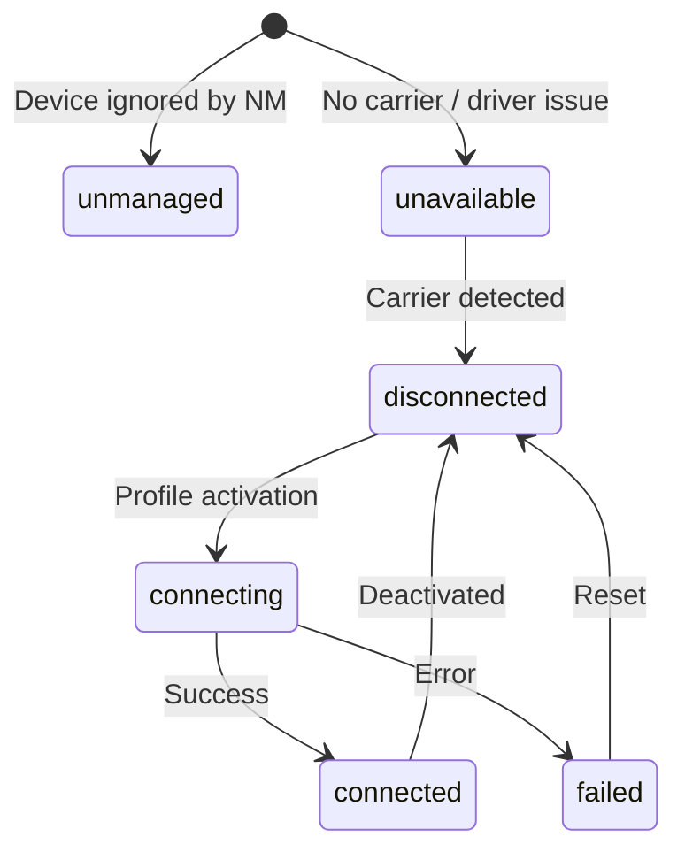
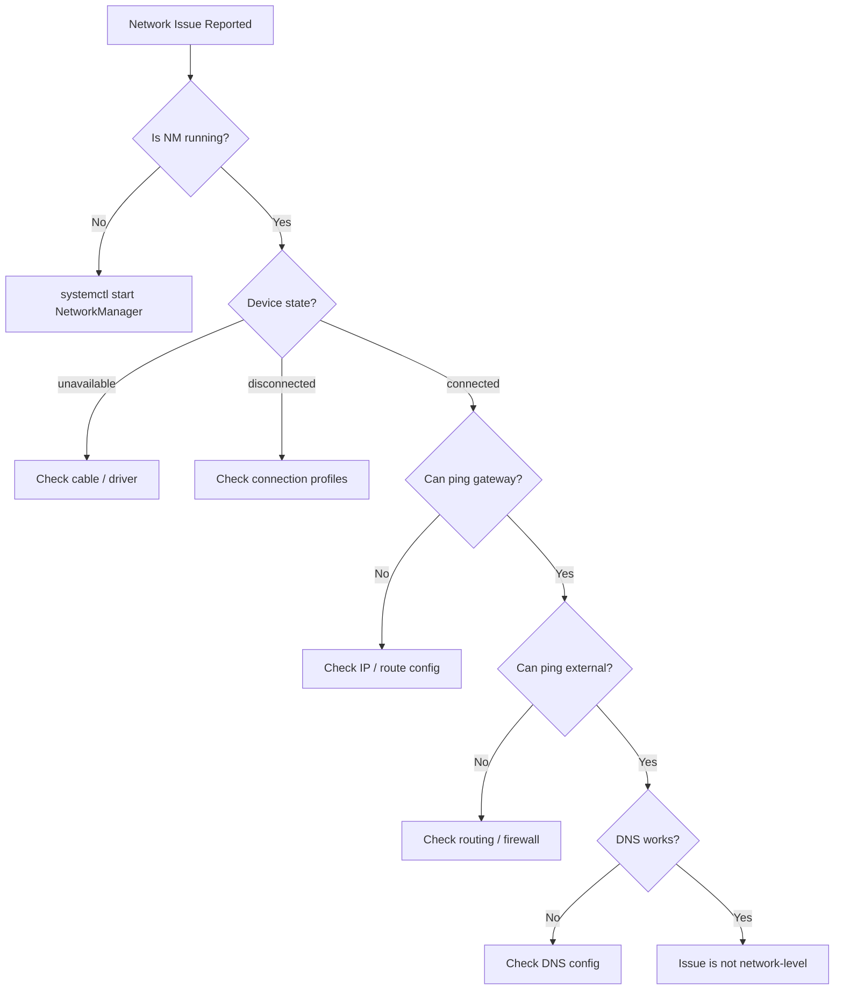

# How to Troubleshoot NetworkManager Connection Issues on RHEL

Author: [nawazdhandala](https://www.github.com/nawazdhandala)

Tags: RHEL, NetworkManager, Troubleshooting, Linux

Description: A practical troubleshooting guide for diagnosing and resolving NetworkManager connection problems on RHEL, with real-world scenarios and debugging techniques.

---

When networking breaks on a RHEL server, the pressure is on. You need to find the problem and fix it fast. NetworkManager handles all the network configuration on RHEL, so knowing how to extract useful diagnostic information from it is a critical skill. This post covers the tools and techniques I use when things go wrong.

## Start with the Basics

Before diving into logs and traces, check the obvious stuff first:

```bash
# Is NetworkManager running?
systemctl status NetworkManager

# Is networking enabled?
nmcli networking

# What is the overall connectivity state?
nmcli general status

# What devices are available and what state are they in?
nmcli device status
```

The device status output tells you a lot at a glance:

```
DEVICE  TYPE      STATE         CONNECTION
ens192  ethernet  connected     office-static
ens224  ethernet  disconnected  --
lo      loopback  connected     lo
```

If a device shows "disconnected" when it should be connected, or "unavailable" when it should be ready, you have your starting point.

## Understanding Device States



**unmanaged** - NetworkManager is not handling this device. Check if it is listed in an unmanaged-devices directive.

**unavailable** - The device exists but is not ready. Usually means no cable is plugged in (no carrier) or the driver is not loaded.

**disconnected** - The device is ready but no connection profile is active on it.

**connecting** - A profile activation is in progress.

**connected** - Everything is working.

**failed** - The last activation attempt failed.

## Checking Logs

NetworkManager logs to the systemd journal. This is your primary debugging tool:

```bash
# View recent NetworkManager logs
journalctl -u NetworkManager --since "10 minutes ago" --no-pager

# Follow the log in real time (useful while reproducing issues)
journalctl -u NetworkManager -f

# Show logs for a specific time window
journalctl -u NetworkManager --since "2026-03-04 14:00" --until "2026-03-04 14:30"
```

### Increasing Log Verbosity

The default log level might not show enough detail. You can increase it temporarily:

```bash
# Set debug-level logging for all domains
nmcli general logging level DEBUG domains ALL

# Check current logging settings
nmcli general logging

# Reset to default after troubleshooting
nmcli general logging level INFO domains DEFAULT
```

With debug logging enabled, NetworkManager produces a lot of output, so use it sparingly and remember to turn it off afterward.

## Common Problems and Solutions

### Problem: Connection Profile Will Not Activate

Symptoms: `nmcli connection up` fails or the connection keeps dropping.

```bash
# Check the connection profile for errors
nmcli connection show office-static

# Look for activation errors in the log
journalctl -u NetworkManager --since "5 minutes ago" | grep -i "error\|fail\|reject"

# Try to activate with verbose output
nmcli --wait 10 connection up office-static
```

Common causes:
- IP address conflict (another device already has that IP)
- Wrong subnet mask or gateway
- The interface name in the profile does not match any device
- The keyfile has incorrect permissions (must be 600)

### Problem: No IP Address After DHCP

```bash
# Check if the DHCP client is getting a response
journalctl -u NetworkManager --since "5 minutes ago" | grep -i dhcp

# Verify the interface is up at the link layer
ip link show ens192

# Check for carrier (cable connected)
cat /sys/class/net/ens192/carrier
```

If the carrier file shows `0`, the cable is not connected or the switch port is down. If DHCP logs show timeouts, the DHCP server may be unreachable - check VLANs and switch configuration.

### Problem: DNS Resolution Fails

```bash
# Check what DNS servers are configured
nmcli device show ens192 | grep DNS

# Check the resolv.conf file
cat /etc/resolv.conf

# Test DNS directly with a specific server
dig @8.8.8.8 google.com

# Check if systemd-resolved is interfering
systemctl status systemd-resolved
```

On RHEL, `/etc/resolv.conf` is managed by NetworkManager. If you see unexpected content, check whether another service is overwriting it.

### Problem: Connection Drops Intermittently

```bash
# Check for carrier changes (cable flapping)
journalctl -u NetworkManager | grep "carrier"

# Check for DHCP lease issues
journalctl -u NetworkManager | grep "lease"

# Monitor the connection in real time
nmcli connection monitor office-static

# Check interface error counters
ip -s link show ens192
```

Look for CRC errors, dropped packets, or carrier state changes. These often point to a physical layer problem - bad cable, failing NIC, or switch port issue.

### Problem: Wrong Route or Missing Gateway

```bash
# Show the current routing table
ip route show

# Show routes with metrics
ip route show | sort -t ' ' -k 7 -n

# Check what routes the connection profile defines
nmcli connection show office-static | grep route

# Check the default gateway
ip route show default
```

If you have multiple interfaces, the default route might be going out the wrong one. Use route metrics to control priority:

```bash
# Set a lower metric for the preferred interface (lower = higher priority)
nmcli connection modify office-static ipv4.route-metric 100
nmcli connection modify mgmt-network ipv4.route-metric 200
nmcli connection up office-static
```

## Advanced Debugging

### Packet Capture

When you need to see what is actually on the wire:

```bash
# Capture packets on an interface (install tcpdump if needed)
dnf install tcpdump -y
tcpdump -i ens192 -n -c 100

# Capture only DHCP traffic
tcpdump -i ens192 -n port 67 or port 68

# Capture and save to a file for analysis
tcpdump -i ens192 -w /tmp/capture.pcap -c 1000
```

### Checking Firewall Rules

firewalld can silently block traffic:

```bash
# Check which zone the interface is in
firewall-cmd --get-active-zones

# List rules for the active zone
firewall-cmd --zone=public --list-all

# Temporarily disable the firewall to test (re-enable immediately after)
systemctl stop firewalld
# ... test connectivity ...
systemctl start firewalld
```

### NetworkManager Dispatcher Scripts

Dispatcher scripts run when network events occur and can sometimes cause problems:

```bash
# List dispatcher scripts
ls -la /etc/NetworkManager/dispatcher.d/

# Check if any scripts are failing
journalctl -u NetworkManager-dispatcher --since "10 minutes ago"
```

### Verifying Keyfile Integrity

Corrupted or malformed keyfiles can prevent connections from loading:

```bash
# Check that all profiles loaded successfully
nmcli connection show

# Look for loading errors
journalctl -u NetworkManager | grep -i "keyfile\|error.*load\|invalid"

# Verify file permissions
ls -la /etc/NetworkManager/system-connections/
```

## The Troubleshooting Checklist

When you get a networking call, work through this checklist:



## Wrapping Up

Most NetworkManager issues fall into a handful of categories: physical layer problems, configuration errors, DHCP failures, DNS issues, or routing problems. The key is to methodically work through the layers, starting with "is the cable plugged in" and working up to "are the DNS records correct." The journal logs and nmcli diagnostic output give you everything you need to identify the root cause. Just remember to turn off debug logging when you are done troubleshooting - your disk space will thank you.
