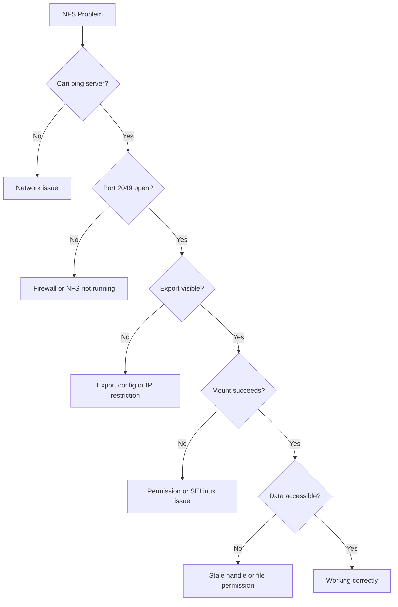

# How to Troubleshoot NFS Mount Failures and Stale Handles on RHEL 9

Author: [nawazdhandala](https://www.github.com/nawazdhandala)

Tags: RHEL, NFS, Troubleshooting, Linux

Description: Diagnose and fix common NFS problems on RHEL 9, including mount failures, stale file handles, permission issues, and hung mounts.

---

## Common NFS Problems

NFS issues tend to fall into a few categories: connection failures, permission denials, stale file handles, and hung mounts. Each has a systematic approach to diagnosis and resolution.

## Problem 1 - Mount Fails with "Connection Refused"

This means the client can reach the server, but the NFS service is not responding.

```bash
# Check if the NFS server process is running
sudo systemctl status nfs-server

# Check if port 2049 is listening
ss -tlnp | grep 2049

# From the client, test connectivity
nc -zv 192.168.1.10 2049
```

Fixes:
```bash
# Start the NFS server if it is stopped
sudo systemctl start nfs-server

# If the port is not listening, check for port conflicts
sudo ss -tlnp | grep 2049
```

## Problem 2 - Mount Fails with "Permission Denied"

```bash
# On the client, check what the server exports
showmount -e 192.168.1.10

# Common causes:
# 1. Client IP not in the export list
# 2. Export path is wrong
# 3. SELinux blocking the export
```

On the server, verify the export:

```bash
# Check active exports
sudo exportfs -v

# Check if SELinux is blocking
sudo ausearch -m avc --start recent | grep nfs

# Fix SELinux if needed
sudo setsebool -P nfs_export_all_rw on
```

## Problem 3 - Stale File Handles (ESTALE)

Stale file handles happen when the server-side file or directory has been deleted and recreated, but the client still holds a reference to the old file handle.

```bash
# The error looks like this:
# ls: cannot access '/mnt/nfs/somefile': Stale file handle
```

### Fix 1 - Unmount and Remount

```bash
# Try a regular unmount
sudo umount /mnt/nfs-data

# If that fails because it is busy
sudo umount -l /mnt/nfs-data

# Remount
sudo mount -a
```

### Fix 2 - Force Unmount

```bash
# Force unmount when lazy unmount does not work
sudo umount -f /mnt/nfs-data
```

### Fix 3 - Server-Side Export Refresh

On the server:

```bash
# Re-export all shares
sudo exportfs -ra

# Restart NFS if needed
sudo systemctl restart nfs-server
```

## Problem 4 - Hung Mounts

A hung NFS mount typically means the server is unreachable or overloaded. Processes accessing the mount point will hang in an uninterruptible state.

```bash
# Check for hung NFS processes
ps aux | grep " D "

# Check NFS mount status
nfsstat -m

# Check if the server is reachable
ping 192.168.1.10
```

### Preventing Hung Mounts

Use the `soft` mount option or set reasonable timeouts:

```bash
# Soft mount with timeout (returns error instead of hanging)
sudo mount -t nfs -o soft,timeo=30,retrans=3 192.168.1.10:/srv/nfs/data /mnt/nfs-data

# Or use hard with intr (allows interrupt with Ctrl+C)
sudo mount -t nfs -o hard,intr 192.168.1.10:/srv/nfs/data /mnt/nfs-data
```

## Problem 5 - "No Route to Host"

```bash
# Check basic connectivity
ping 192.168.1.10

# Check firewall on the server
sudo firewall-cmd --list-services

# Open NFS if needed
sudo firewall-cmd --permanent --add-service=nfs
sudo firewall-cmd --reload
```

## Diagnostic Flow



## Problem 6 - RPC Errors

```bash
# Check RPC services
rpcinfo -p 192.168.1.10

# If rpcbind is not running
sudo systemctl start rpcbind

# Check for RPC-related errors
journalctl -u rpcbind
journalctl -u rpc-gssd
```

## Using rpcdebug for Detailed Logs

For deep troubleshooting, enable NFS debug logging:

```bash
# Enable NFS client debug logging
sudo rpcdebug -m nfs -s all

# Reproduce the problem

# Check the kernel log
dmesg | tail -50

# Disable debug logging (produces a LOT of output)
sudo rpcdebug -m nfs -c all
```

On the server side:

```bash
# Enable NFS server debug logging
sudo rpcdebug -m nfsd -s all

# After reproducing the problem
sudo rpcdebug -m nfsd -c all

# Check logs
dmesg | tail -50
```

## Checking NFS Statistics

```bash
# Client-side NFS statistics
nfsstat -c

# Server-side statistics
nfsstat -s

# Per-mount statistics
cat /proc/self/mountstats
```

Look for high retransmission counts, which indicate network issues.

## Problem 7 - UID/GID Mismatch

Files show the wrong owner or "nobody" on the client:

```bash
# Check if idmapd is running (required for NFSv4 ID mapping)
sudo systemctl status nfs-idmapd

# Verify the domain in /etc/idmapd.conf matches on server and client
grep Domain /etc/idmapd.conf

# Restart idmapd after changes
sudo systemctl restart nfs-idmapd
```

The Domain value in /etc/idmapd.conf must be identical on server and all clients.

## Wrap-Up

NFS troubleshooting on RHEL 9 follows a logical progression: check connectivity, then the service, then exports, then permissions, then SELinux. Most problems fall into one of these categories, and the fix is usually straightforward once you identify which layer is failing. Keep rpcdebug and nfsstat in your toolkit for the trickier issues, and always check SELinux early in your diagnosis.
