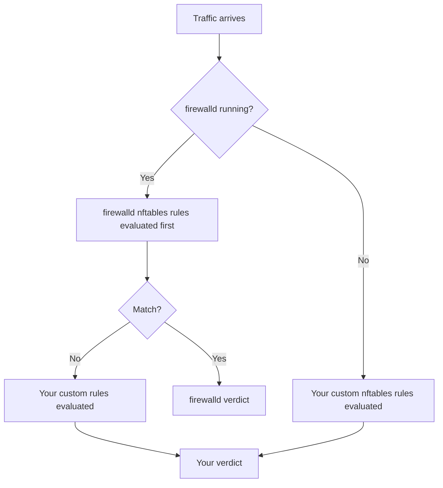

# How to Troubleshoot nftables Rules Not Working on RHEL

Author: [nawazdhandala](https://www.github.com/nawazdhandala)

Tags: RHEL, nftables, Troubleshooting, Linux

Description: Practical troubleshooting steps for when your nftables rules aren't behaving as expected on RHEL, covering common mistakes and debugging techniques.

---

You wrote your nftables rules, applied them, and traffic that should be blocked is getting through, or worse, traffic that should be allowed is getting dropped. This is one of the most frustrating things in systems administration. Let's work through the most common causes and how to fix them.

## Step 1: Verify Rules Are Actually Loaded

The first thing to check is whether your rules are actually in place. It sounds obvious, but services restart, configs get overwritten, and typos happen.

List the full ruleset:

```bash
nft list ruleset
```

If this comes back empty or doesn't match what you expect, your rules didn't load. Check the nftables service status:

```bash
systemctl status nftables
```

Look for errors in the journal:

```bash
journalctl -u nftables --no-pager -n 50
```

## Step 2: Check for firewalld Conflicts

On RHEL, firewalld is enabled by default and it uses nftables as its backend. If firewalld is running alongside your custom nftables rules, they'll conflict.



Check if firewalld is running:

```bash
systemctl is-active firewalld
```

If you want to use your own nftables rules directly, stop and disable firewalld:

```bash
systemctl stop firewalld
systemctl disable firewalld
```

If you want to keep firewalld, manage your rules through it instead.

## Step 3: Check Chain Priorities and Hooks

A common mistake is creating chains that don't hook into the right place in the netfilter pipeline.

List your chains with their priorities:

```bash
nft list chains
```

Make sure your chains have the correct type, hook, and priority:

```bash
# Correct input chain definition
nft add chain inet firewall input { type filter hook input priority 0 \; policy drop \; }
```

If you forgot the hook definition, the chain exists but never processes any traffic. This is a regular (non-base) chain that only executes if another chain jumps to it.

## Step 4: Examine Rule Order

Rules are evaluated top to bottom within a chain. If an early rule matches and accepts traffic before your blocking rule, the block never fires.

List rules with handles to see the order:

```bash
nft -a list chain inet firewall input
```

A common mistake is putting a broad accept rule before a more specific deny:

```bash
# Wrong order - the accept catches everything first
add rule inet firewall input ct state established,related accept
add rule inet firewall input accept    # <-- This matches everything
add rule inet firewall input ip saddr 10.0.0.50 drop   # <-- Never reached
```

## Step 5: Use Counters to Debug

Add counters to your rules to see which ones are actually matching traffic:

```bash
nft add rule inet firewall input ip saddr 10.0.0.50 counter drop
```

Then send some test traffic and check the counters:

```bash
nft list chain inet firewall input
```

Look at the counter values. If a rule shows zero packets, traffic isn't reaching it.

You can also add counters to every rule temporarily for debugging:

```bash
nft list ruleset | sed 's/accept/counter accept/g; s/drop/counter drop/g' > /tmp/debug-rules.nft
nft -f /tmp/debug-rules.nft
```

## Step 6: Check for the Wrong Address Family

If you created a table with the `ip` family, it only matches IPv4 traffic. IPv6 traffic passes right through.

Check your table family:

```bash
nft list tables
```

If you see `table ip firewall` but your traffic is IPv6, that's the problem. Use `inet` for dual-stack:

```bash
nft add table inet firewall
```

## Step 7: Trace Packets

nftables has built-in packet tracing. Enable it for specific traffic to see exactly how packets traverse your rules.

Enable tracing for traffic from a specific IP:

```bash
nft add rule inet firewall input ip saddr 10.0.0.50 meta nftrace set 1
```

Then monitor the trace output:

```bash
nft monitor trace
```

This shows you every rule the packet hits and the verdict at each step. It's the most powerful debugging tool available.

When you're done, remove the trace rule:

```bash
nft -a list chain inet firewall input
# Find the handle of the trace rule
nft delete rule inet firewall input handle <number>
```

## Step 8: Check for SELinux Blocking

Sometimes traffic gets through nftables fine but the application still can't respond because SELinux is blocking it.

Check for recent SELinux denials:

```bash
ausearch -m avc -ts recent
```

If SELinux is the problem, you'll see denial messages. Fix them with the appropriate boolean or custom policy rather than disabling SELinux.

## Step 9: Verify Network Configuration

Make sure the network basics are right. Bad routing or incorrect interface configuration can make it look like firewall rules are broken.

Check your interfaces:

```bash
ip addr show
```

Check the routing table:

```bash
ip route show
```

Test connectivity without the firewall by temporarily flushing rules:

```bash
# Save current rules first
nft list ruleset > /tmp/nft-backup.nft

# Flush everything
nft flush ruleset

# Test connectivity
# ...

# Restore rules
nft -f /tmp/nft-backup.nft
```

## Step 10: Common Syntax Mistakes

Here are mistakes I see regularly:

Using wrong protocol family in matches:

```bash
# Wrong - using 'ip' match in an ip6 table
nft add rule ip6 firewall input ip saddr 192.168.1.1 drop

# Right - use ip6 matches in ip6 tables
nft add rule ip6 firewall input ip6 saddr ::1 drop
```

Forgetting to escape semicolons on the command line:

```bash
# Wrong - shell interprets the semicolon
nft add chain inet firewall input { type filter hook input priority 0; policy drop; }

# Right - escape semicolons
nft add chain inet firewall input { type filter hook input priority 0 \; policy drop \; }
```

Missing the `ct state established,related` rule, which breaks return traffic for allowed connections:

```bash
# Always include this as one of your first rules
nft add rule inet firewall input ct state established,related accept
```

## Wrapping Up

Most nftables issues come down to one of a few things: rules not loaded, firewalld conflict, wrong rule order, or wrong address family. The trace feature is your best friend for hard-to-diagnose problems. When in doubt, add counters to everything and watch what matches.
