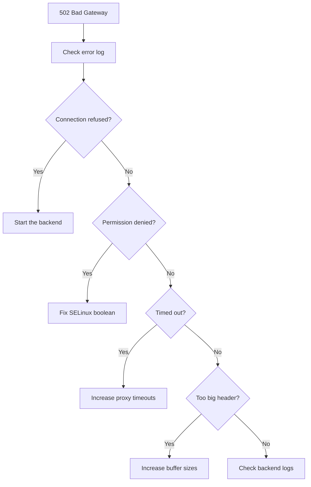

# How to Troubleshoot Nginx 502 Bad Gateway Errors on RHEL

Author: [nawazdhandala](https://www.github.com/nawazdhandala)

Tags: RHEL, Nginx, 502, Troubleshooting, Linux

Description: A systematic approach to diagnosing and fixing 502 Bad Gateway errors when using Nginx as a reverse proxy on RHEL.

---

## What Does 502 Mean?

A 502 Bad Gateway means Nginx tried to forward a request to the backend but could not get a valid response. The problem is between Nginx and the backend, not between the client and Nginx. The backend is either down, unreachable, or responding with garbage.

## The Troubleshooting Checklist

Here is the order I work through when debugging a 502. Start at the top and work down.

## Step 1 - Check the Error Log

This is always the first step. The error log tells you exactly what went wrong:

```bash
# Check the last 30 lines of the error log
sudo tail -30 /var/log/nginx/error.log
```

Common messages and what they mean:

| Error Message | Cause |
|--------------|-------|
| `connect() failed (111: Connection refused)` | Backend is not running |
| `connect() failed (113: No route to host)` | Backend server is unreachable |
| `connect() failed (13: Permission denied)` | SELinux is blocking the connection |
| `upstream timed out` | Backend took too long to respond |
| `recv() failed (104: Connection reset by peer)` | Backend crashed or dropped the connection |

## Step 2 - Is the Backend Running?

```bash
# Check if the backend process is running
sudo systemctl status your-app-service

# Or check if something is listening on the expected port
ss -tlnp | grep 3000
```

If nothing is listening on the expected port, start the backend:

```bash
# Start the backend service
sudo systemctl start your-app-service
```

## Step 3 - Can Nginx Reach the Backend?

Test connectivity from the Nginx server:

```bash
# Test TCP connectivity to the backend
curl -I http://127.0.0.1:3000

# Or use nc to check the port
nc -zv 127.0.0.1 3000
```

If this fails, the backend is not accepting connections.

## Step 4 - Check SELinux

This is the number one RHEL-specific cause of 502 errors:

```bash
# Check the SELinux boolean
getsebool httpd_can_network_connect
```

If it says `off`:

```bash
# Enable network connections for Nginx
sudo setsebool -P httpd_can_network_connect on
```

Also check the audit log for SELinux denials:

```bash
# Search for AVC denials related to nginx
sudo ausearch -m avc -ts recent | grep nginx
```

## Step 5 - Check the Firewall

If the backend is on a different server, make sure the firewall allows the connection:

```bash
# Check if the backend port is open
sudo firewall-cmd --list-all

# Test connectivity to a remote backend
curl -I http://192.168.1.11:3000
```

## Step 6 - Check Proxy Configuration

Review your Nginx proxy settings:

```bash
# Look at the proxy configuration
grep -r "proxy_pass" /etc/nginx/conf.d/
```

Common configuration mistakes:

```nginx
# Wrong: trailing slash mismatch
location /api {
    proxy_pass http://127.0.0.1:3000/;  # Trailing slash changes path behavior
}

# Correct: be consistent
location /api/ {
    proxy_pass http://127.0.0.1:3000/api/;
}
```

## Step 7 - Timeout Issues

If the backend is slow, Nginx may time out:

```bash
# Check for timeout messages
sudo grep "timed out" /var/log/nginx/error.log
```

Increase the proxy timeouts:

```nginx
location / {
    proxy_pass http://127.0.0.1:3000;
    proxy_connect_timeout 60s;
    proxy_read_timeout 120s;
    proxy_send_timeout 60s;
}
```

## Step 8 - Buffer Size Issues

If the backend sends large headers, Nginx may reject them:

```bash
# Look for buffer-related errors
sudo grep "upstream sent too big header" /var/log/nginx/error.log
```

Increase buffer sizes:

```nginx
location / {
    proxy_pass http://127.0.0.1:3000;
    proxy_buffer_size 16k;
    proxy_buffers 4 32k;
    proxy_busy_buffers_size 64k;
}
```

## Troubleshooting Flow



## Step 9 - Check Backend Application Logs

If Nginx is reaching the backend but still getting 502, the problem might be in the application itself:

```bash
# Check the backend application logs
sudo journalctl -u your-app-service --since "5 minutes ago"
```

The backend might be crashing, running out of memory, or returning malformed responses.

## Step 10 - Unix Socket Issues

If you are proxying to a Unix socket (common with PHP-FPM or Gunicorn):

```bash
# Check if the socket file exists
ls -la /run/php-fpm/www.sock

# Check permissions on the socket
stat /run/php-fpm/www.sock
```

The Nginx user needs read/write access to the socket:

```bash
# Verify Nginx can access the socket
sudo -u nginx test -w /run/php-fpm/www.sock && echo "Writable" || echo "Not writable"
```

## Step 11 - Upstream Health

If you are load balancing, a 502 might mean all backends are down:

```nginx
upstream backend {
    server 192.168.1.11:3000 max_fails=3 fail_timeout=30s;
    server 192.168.1.12:3000 max_fails=3 fail_timeout=30s;
}
```

Check each backend individually to find the failed one.

## Wrap-Up

502 errors always come down to the connection between Nginx and the backend. Start with the error log, which tells you exactly what is happening. On RHEL, SELinux is the most commonly overlooked cause. After that, check if the backend is running, verify connectivity, and adjust timeouts and buffers as needed. A systematic approach saves you from chasing the wrong problem.
