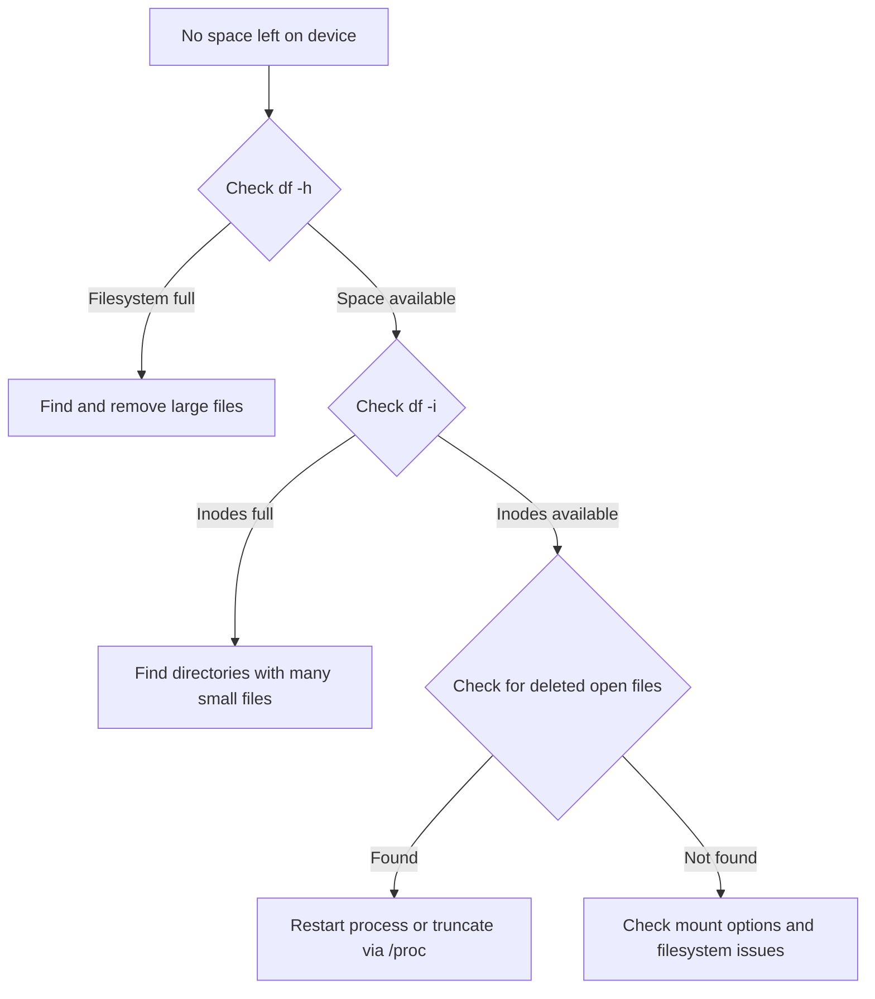

# How to Troubleshoot No Space Left on Device Errors on RHEL 9

Author: [nawazdhandala](https://www.github.com/nawazdhandala)

Tags: RHEL, Disk Space, Troubleshooting, Linux, System Administration

Description: A systematic guide to diagnosing and resolving "No space left on device" errors on RHEL 9, covering disk space exhaustion, inode depletion, large file hunting, journal cleanup, and preventive measures.

---

## The Dreaded Error Message

"No space left on device" is one of those errors that can bring services to their knees. Applications crash, databases refuse to write, logs stop recording, and deployments fail. The tricky part is that this error does not always mean you are out of disk space. It could be inode exhaustion, a filled-up /tmp partition, or even a deleted file still held open by a process.

Let me walk through how I diagnose this systematically on RHEL 9 systems.

## Step 1: Check Disk Space Usage

Start with the obvious. See which filesystems are full.

```bash
# Show disk usage for all mounted filesystems in human-readable format
df -h
```

Look for any filesystem at 100% or close to it. Pay attention to:
- `/` - the root filesystem
- `/var` - where logs, mail, and package data live
- `/tmp` - temporary files
- `/home` - user data
- `/boot` - kernel images

```bash
# Show only filesystems that are more than 80% full
df -h | awk 'NR==1 || +$5 >= 80'
```

## Step 2: Check Inode Usage

Even with plenty of disk space, you can run out of inodes. Every file and directory uses one inode. If you have millions of tiny files, you can exhaust inodes before disk space.

```bash
# Check inode usage for all filesystems
df -i
```

If a filesystem shows 100% inode usage, that is your problem.

```bash
# Find directories with the most files (potential inode hogs)
find / -xdev -printf '%h\n' 2>/dev/null | sort | uniq -c | sort -rn | head -20
```

Common inode hogs:
- Mail queues with millions of bounced messages
- Session files in /tmp or /var/lib/php/sessions
- Log rotation that creates too many small files
- Build caches or package caches



## Step 3: Find What Is Using the Space

Once you know which filesystem is full, drill down to find the culprits.

```bash
# Show the largest directories under /var (common culprit)
du -sh /var/* 2>/dev/null | sort -rh | head -20

# Drill deeper into the biggest directory
du -sh /var/log/* 2>/dev/null | sort -rh | head -20
```

For a faster approach that scans the whole system:

```bash
# Find files larger than 100MB anywhere on the root filesystem
find / -xdev -type f -size +100M -exec ls -lh {} \; 2>/dev/null | sort -k5 -rh | head -20

# Find files larger than 1GB
find / -xdev -type f -size +1G -exec ls -lh {} \; 2>/dev/null
```

The `-xdev` flag prevents `find` from crossing filesystem boundaries, which keeps the search focused on the filesystem you care about.

## Step 4: Check for Deleted Files Still Held Open

This is a sneaky one. When a process has a file open and you delete the file, the disk space is not actually freed until the process closes the file. The file disappears from `ls` but still occupies space.

```bash
# Find deleted files still held open by processes
sudo lsof +L1 2>/dev/null | head -20
```

This shows files with a link count of 0 (deleted) that are still open. The SIZE column tells you how much space they are holding.

```bash
# If you find a large deleted file held by a process, you have options:

# Option 1: Restart the process (cleanest approach)
sudo systemctl restart httpd

# Option 2: Truncate the file through /proc without restarting
# Find the file descriptor number from lsof output, then:
sudo truncate -s 0 /proc/<PID>/fd/<FD_NUMBER>
```

## Step 5: Common Space Hogs and How to Clean Them

### Journal Logs

The systemd journal can grow very large on busy systems.

```bash
# Check journal disk usage
sudo journalctl --disk-usage

# Clean journal entries older than 7 days
sudo journalctl --vacuum-time=7d

# Limit journal to 500MB
sudo journalctl --vacuum-size=500M
```

To set a permanent size limit:

```bash
# Edit the journal configuration
sudo vi /etc/systemd/journald.conf
```

Set or uncomment:

```ini
[Journal]
SystemMaxUse=500M
```

Then restart the journal service:

```bash
sudo systemctl restart systemd-journald
```

### Old Kernels

RHEL 9 keeps old kernel packages around for rollback. These take up space in `/boot` and `/usr/lib/modules/`.

```bash
# List installed kernel packages
sudo dnf list installed kernel-core

# Check how many kernels to keep (default is 3)
grep installonly_limit /etc/dnf/dnf.conf

# Remove old kernels manually, keeping the latest 2
sudo dnf remove --oldinstallonly --setopt installonly_limit=2 kernel-core
```

### Package Manager Cache

```bash
# Check dnf cache size
du -sh /var/cache/dnf/

# Clean the dnf cache
sudo dnf clean all

# Remove orphaned packages
sudo dnf autoremove
```

### /tmp Cleanup

```bash
# Check /tmp usage
du -sh /tmp

# RHEL 9 uses systemd-tmpfiles for /tmp cleanup
# Check the configuration
cat /usr/lib/tmpfiles.d/tmp.conf

# Force a cleanup now
sudo systemd-tmpfiles --clean
```

### Old Log Files

```bash
# Check for unrotated or large log files
find /var/log -type f -size +50M -exec ls -lh {} \;

# Force logrotate to run
sudo logrotate -f /etc/logrotate.conf

# Check for compressed logs that can be removed
find /var/log -name "*.gz" -mtime +30 -exec ls -lh {} \;
```

### Core Dumps

```bash
# Check for core dumps
find / -name "core.*" -o -name "core" -type f 2>/dev/null

# Check systemd-coredump storage
sudo coredumpctl list
du -sh /var/lib/systemd/coredump/

# Clean old core dumps
sudo journalctl --vacuum-time=3d
```

## Step 6: When /boot Is Full

The `/boot` partition is typically small (500MB-1GB) and fills up when too many kernel versions are installed.

```bash
# Check /boot usage
df -h /boot

# List kernels sorted by version
rpm -qa kernel-core | sort -V

# Check current running kernel (do NOT remove this one)
uname -r

# Remove specific old kernels
sudo dnf remove kernel-core-5.14.0-70.el9.x86_64
```

## Emergency: System Cannot Boot or Write

If the system is completely out of space and you cannot even run commands normally:

```bash
# Boot into single-user mode or use a rescue disk

# If you can get a shell, clear some quick wins:
# Remove dnf cache
sudo rm -rf /var/cache/dnf/*

# Truncate large log files (does not delete, just empties them)
sudo truncate -s 0 /var/log/messages
sudo truncate -s 0 /var/log/secure

# Clear the journal
sudo journalctl --vacuum-size=50M

# Remove old tmp files
sudo find /tmp -type f -mtime +1 -delete
sudo find /var/tmp -type f -mtime +7 -delete
```

## Prevention: Monitoring and Alerts

The best way to handle disk space issues is to catch them before they become critical.

```bash
# Simple disk space monitoring script for cron
#!/bin/bash
# /usr/local/bin/disk-monitor.sh
# Run via cron: */30 * * * * /usr/local/bin/disk-monitor.sh

THRESHOLD=85
MAILTO="admin@example.com"

df -h --output=pcent,target | tail -n +2 | while read -r usage mount; do
    pct=${usage%\%}
    if [ "$pct" -ge "$THRESHOLD" ]; then
        echo "WARNING: $mount is at ${usage} capacity on $(hostname)" | \
            mail -s "Disk Alert: $mount at ${usage}" "$MAILTO"
    fi
done
```

Set up logrotate properly for all applications:

```bash
# Verify logrotate runs daily
sudo systemctl status logrotate.timer

# Test logrotate configuration
sudo logrotate -d /etc/logrotate.conf
```

## Quick Reference Cleanup Commands

```bash
# Journal cleanup
sudo journalctl --vacuum-size=500M

# DNF cache cleanup
sudo dnf clean all

# Old kernel cleanup
sudo dnf remove --oldinstallonly --setopt installonly_limit=2 kernel-core

# Find top 20 largest files on root filesystem
find / -xdev -type f -size +100M -exec ls -lh {} \; 2>/dev/null | sort -k5 -rh | head -20

# Find deleted files still consuming space
sudo lsof +L1

# Tmp cleanup
sudo systemd-tmpfiles --clean

# Force logrotate
sudo logrotate -f /etc/logrotate.conf
```

## Summary

"No space left on device" is almost always fixable, but you need a systematic approach. Check disk space with `df -h`, check inodes with `df -i`, look for deleted-but-open files with `lsof`, and then hunt down the space hogs. The usual suspects are journal logs, old kernels, package caches, and unrotated log files. Most importantly, set up monitoring so you catch these issues at 85% full instead of 100%.
