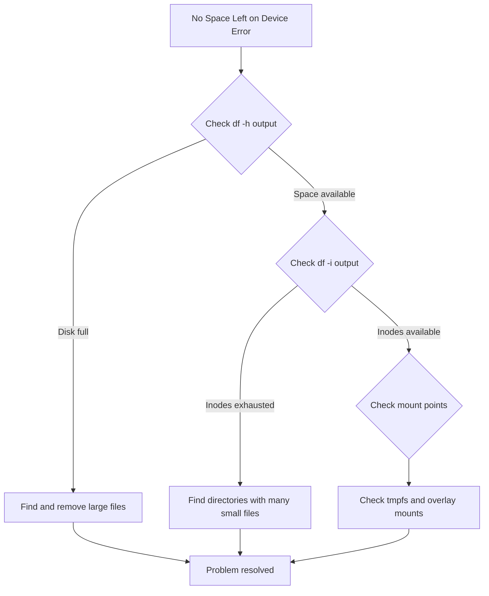

# How to Troubleshoot 'No Space Left on Device' Errors on RHEL

Author: [nawazdhandala](https://www.github.com/nawazdhandala)

Tags: RHEL, Troubleshooting, Disk Space, Storage, Linux

Description: Learn how to diagnose and fix 'No space left on device' errors on RHEL by identifying disk space hogs, inode exhaustion, and filesystem issues.

---

The "No space left on device" error is one of the most common problems you will encounter on any Linux system, including RHEL. This error can appear even when `df` shows available space, because it can be caused by several different underlying issues. In this guide, we will walk through a systematic approach to diagnosing and resolving this problem.

## Understanding the Error

The "No space left on device" error (ENOSPC) can be triggered by three main conditions:

1. The filesystem has run out of block storage (actual disk space).
2. The filesystem has run out of inodes (metadata entries for files).
3. A pseudo-filesystem like `/tmp` or a tmpfs mount is full.



## Step 1: Check Overall Disk Usage

Start by checking how much space is used on each mounted filesystem:

```bash
# Show disk usage in human-readable format
df -h
```

Sample output when the disk is full:

```
Filesystem      Size  Used Avail Use% Mounted on
/dev/sda3        50G   50G     0 100% /
/dev/sda1       500M  200M  300M  40% /boot
tmpfs           3.9G     0  3.9G   0% /dev/shm
```

If any filesystem shows 100% usage, that is your problem area.

## Step 2: Identify Large Files and Directories

Use the `du` command to find the biggest directories:

```bash
# Find the top 10 largest directories under root
sudo du -h --max-depth=1 / 2>/dev/null | sort -hr | head -20
```

Then drill down into the largest directory:

```bash
# Drill into /var, which is commonly the culprit
sudo du -h --max-depth=1 /var | sort -hr | head -10
```

Common space hogs include:

- `/var/log` - log files that have grown too large
- `/var/cache` - package manager caches
- `/tmp` - temporary files that were never cleaned up
- `/var/lib/docker` - Docker images and containers

## Step 3: Find Specific Large Files

```bash
# Find files larger than 100MB on the root filesystem
sudo find / -xdev -type f -size +100M -exec ls -lh {} \; 2>/dev/null | sort -k5 -hr
```

The `-xdev` flag prevents `find` from crossing filesystem boundaries, which keeps the search focused on the filesystem you care about.

## Step 4: Check for Deleted Files Still Held Open

A common and tricky scenario is when a large file has been deleted but a process still holds it open. The space is not actually freed until the process releases the file handle.

```bash
# Find deleted files still held open by processes
sudo lsof +L1 2>/dev/null | head -20
```

If you find large deleted files being held open, you can either restart the process or truncate the file descriptor:

```bash
# Identify the process holding the deleted file
sudo lsof +L1 | grep deleted

# Restart the service to release the file handle
# For example, if rsyslog is holding a deleted log file:
sudo systemctl restart rsyslog
```

## Step 5: Check for Inode Exhaustion

If `df -h` shows free space but you still get the error, check inode usage:

```bash
# Check inode usage across all filesystems
df -i
```

Sample output showing inode exhaustion:

```
Filesystem      Inodes   IUsed   IFree IUse% Mounted on
/dev/sda3      3276800 3276800       0  100% /
```

Find directories with the most files:

```bash
# Count files per directory under /
sudo find / -xdev -printf '%h\n' | sort | uniq -c | sort -rn | head -20
```

This often points to directories filled with tiny session files, cache entries, or mail queue items.

## Step 6: Clean Up Common Space Consumers

### Clear Package Manager Cache

```bash
# Clean the DNF package cache
sudo dnf clean all

# Check how much space was reclaimed
df -h /
```

### Rotate and Compress Logs

```bash
# Force log rotation
sudo logrotate -f /etc/logrotate.conf

# Find and compress any uncompressed log files older than 7 days
sudo find /var/log -name "*.log" -mtime +7 -exec gzip {} \;
```

### Remove Old Kernels

```bash
# List installed kernels
sudo dnf list installed kernel-core

# Remove old kernels, keeping only the latest 2
sudo dnf remove $(dnf repoquery --installonly --latest-limit=-2 -q)
```

### Clean Journal Logs

```bash
# Check journal disk usage
journalctl --disk-usage

# Retain only the last 7 days of journal logs
sudo journalctl --vacuum-time=7d

# Or limit journal size to 500MB
sudo journalctl --vacuum-size=500M
```

## Step 7: Set Up Monitoring to Prevent Recurrence

Create a simple disk usage monitoring script:

```bash
#!/bin/bash
# /usr/local/bin/disk-check.sh
# Simple disk space monitoring script

THRESHOLD=90

df -h --output=pcent,target | tail -n +2 | while read line; do
    usage=$(echo "$line" | awk '{print $1}' | tr -d '%')
    mount=$(echo "$line" | awk '{print $2}')

    if [ "$usage" -ge "$THRESHOLD" ]; then
        echo "WARNING: $mount is ${usage}% full" | \
            systemd-cat -t disk-monitor -p warning
    fi
done
```

Set it up as a systemd timer:

```bash
# Make the script executable
sudo chmod +x /usr/local/bin/disk-check.sh

# Create a systemd service unit
sudo tee /etc/systemd/system/disk-check.service << 'EOF'
[Unit]
Description=Disk space check

[Service]
Type=oneshot
ExecStart=/usr/local/bin/disk-check.sh
EOF

# Create a systemd timer to run every hour
sudo tee /etc/systemd/system/disk-check.timer << 'EOF'
[Unit]
Description=Run disk space check hourly

[Timer]
OnCalendar=hourly
Persistent=true

[Install]
WantedBy=timers.target
EOF

# Enable and start the timer
sudo systemctl daemon-reload
sudo systemctl enable --now disk-check.timer
```

## Quick Reference

| Symptom | Diagnostic Command | Likely Cause |
|---------|-------------------|-------------|
| df shows 100% used | `du -h --max-depth=1 /` | Large files or directories |
| df shows space available | `df -i` | Inode exhaustion |
| Space does not free after deleting files | `lsof +L1` | Deleted files held open |
| /tmp is full | `df -h /tmp` | tmpfs filled up |

## Summary

Troubleshooting "No space left on device" errors on RHEL follows a logical progression: check actual disk usage, check inode usage, look for deleted files held open by processes, and then clean up the identified culprit. Setting up proactive monitoring will help you catch disk space issues before they cause outages.
