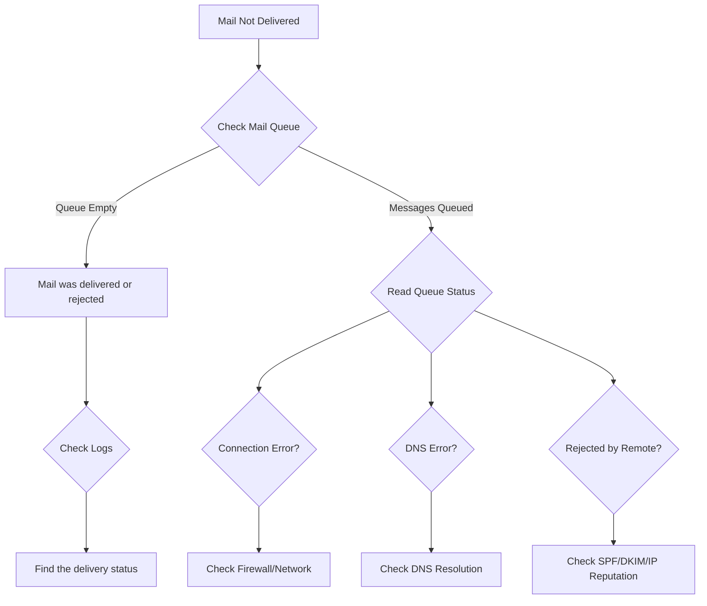

# How to Troubleshoot Postfix Mail Delivery Issues on RHEL

Author: [nawazdhandala](https://www.github.com/nawazdhandala)

Tags: RHEL, Postfix, Troubleshooting, Mail, Linux

Description: A systematic approach to diagnosing and fixing common Postfix mail delivery problems on RHEL, covering logs, queues, DNS, and connectivity.

---

## The Troubleshooting Mindset

When mail is not getting delivered, resist the urge to start changing random configuration settings. Postfix logs tell you exactly what is happening if you know where to look. Every delivery attempt, every rejection, every bounce is recorded. Start with the logs, follow the trail, and fix the actual problem.

## Where Postfix Logs Live

On RHEL, Postfix logs go to the systemd journal and `/var/log/maillog`:

```bash
# View recent Postfix log entries via journalctl
sudo journalctl -u postfix --since "30 minutes ago"

# Or use the traditional log file
sudo tail -100 /var/log/maillog
```

For real-time monitoring while testing:

```bash
# Watch logs in real time
sudo tail -f /var/log/maillog
```

## Troubleshooting Flow



## Step 1: Check the Mail Queue

The mail queue is the first place to look:

```bash
# Show all messages in the queue
sudo postqueue -p

# Show queue summary (count and size)
sudo qshape deferred
```

If the queue is empty, the message was either delivered successfully or bounced. Check the logs.

If messages are stuck, look at the reason:

```bash
# View a specific queued message (headers and envelope)
sudo postcat -q <QUEUE_ID>
```

## Step 2: Read the Log Entry

Every message gets a unique queue ID. Find it in the logs:

```bash
# Search for a specific recipient in the logs
sudo grep "recipient@example.com" /var/log/maillog

# Search by queue ID
sudo grep "ABC123DEF" /var/log/maillog
```

A successful delivery looks like:

```bash
postfix/smtp[12345]: ABC123DEF: to=<user@remote.com>, relay=mx.remote.com[1.2.3.4]:25, delay=1.2, status=sent (250 OK)
```

A failed delivery shows the error:

```bash
postfix/smtp[12345]: ABC123DEF: to=<user@remote.com>, relay=none, delay=300, status=deferred (connect to mx.remote.com[1.2.3.4]:25: Connection timed out)
```

## Step 3: Common Problems and Fixes

### Problem: Connection Timed Out

```bash
status=deferred (connect to mx.remote.com[1.2.3.4]:25: Connection timed out)
```

This means Postfix cannot reach the remote server on port 25.

**Check outbound port 25:**

```bash
# Test connectivity to a remote mail server
telnet mx.remote.com 25

# Or use nmap
nmap -p 25 mx.remote.com
```

**Common causes:**
- Your ISP or cloud provider blocks outbound port 25
- A firewall rule is blocking outgoing connections
- The remote server is down

**Fix for blocked port 25:**

If your provider blocks port 25, use a relay:

```bash
# In main.cf, relay through an authorized server
relayhost = [smtp-relay.example.com]:587
```

### Problem: DNS Resolution Failures

```bash
status=deferred (Host or domain name not found)
```

**Check DNS:**

```bash
# Look up MX records for the destination domain
dig MX remote.com

# Check if Postfix can resolve it
postmap -q "remote.com" dns:mx
```

**Check the DNS resolver:**

```bash
# Verify /etc/resolv.conf has working nameservers
cat /etc/resolv.conf

# Test name resolution
dig @8.8.8.8 MX remote.com
```

### Problem: Relay Access Denied

```bash
status=bounced (host mx.remote.com said: 554 Relay access denied)
```

This means the remote server thinks you are trying to use it as an open relay, or your server is not authorized to send.

**Check your `relayhost` setting:**

```bash
sudo postconf relayhost
```

If using a relay, make sure you have authentication configured.

### Problem: Rejected by Remote Server

```bash
status=bounced (host mx.google.com said: 550-5.7.26 This mail has been blocked because the sender is unauthenticated)
```

**Common rejection reasons:**
- No PTR record for your IP
- Failed SPF check
- No DKIM signature
- IP is on a blocklist

**Check your IP reputation:**

```bash
# Check if your IP is on major blocklists
dig +short 10.113.0.203.zen.spamhaus.org
```

(Reverse the IP octets for the query)

**Verify PTR record:**

```bash
# Check reverse DNS for your server IP
dig -x 203.0.113.10
```

### Problem: Mailbox Full or User Unknown

```bash
status=bounced (host mx.remote.com said: 552 Mailbox full)
status=bounced (host mx.remote.com said: 550 User not found)
```

These are recipient-side issues. Not much you can do except notify the sender.

### Problem: TLS Handshake Failures

```bash
status=deferred (TLS handshake failed)
```

**Try lowering TLS requirements temporarily:**

```bash
# Check current TLS setting
sudo postconf smtp_tls_security_level

# Set to opportunistic if it was set to encrypt
# In main.cf: smtp_tls_security_level = may
```

## Step 4: Queue Management

### Retry Delivery Now

```bash
# Flush the entire queue (retry all deferred messages)
sudo postqueue -f

# Retry messages for a specific domain
sudo postqueue -s example.com
```

### Remove Stuck Messages

```bash
# Delete a specific message
sudo postsuper -d <QUEUE_ID>

# Delete all deferred messages
sudo postsuper -d ALL deferred

# Delete all messages (use with caution)
sudo postsuper -d ALL
```

### Hold and Release Messages

```bash
# Put a message on hold
sudo postsuper -h <QUEUE_ID>

# Release a held message
sudo postsuper -H <QUEUE_ID>
```

## Step 5: Configuration Validation

```bash
# Check for syntax errors in main.cf and master.cf
sudo postfix check

# Show all non-default settings
sudo postconf -n

# Compare your settings with defaults
sudo postconf -d | diff - <(sudo postconf -n)
```

## Step 6: Test Sending Manually

Use SMTP commands directly to isolate the problem:

```bash
# Connect to your local Postfix
telnet localhost 25
```

Then type:

```bash
EHLO test.example.com
MAIL FROM:<sender@example.com>
RCPT TO:<recipient@remote.com>
DATA
Subject: Test

This is a test.
.
QUIT
```

Watch the responses. A 250 reply means success. 4xx means temporary failure. 5xx means permanent rejection.

## Useful Diagnostic Commands

```bash
# Show Postfix version
postconf mail_version

# Show all active processes
sudo postfix status

# Show TLS session cache
sudo postconf smtp_tls_session_cache_database

# Display master.cf services
sudo postconf -M
```

## Wrapping Up

Nine times out of ten, Postfix mail delivery issues boil down to one of these: network/firewall blocking port 25, DNS resolution problems, missing authentication records (SPF/DKIM), or IP reputation issues. The mail log tells you which one. Read it carefully, fix the actual problem, and test again. Do not guess.
