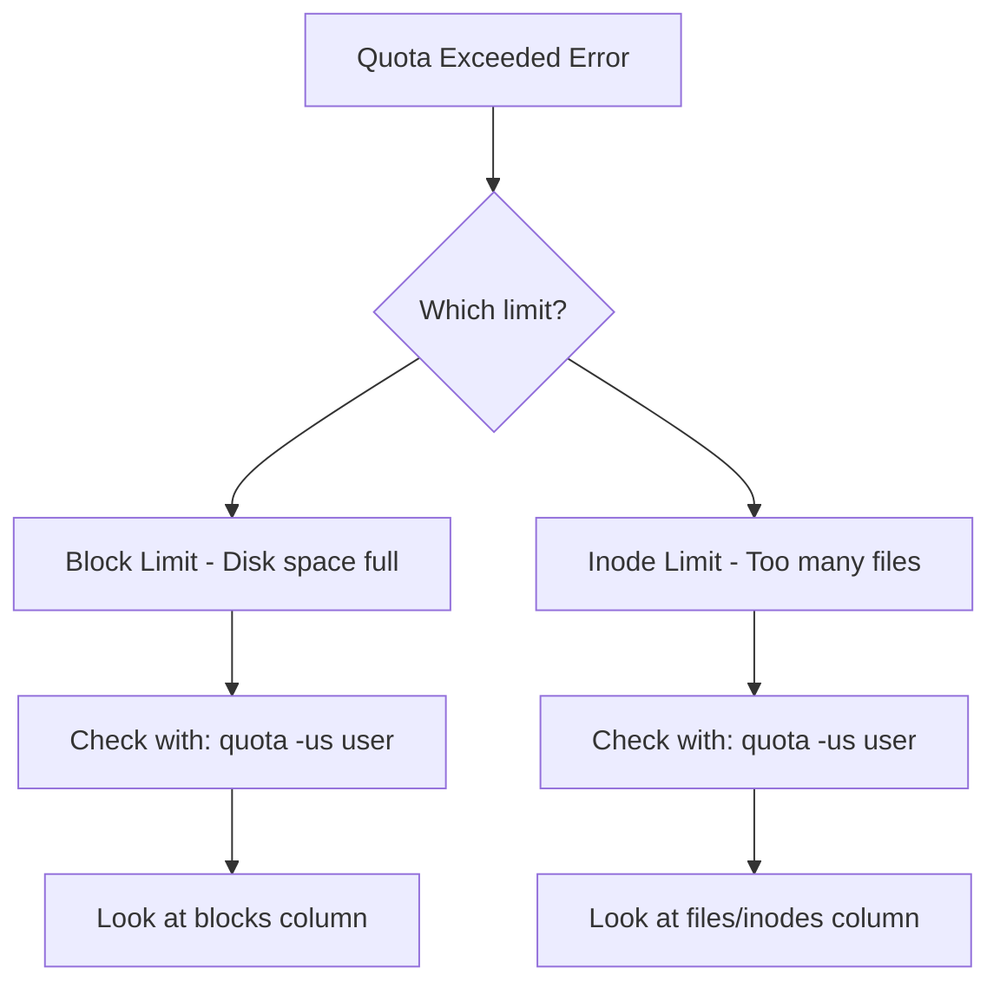

# How to Troubleshoot Quota Exceeded Errors on RHEL

Author: [nawazdhandala](https://www.github.com/nawazdhandala)

Tags: RHEL, Quotas, Troubleshooting, Linux

Description: A practical troubleshooting guide for resolving disk quota exceeded errors on RHEL, covering common causes, diagnostic steps, and solutions for both XFS and ext4.

---

"Disk quota exceeded" is one of those errors that can show up in a dozen different ways - failed builds, applications crashing, users unable to save files, mail delivery failures. The error itself is simple, but tracking down why it happened and fixing it properly takes some know-how.

## The Error in Various Contexts

The quota exceeded error (EDQUOT) surfaces differently depending on the application:

- **Shell**: `write failed: Disk quota exceeded`
- **SMTP/Postfix**: `Insufficient system storage` or `452 4.3.1`
- **NFS clients**: `Disk quota exceeded` or stale file handles
- **Applications**: Might just report "I/O error" or "permission denied"

## Step 1: Identify the Affected User and Filesystem

First, figure out which user and filesystem are involved:

```bash
# Check quota for a specific user across all filesystems
quota -us jsmith
```

If you do not know which user is affected, check the application logs to find the process owner, then look up their quota:

```bash
# Find the user running a process that reported the error
ps aux | grep <process_name>

# Then check their quota
quota -us <username>
```

For XFS:

```bash
# Check quota on an XFS filesystem
xfs_quota -x -c 'quota -ubh jsmith' /data
```

## Step 2: Determine the Type of Limit Hit

There are two types of limits that can cause this error:



Check block (space) usage:

```bash
# Show block usage details
repquota -us /home | grep jsmith
```

Check inode (file count) usage:

```bash
# Show inode usage details
repquota -us /home | grep jsmith
```

The output shows both. A `+` next to the block or inode column indicates which limit was exceeded.

## Step 3: Find What Is Using the Space

Once you know the user and filesystem, find the biggest offenders:

```bash
# Find the top 20 largest files owned by the user
find /home/jsmith -user jsmith -type f -exec du -h {} + 2>/dev/null | sort -rh | head -20
```

```bash
# Get a summary by directory
du -sh /home/jsmith/*/ 2>/dev/null | sort -rh | head -10
```

Common space hogs:

- `.cache` directories (browsers, package managers)
- Old log files
- Core dumps in the home directory
- Duplicate downloads
- IDE caches and build artifacts

```bash
# Find files larger than 100 MB
find /home/jsmith -user jsmith -type f -size +100M -ls 2>/dev/null
```

## Step 4: Find What Is Using Inodes

If the inode limit was hit, the user has too many files regardless of total size:

```bash
# Count files per subdirectory
for dir in /home/jsmith/*/; do
    echo "$(find "$dir" -user jsmith -type f 2>/dev/null | wc -l) $dir"
done | sort -rn | head -10
```

Common inode consumers:

- `node_modules` directories (tens of thousands of files)
- Mail directories with many small messages
- Git repositories with large histories
- Cache directories

## Step 5: Immediate Resolution

### Option A: Help the User Clean Up

Point them to what is consuming their space:

```bash
# Show the user their top space consumers
du -sh /home/jsmith/* 2>/dev/null | sort -rh | head -10
```

Common cleanup actions:

```bash
# Clear package manager cache
dnf clean all

# Remove old log files
find /home/jsmith -name "*.log" -mtime +30 -delete

# Clear thumbnail cache
rm -rf /home/jsmith/.cache/thumbnails/*

# Remove core dumps
find /home/jsmith -name "core.*" -delete
```

### Option B: Increase the Quota

If the user legitimately needs more space:

For ext4:

```bash
# Increase quota - new soft 20 GB, hard 24 GB
setquota -u jsmith 20971520 25165824 0 0 /home
```

For XFS:

```bash
# Increase quota on XFS
xfs_quota -x -c 'limit bsoft=20g bhard=24g jsmith' /data
```

### Option C: Extend the Grace Period

If the user just needs more time to clean up:

```bash
# On ext4 - temporarily raise their soft limit, then set it back after they clean up
# This resets the grace timer
setquota -u jsmith 20971520 25165824 0 0 /home
# After cleanup, restore original limits
setquota -u jsmith 10485760 12582912 0 0 /home
```

## Step 6: Investigate Root Causes

If the same user or application keeps hitting quotas, dig deeper:

### Check for runaway logging

```bash
# Find recently modified large files
find /home/jsmith -user jsmith -type f -mtime -1 -size +50M -ls 2>/dev/null
```

### Check for hidden files and directories

```bash
# Include hidden directories in the size check
du -sh /home/jsmith/.[!.]* 2>/dev/null | sort -rh
```

### Check for files owned by the user on other filesystems

```bash
# The user might be writing to unexpected locations
find / -user jsmith -type f -size +10M 2>/dev/null | grep -v /home/jsmith
```

## Common Gotchas

### 1. Root Is Exempt (Mostly)

Root typically bypasses quota enforcement. But processes that drop privileges (like web servers) will be subject to the quota of the user they run as.

### 2. NFS Quota Mismatches

If using NFS, quotas are enforced on the server side. The client might show confusing error messages:

```bash
# Check NFS server-side quota for the user
ssh nfs-server "repquota -us /export/home | grep jsmith"
```

### 3. Quota Not Enabled

Sometimes the error is not from quotas at all - it is a genuinely full filesystem:

```bash
# Check if the filesystem is actually full
df -h /home

# Check if quotas are actually enabled
quotaon -p /home
# or for XFS
xfs_quota -x -c 'state' /data
```

### 4. Grace Period Already Expired

The user might be over their soft limit with an expired grace period. They need to get below the soft limit, not just the hard limit:

```bash
# Check grace period status
repquota -us /home | grep jsmith
# A "none" in the grace column means time has expired
```

### 5. Group Quota vs. User Quota

The user might be within their personal quota but hitting the group quota:

```bash
# Check group quotas too
quota -g $(id -gn jsmith)
```

## Prevention

Set up proactive monitoring to catch issues before users do:

```bash
#!/bin/bash
# /usr/local/bin/quota-alert.sh
# Alert when any user exceeds 90% of their soft limit

THRESHOLD=90

repquota -u /home 2>/dev/null | tail -n +5 | while read -r line; do
    USER=$(echo "$line" | awk '{print $1}')
    USED=$(echo "$line" | awk '{print $3}')
    SOFT=$(echo "$line" | awk '{print $4}')

    [ "$SOFT" -eq 0 ] 2>/dev/null && continue
    [ -z "$SOFT" ] && continue
    [ "$SOFT" -le 0 ] 2>/dev/null && continue

    PERCENT=$((USED * 100 / SOFT))
    if [ "$PERCENT" -ge "$THRESHOLD" ]; then
        logger -p user.warning "QUOTA ALERT: $USER at ${PERCENT}% of quota on /home"
    fi
done
```

## Summary

Troubleshooting quota exceeded errors comes down to: identify the user and filesystem, determine if it is a block or inode issue, find what is consuming the space, and then either clean up or adjust limits. Check for group quotas and expired grace periods as common gotchas. Set up monitoring so you catch issues at 80-90% instead of 100%.
