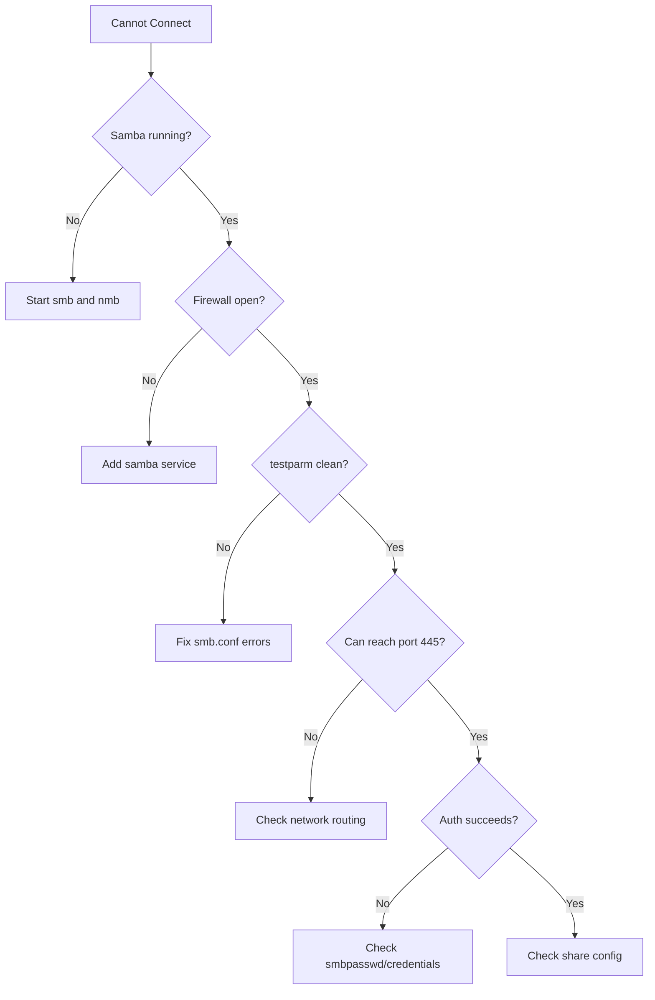

# How to Troubleshoot Samba Connection and Permission Issues on RHEL 9

Author: [nawazdhandala](https://www.github.com/nawazdhandala)

Tags: RHEL, Samba, Troubleshooting, Linux

Description: Systematically diagnose and fix Samba connection failures and permission problems on RHEL 9 with practical debugging commands and common solutions.

---

## Troubleshooting Approach

Samba problems typically fall into three categories: the client cannot connect at all, the client connects but gets permission errors, or performance is poor. Each has a systematic diagnostic path.

## Cannot Connect at All

### Check if Samba Is Running

```bash
# Verify smbd and nmbd are active
sudo systemctl status smb nmb

# If not running, start them
sudo systemctl start smb nmb

# Check for startup errors
journalctl -u smb --since "10 minutes ago"
```

### Check the Configuration

```bash
# Validate smb.conf syntax
testparm

# testparm reports errors and warnings
# Fix any issues it flags before proceeding
```

### Check the Firewall

```bash
# Is Samba allowed?
sudo firewall-cmd --list-services | grep samba

# Test port 445 from the client
nc -zv 192.168.1.10 445
```

### Check Network Connectivity

```bash
# Basic connectivity
ping 192.168.1.10

# DNS resolution (if using hostnames)
host samba-server.example.com

# Name resolution via NetBIOS
nmblookup samba-server
```

## Connection Diagnostic Flow



## Permission Denied After Connecting

### Check Samba User Exists

```bash
# List Samba users
sudo pdbedit -L

# If user is missing, add them
sudo smbpasswd -a username
```

### Check Share-Level Permissions

```bash
# Review the share configuration
testparm -s 2>/dev/null | grep -A 20 "\[shared\]"

# Verify the user is in valid users or relevant group
groups username
```

### Check Filesystem Permissions

```bash
# Check Linux permissions on the share path
ls -la /srv/samba/shared

# Test file creation as the Samba user
sudo -u smbuser touch /srv/samba/shared/test-perm
```

### Check SELinux

```bash
# Look for SELinux denials
sudo ausearch -m avc -c smbd --start recent

# Check the file context
ls -Zd /srv/samba/shared

# If context is wrong
sudo semanage fcontext -a -t samba_share_t "/srv/samba/shared(/.*)?"
sudo restorecon -Rv /srv/samba/shared
```

## Using smbclient for Diagnosis

smbclient is your best friend for Samba troubleshooting:

```bash
# List shares (basic connectivity test)
smbclient -L //192.168.1.10 -U username

# Connect to a share
smbclient //192.168.1.10/shared -U username

# Test operations inside smbclient
smb: \> ls
smb: \> mkdir testdir
smb: \> put /tmp/test.txt test.txt
smb: \> del test.txt
smb: \> quit
```

## Checking Samba Logs

```bash
# Main Samba log
sudo tail -f /var/log/samba/log.smbd

# Per-client logs (if configured)
ls /var/log/samba/

# Increase log level for more detail
# In smb.conf [global] section:
# log level = 3
# Then restart: sudo systemctl restart smb
```

Log levels:
- 0: Errors only
- 1: Warnings
- 2: Basic information
- 3: Detailed operations (good for debugging)
- 10: Everything (very verbose)

## Windows-Side Troubleshooting

If the problem is on the Windows client:

```cmd
REM Clear cached credentials
net use * /delete /yes

REM Check SMB connectivity
Test-NetConnection -ComputerName 192.168.1.10 -Port 445

REM View current SMB connections
net use

REM Try connecting with explicit credentials
net use \\192.168.1.10\shared /user:username password
```

## Authentication Issues

### Wrong Password

```bash
# Reset the Samba password
sudo smbpasswd username

# Verify the account is enabled
sudo pdbedit -L -v | grep -A5 username
```

### Account Locked or Disabled

```bash
# Check account status
sudo pdbedit -L -v username | grep -i "account"

# Enable a disabled account
sudo smbpasswd -e username
```

## Performance Issues

```bash
# Check current connections
sudo smbstatus

# View per-connection details
sudo smbstatus -S

# Check locked files
sudo smbstatus -L
```

For slow transfers:

```bash
# Check the SMB protocol version in use
sudo smbstatus -b | head -20

# Test transfer speed
dd if=/dev/zero of=/mnt/smb-share/speedtest bs=1M count=100
```

## Common Fixes Summary

| Problem | Quick Fix |
|---------|-----------|
| Connection refused | `sudo systemctl start smb` |
| Port blocked | `sudo firewall-cmd --add-service=samba --permanent` |
| Auth failure | `sudo smbpasswd -a username` |
| Permission denied | Check `valid users` in smb.conf |
| SELinux denial | `sudo setsebool -P samba_export_all_rw on` |
| Wrong file context | `restorecon -Rv /path/to/share` |
| Stale credentials (Windows) | `net use * /delete /yes` |

## Wrap-Up

Samba troubleshooting on RHEL 9 is methodical: check the service, check the firewall, check the configuration, check authentication, check filesystem permissions, check SELinux. Work through each layer in order, and you will find the problem. Keep testparm, smbclient, and ausearch in your toolkit, and increase the log level when you need more detail.
