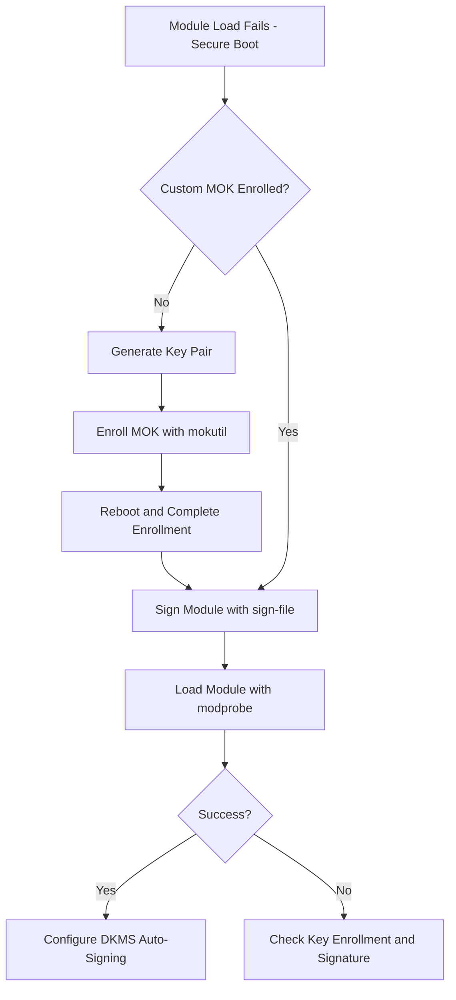

# How to Troubleshoot Secure Boot Failures with Unsigned Kernel Modules on RHEL 9

Author: [nawazdhandala](https://www.github.com/nawazdhandala)

Tags: RHEL, Secure Boot, Kernel Modules, Linux

Description: Diagnose and resolve Secure Boot failures caused by unsigned kernel modules on RHEL 9, including third-party drivers and custom modules.

---

Secure Boot and unsigned kernel modules do not get along. When Secure Boot is enabled, the kernel refuses to load any module that is not signed with a trusted key. This is by design, but it catches a lot of people off guard when they install third-party drivers like NVIDIA, VirtualBox, or custom DKMS modules and they simply do not load. Here is how to diagnose and fix these issues.

## Identifying the Problem

The first sign is usually a module failing to load:

```bash
# Try loading a module and check for errors
sudo modprobe vboxdrv
# modprobe: ERROR: could not insert 'vboxdrv': Required key not available

# Check dmesg for signature verification failures
sudo dmesg | grep -i "module verification failed"
```

The "Required key not available" error is the signature of a Secure Boot module rejection.

## Checking Which Modules Are Unsigned

```bash
# Check if a module has a signature
modinfo vboxdrv | grep sig

# Check all loaded modules for signature status
for mod in $(lsmod | awk 'NR>1{print $1}'); do
    sig=$(modinfo $mod 2>/dev/null | grep "^sig_id:" | awk '{print $2}')
    if [ -z "$sig" ]; then
        echo "UNSIGNED: $mod"
    fi
done
```

## Solution 1: Sign Modules with a Custom MOK Key

The recommended approach is to create your own Machine Owner Key (MOK), sign the modules, and enroll the key.

### Generate a Key Pair

```bash
# Create a directory for the signing key
sudo mkdir -p /root/module-signing
cd /root/module-signing

# Generate a private key and certificate
sudo openssl req -new -x509 -newkey rsa:2048 -keyout MOK.priv -outform DER -out MOK.der -nodes -days 36500 -subj "/CN=Custom Module Signing Key/"
```

### Enroll the Key with MOK

```bash
# Import the key into the MOK database
sudo mokutil --import /root/module-signing/MOK.der
```

This will prompt you to set a one-time password. You need this password at the next reboot.

```bash
# Reboot to complete MOK enrollment
sudo reboot
```

During reboot, the MOK Manager will appear in the console. Select "Enroll MOK", confirm, and enter the password you set.

### Sign the Module

```bash
# Sign the kernel module
sudo /usr/src/kernels/$(uname -r)/scripts/sign-file sha256 /root/module-signing/MOK.priv /root/module-signing/MOK.der /path/to/module.ko

# For example, signing a VirtualBox module
sudo /usr/src/kernels/$(uname -r)/scripts/sign-file sha256 /root/module-signing/MOK.priv /root/module-signing/MOK.der /lib/modules/$(uname -r)/misc/vboxdrv.ko
```

### Verify the Signature

```bash
# Check the module now has a signature
modinfo /lib/modules/$(uname -r)/misc/vboxdrv.ko | grep sig
```

### Load the Module

```bash
# Load the signed module
sudo modprobe vboxdrv
```

## Solution 2: Automate Signing with DKMS

For DKMS modules that rebuild on kernel updates, automate the signing:

```bash
# Create a DKMS signing script
sudo tee /etc/dkms/sign_helper.sh << 'SCRIPT'
#!/bin/bash
/usr/src/kernels/$1/scripts/sign-file sha256 /root/module-signing/MOK.priv /root/module-signing/MOK.der "$2"
SCRIPT

sudo chmod 755 /etc/dkms/sign_helper.sh
```

Configure DKMS to use the signing script:

```bash
# Add to DKMS configuration
sudo tee /etc/dkms/framework.conf.d/signing.conf << 'EOF'
sign_tool="/etc/dkms/sign_helper.sh"
EOF
```

Now when DKMS rebuilds modules for a new kernel, they will be automatically signed.

## Module Signing Workflow



## Verifying MOK Enrollment

After enrollment, verify your key is enrolled:

```bash
# List enrolled MOK keys
mokutil --list-enrolled

# Check for your custom key
mokutil --list-enrolled | grep "Custom Module Signing"
```

## Troubleshooting Enrollment Failures

If MOK enrollment did not work:

```bash
# Check if the enrollment request is pending
mokutil --list-new

# If you missed the enrollment during boot, re-import
sudo mokutil --import /root/module-signing/MOK.der
sudo reboot
```

Make sure you have console access during the reboot to interact with the MOK Manager. It only appears for a few seconds.

## Solution 3: Disable Secure Boot (Last Resort)

If you cannot sign the modules and need them running immediately:

1. Reboot and enter UEFI firmware setup
2. Disable Secure Boot
3. Boot normally

This is a security trade-off. You lose boot chain protection in exchange for module compatibility. Only do this if module signing is not feasible.

```bash
# After disabling Secure Boot, verify
mokutil --sb-state
# Should show: SecureBoot disabled
```

## Handling Kernel Updates

When the kernel updates, DKMS modules are rebuilt. If you set up automatic signing, they will be signed automatically. If not:

```bash
# After kernel update, re-sign modules manually
sudo /usr/src/kernels/$(uname -r)/scripts/sign-file sha256 /root/module-signing/MOK.priv /root/module-signing/MOK.der /lib/modules/$(uname -r)/misc/vboxdrv.ko
```

## Checking Key Expiration

The signing certificate has an expiration date. Check it:

```bash
# Check certificate expiration
openssl x509 -in /root/module-signing/MOK.der -inform DER -noout -dates
```

When it expires, generate a new key pair, re-enroll, and re-sign your modules.

## Security Considerations

- Protect the private key (`MOK.priv`) carefully. Anyone with this key can sign modules that your system will trust.
- Set restrictive permissions: `chmod 400 /root/module-signing/MOK.priv`
- Consider using a long validity period for the certificate to reduce re-enrollment frequency
- Audit which modules are signed with your custom key periodically

Signing kernel modules takes some initial setup, but it lets you run third-party drivers while keeping Secure Boot's protection intact. That is the right trade-off for most production environments.
