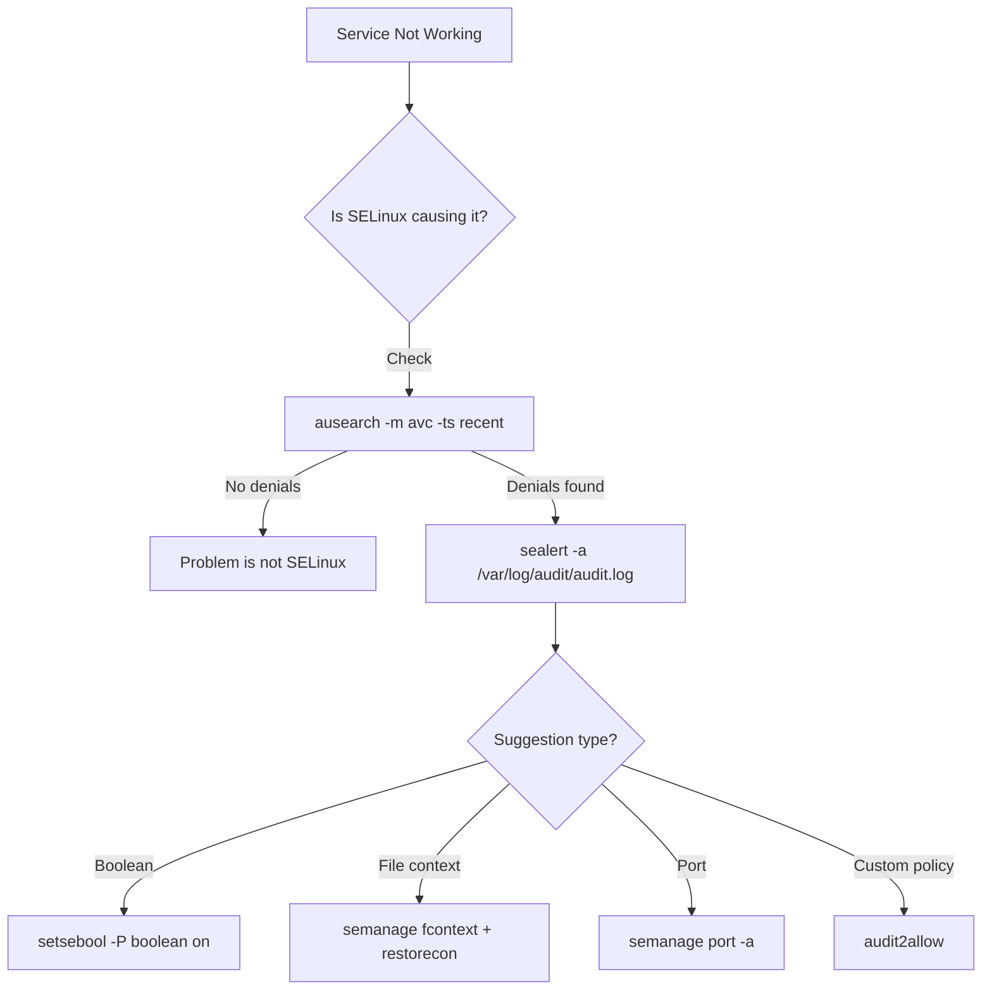

# How to Troubleshoot SELinux Denials Using sealert and ausearch on RHEL 9

Author: [nawazdhandala](https://www.github.com/nawazdhandala)

Tags: RHEL, SELinux, Troubleshooting, sealert, Linux

Description: Use sealert and ausearch to diagnose and resolve SELinux denials on RHEL 9 with practical examples and a systematic troubleshooting approach.

---

## The Troubleshooting Process

When something breaks on an SELinux-enforcing system, the fix is usually one of three things: set a boolean, fix a file context, or add a port label. The trick is figuring out which one. That is where `ausearch` and `sealert` come in. They read the audit log and tell you exactly what was denied and how to fix it.

## Troubleshooting Flow



## Prerequisites

Install the troubleshooting tools:

```bash
# Install SELinux troubleshooting tools
sudo dnf install -y setroubleshoot-server setools-console
```

## Using ausearch

`ausearch` queries the audit log for SELinux AVC (Access Vector Cache) denials.

### Find Recent Denials

```bash
# Show denials from the last 10 minutes
sudo ausearch -m avc -ts recent

# Show all denials from today
sudo ausearch -m avc -ts today

# Show denials from the last hour
sudo ausearch -m avc -ts "1 hour ago"
```

### Filter by Service

```bash
# Find denials for Apache
sudo ausearch -m avc -c httpd

# Find denials for Postfix
sudo ausearch -m avc -c postfix

# Find denials for a specific process name
sudo ausearch -m avc -c sshd
```

### Understanding AVC Messages

A typical AVC denial looks like:

```
type=AVC msg=audit(1709555123.456:789): avc:  denied  { read } for  pid=12345 comm="httpd" name="config.php" dev="sda1" ino=67890 scontext=system_u:system_r:httpd_t:s0 tcontext=unconfined_u:object_r:user_home_t:s0 tclass=file permissive=0
```

Breaking it down:
- **denied { read }** - The action that was blocked (reading a file)
- **comm="httpd"** - The process that tried the action
- **name="config.php"** - The target file
- **scontext=...httpd_t...** - The source context (Apache's domain)
- **tcontext=...user_home_t...** - The target context (wrong file label)
- **tclass=file** - The object class (file, directory, socket, port, etc.)
- **permissive=0** - Whether this was actually blocked (0=blocked, 1=logged only)

## Using sealert

`sealert` provides human-readable analysis of denials with suggested fixes.

### Analyze All Denials

```bash
# Analyze the entire audit log
sudo sealert -a /var/log/audit/audit.log
```

### Analyze Recent Denials

```bash
# Look at denials from a specific time range
sudo ausearch -m avc -ts recent | sudo sealert -a -
```

### Understanding sealert Output

A typical sealert report:

```
SELinux is preventing httpd from read access on the file config.php.

*****  Plugin restorecon (94.8 confidence) suggests   ************************

If you want to fix the label.
/var/www/html/config.php default label should be httpd_sys_content_t.
Then you can run restorecon. The access attempt may have been stopped due to
insufficient permissions to access a parent directory in which case try to
change the following command accordingly.
Do
# /sbin/restorecon -v /var/www/html/config.php

*****  Plugin catchall_boolean (7.64 confidence) suggests   ******************

If you want to allow httpd to read user content
Then you must tell SELinux about this by enabling the 'httpd_read_user_content' boolean.
Do
setsebool -P httpd_read_user_content 1
```

`sealert` ranks suggestions by confidence. The highest confidence suggestion is usually the right one.

## Using the SetroubleshootD Service

The `setroubleshootd` service monitors the audit log in real time and generates alerts:

```bash
# Enable the setroubleshoot service
sudo systemctl enable --now setroubleshootd
```

When a denial happens, you can check:

```bash
# View setroubleshoot alerts
sudo journalctl -t setroubleshoot --since "1 hour ago"
```

## Practical Examples

### Example 1: Apache Cannot Read Files

```bash
# 1. Check for denials
sudo ausearch -m avc -c httpd -ts recent

# 2. Get the fix suggestion
sudo ausearch -m avc -c httpd -ts recent | sudo sealert -a -

# 3. If it is a file context issue
sudo restorecon -Rv /var/www/html/

# 4. Verify the fix
curl http://localhost/config.php
```

### Example 2: Application Cannot Bind to a Port

```bash
# 1. Find the denial
sudo ausearch -m avc -ts recent | grep name_bind

# Output shows: denied { name_bind } ... src=9090 ... tcontext=...unreserved_port_t

# 2. Add the port label
sudo semanage port -a -t http_port_t -p tcp 9090

# 3. Restart the service
sudo systemctl restart httpd
```

### Example 3: Service Cannot Connect to the Network

```bash
# 1. Find the denial
sudo ausearch -m avc -c httpd -ts recent | grep connect

# Output shows: denied { name_connect }

# 2. Enable the appropriate boolean
sudo setsebool -P httpd_can_network_connect on
```

## Checking if SELinux Is Causing the Problem

Before diving into audit logs, a quick test:

```bash
# Temporarily switch to permissive
sudo setenforce 0

# Test if the service works now
sudo systemctl restart httpd
curl http://localhost/

# If it works, SELinux was the issue
# Switch back to enforcing
sudo setenforce 1

# Now fix the actual SELinux issue
```

Or better, use per-domain permissive mode:

```bash
# Set only httpd to permissive
sudo semanage permissive -a httpd_t

# Test the service and collect denials
sudo ausearch -m avc -c httpd -ts recent

# Fix the issues, then remove permissive exception
sudo semanage permissive -d httpd_t
```

## Filtering Noise

Audit logs can be noisy. Filter effectively:

```bash
# Show unique denial types (deduplicated)
sudo ausearch -m avc -ts today | grep "denied" | sort -u

# Show denials for a specific file
sudo ausearch -m avc -ts today | grep "name=\"filename\""

# Show denials by target type
sudo ausearch -m avc -ts today | grep "tcontext=.*:httpd_sys_content_t"
```

## Monitoring Ongoing Denials

```bash
# Watch for new denials in real time
sudo tail -f /var/log/audit/audit.log | grep "denied"
```

## Wrapping Up

The troubleshooting workflow is always the same: check `ausearch` for denials, run `sealert` to get suggestions, and apply the fix. Most issues are solved by restoring file contexts, enabling a boolean, or adding a port label. Only reach for `audit2allow` when the simpler approaches do not work. The tools make it straightforward once you know the pattern.
