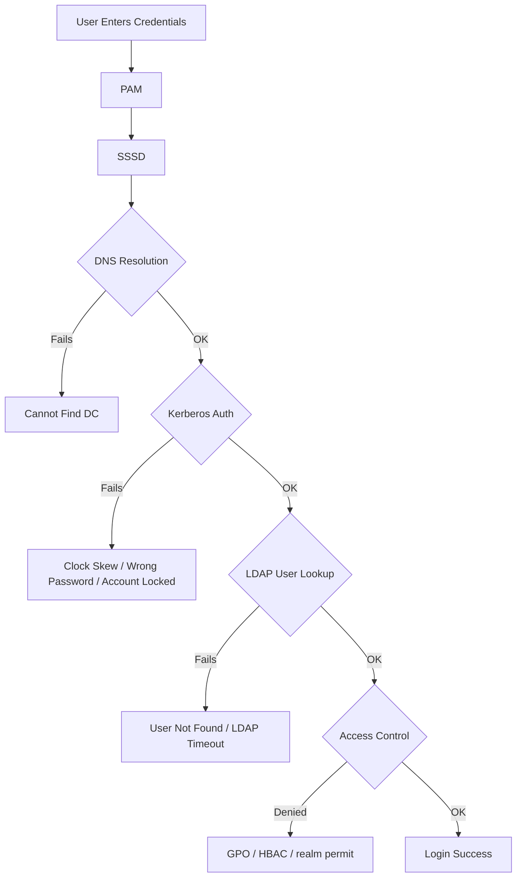

# How to Troubleshoot SSSD and Active Directory Login Failures on RHEL 9

Author: [nawazdhandala](https://www.github.com/nawazdhandala)

Tags: RHEL, SSSD, Active Directory, Troubleshooting, Linux

Description: A hands-on troubleshooting guide for diagnosing and fixing SSSD and Active Directory login failures on RHEL 9, covering common issues with DNS, Kerberos, GPO, caching, and connectivity.

---

AD login failures on RHEL are frustrating because the error messages are usually vague and the actual cause can be anywhere in the authentication chain. This guide goes through the most common failure scenarios in the order you should check them, with real diagnostic commands and fixes.

## The Authentication Chain

When a login fails, the problem could be at any point in this chain:



## Step 1 - Check SSSD Status and Logs

Start here. Most problems show up in the SSSD logs.

```bash
# Check if SSSD is running
sudo systemctl status sssd

# If SSSD is not running, check why
sudo journalctl -u sssd --no-pager -n 50

# Check SSSD domain status
sudo sssctl domain-status example.com
```

### Enable Debug Logging

The default log level is too low for troubleshooting. Increase it.

```bash
# Set debug level to 6 (very verbose)
sudo sssctl debug-level 6

# Or edit sssd.conf for persistent debug logging
sudo vi /etc/sssd/sssd.conf
```

Add to each section:

```ini
[sssd]
debug_level = 6

[domain/example.com]
debug_level = 6

[nss]
debug_level = 6

[pam]
debug_level = 6
```

```bash
sudo systemctl restart sssd

# Watch the logs in real time
sudo tail -f /var/log/sssd/sssd_example.com.log
```

## Step 2 - Check DNS Resolution

DNS is the number one cause of AD login failures. Kerberos and LDAP both depend on it.

```bash
# Check if the AD domain resolves
host example.com

# Check for AD SRV records
dig _ldap._tcp.example.com SRV
dig _kerberos._tcp.example.com SRV

# Check if a specific DC resolves
host dc1.example.com

# Check reverse DNS (some AD configurations require this)
host 10.0.0.10

# Verify /etc/resolv.conf points to AD-aware DNS
cat /etc/resolv.conf
```

### Fix DNS Issues

```bash
# Point DNS to the AD domain controller
sudo nmcli con mod "System eth0" ipv4.dns "10.0.0.10"
sudo nmcli con up "System eth0"

# Verify the change
cat /etc/resolv.conf
```

## Step 3 - Check Time Synchronization

Kerberos authentication fails if the clock difference between the RHEL client and the AD DC is more than 5 minutes.

```bash
# Check current time
timedatectl

# Check chrony sync status
chronyc tracking

# Check the time offset
chronyc sources -v
```

### Fix Time Issues

```bash
# Force an immediate time sync
sudo chronyc makestep

# Configure chrony to use the AD DC as time source
sudo vi /etc/chrony.conf
# Add: server dc1.example.com iburst

sudo systemctl restart chronyd
```

## Step 4 - Check Kerberos Authentication

Test Kerberos independently from SSSD.

```bash
# Try to get a Kerberos ticket manually
kinit aduser@EXAMPLE.COM

# If kinit succeeds, check the ticket
klist

# If kinit fails, try with verbose output
KRB5_TRACE=/dev/stderr kinit aduser@EXAMPLE.COM
```

### Common kinit Errors

| Error | Cause | Fix |
|-------|-------|-----|
| `Cannot find KDC for realm` | DNS cannot locate AD KDC | Fix DNS SRV records |
| `Clock skew too great` | Time difference > 5 minutes | Sync time with chronyc makestep |
| `Preauthentication failed` | Wrong password or account locked | Check password, check AD account status |
| `Client not found in Kerberos database` | User does not exist in AD | Verify username spelling and domain |

## Step 5 - Check User Lookup

Verify that SSSD can find the user in AD.

```bash
# Look up the user
id aduser@example.com

# If using short names
id aduser

# Check NSS resolution directly
getent passwd aduser@example.com

# If the lookup fails, clear the cache and try again
sudo sss_cache -E
sudo systemctl restart sssd
id aduser@example.com
```

## Step 6 - Check Access Control

Even if authentication succeeds, the user might be denied access by GPO, HBAC, or realm permit rules.

### Check realm permit Settings

```bash
# Check who is allowed to log in
realm list | grep "permitted-logins"

# Allow all users (for testing only)
sudo realm permit --all

# Allow specific users or groups
sudo realm permit aduser@example.com
sudo realm permit -g "Linux Users@example.com"
```

### Check GPO Access Control

SSSD enforces AD Group Policy Objects (GPO) for logon rights by default on RHEL 9.

```bash
# Check if GPO enforcement is blocking logins
sudo grep -i gpo /var/log/sssd/sssd_example.com.log
```

If GPO is blocking logins and you want to troubleshoot:

```bash
# Temporarily set GPO to permissive mode
sudo vi /etc/sssd/sssd.conf
```

Add to the domain section:

```ini
[domain/example.com]
ad_gpo_access_control = permissive
```

```bash
sudo systemctl restart sssd
```

If login works with `permissive`, the issue is in the AD GPO configuration. Check the "Allow log on locally" and "Allow log on through Remote Desktop Services" settings in the GPO applied to the computer object in AD.

## Step 7 - Check PAM Configuration

```bash
# Verify authselect profile
authselect current

# Check PAM configuration for SSSD
grep -r sssd /etc/pam.d/system-auth
grep -r sssd /etc/pam.d/password-auth
```

If PAM is not configured for SSSD:

```bash
# Reset authselect to the sssd profile
sudo authselect select sssd with-mkhomedir --force
```

## Step 8 - Nuclear Option: Clear Everything and Rejoin

When nothing else works, sometimes the cleanest fix is to leave and rejoin the domain.

```bash
# Leave the domain
sudo realm leave example.com

# Stop and clear SSSD
sudo systemctl stop sssd
sudo rm -rf /var/lib/sss/db/*
sudo rm -rf /var/lib/sss/mc/*

# Rejoin
sudo realm join example.com -U Administrator

# Restart SSSD
sudo systemctl start sssd

# Test
id aduser@example.com
```

## Quick Diagnostic Script

Here is a script that checks the most common issues in order:

```bash
#!/bin/bash
# ad-diagnostics.sh - Quick AD integration health check

echo "=== SSSD Status ==="
systemctl is-active sssd

echo "=== Domain Membership ==="
realm list 2>/dev/null | head -5

echo "=== DNS Resolution ==="
host _ldap._tcp.example.com 2>&1 | head -3

echo "=== Time Sync ==="
chronyc tracking 2>/dev/null | grep "System time"

echo "=== Kerberos Ticket ==="
klist 2>/dev/null || echo "No ticket found"

echo "=== Test User Lookup ==="
id administrator@example.com 2>&1

echo "=== SSSD Domain Status ==="
sssctl domain-status example.com 2>/dev/null
```

```bash
# Run the diagnostic script
chmod +x ad-diagnostics.sh
sudo ./ad-diagnostics.sh
```

When troubleshooting SSSD and AD issues, work through the chain systematically: DNS first, then time, then Kerberos, then LDAP, then access control. Resist the urge to change multiple things at once. Change one thing, test, and move on. The SSSD debug logs are your best friend here, so keep them enabled until the problem is resolved.
