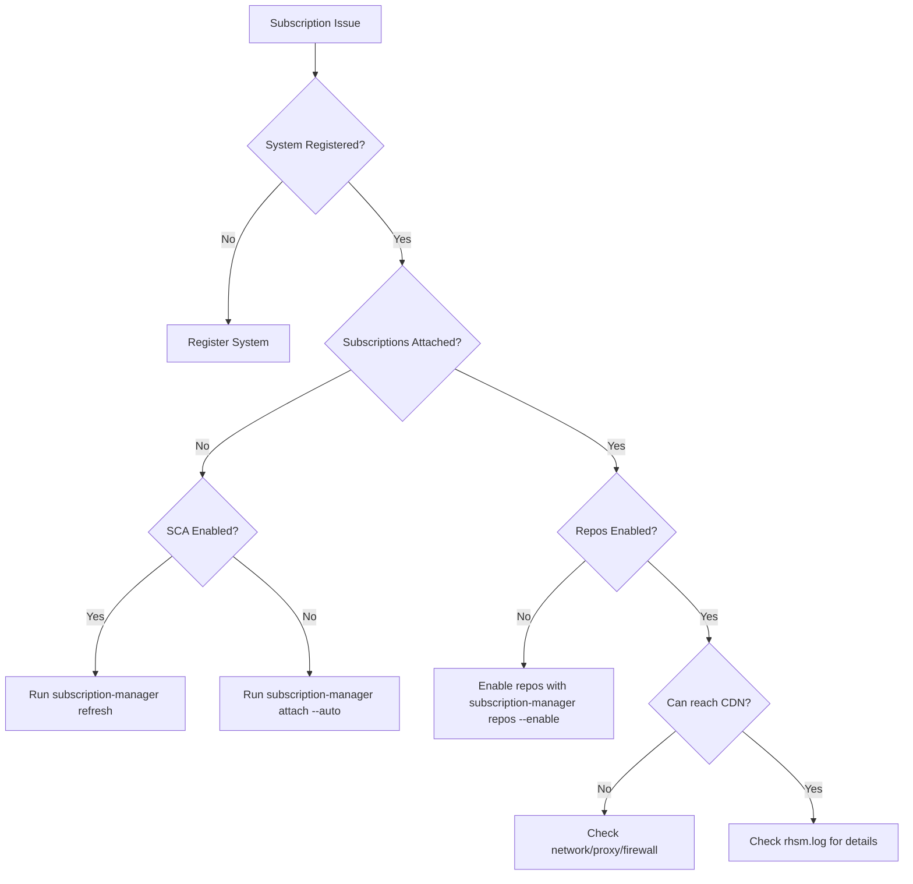

# How to Troubleshoot Subscription and Entitlement Issues on RHEL

Author: [nawazdhandala](https://www.github.com/nawazdhandala)

Tags: RHEL, Subscriptions, Troubleshooting, Red Hat, Linux

Description: A practical troubleshooting guide for common RHEL subscription and entitlement problems, covering registration failures, certificate errors, repo access issues, and more.

---

Subscription issues on RHEL can range from mildly annoying (a repo not showing up) to blocking (unable to install any packages). I have dealt with these problems across hundreds of systems over the years, and the root cause is almost always one of a handful of common issues. This guide walks through diagnosing and fixing the most frequent subscription and entitlement problems.

## Quick Diagnostic Commands

When something seems wrong with subscriptions, start with these commands:

```bash
# Check if the system is registered
sudo subscription-manager identity

# Check subscription compliance status
sudo subscription-manager status

# List installed products and their subscription status
sudo subscription-manager list --installed

# List attached subscriptions
sudo subscription-manager list --consumed

# List enabled repositories
sudo subscription-manager repos --list-enabled

# Check the subscription-manager log
sudo tail -50 /var/log/rhsm/rhsm.log
```

## Problem: "This System Is Not Registered"

**Symptom**: Running `dnf install` or `dnf update` fails with "This system is not registered to Red Hat Subscription Management."

**Diagnosis**:

```bash
# Check registration status
sudo subscription-manager identity
```

If this returns an error, the system is not registered.

**Fix**: Register the system:

```bash
# Register with credentials
sudo subscription-manager register --username=your_username --password=your_password

# Or with an activation key
sudo subscription-manager register --activationkey=my-key --org=my-org
```

## Problem: "Unable to Verify Server's Identity"

**Symptom**: Registration fails with SSL or certificate verification errors.

**Diagnosis**: This usually means the system's clock is wrong, or the CA certificate is missing/corrupted.

```bash
# Check the system time
timedatectl

# Check if CA certificate exists
ls -la /etc/rhsm/ca/
```

**Fix**:

```bash
# Fix system time
sudo timedatectl set-ntp true
sudo chronyc makestep

# Reinstall the CA certificate if needed
sudo dnf reinstall -y subscription-manager-rhsm-certificates
```

## Problem: Repositories Are Not Available

**Symptom**: `dnf repolist` shows no repos, or specific repos are missing.

**Diagnosis**:

```bash
# Check what repos are enabled
sudo subscription-manager repos --list-enabled

# Check if subscriptions are attached (non-SCA)
sudo subscription-manager list --consumed

# Check the subscription status
sudo subscription-manager status
```

**Fix**: The fix depends on whether you are using SCA or traditional entitlements.

With SCA:

```bash
# Refresh subscription data
sudo subscription-manager refresh

# Enable the needed repo
sudo subscription-manager repos --enable=rhel-9-for-x86_64-baseos-rpms
```

Without SCA:

```bash
# Auto-attach a subscription
sudo subscription-manager attach --auto

# Then enable repos
sudo subscription-manager repos --enable=rhel-9-for-x86_64-baseos-rpms
```

## Troubleshooting Decision Tree



## Problem: "No Subscriptions Are Available"

**Symptom**: `subscription-manager attach --auto` says no subscriptions are available, or `subscription-manager list --available` returns nothing.

**Diagnosis**: This usually means all subscriptions in your account are already consumed, or the subscription does not match the system's architecture.

```bash
# Check available subscriptions with all details
sudo subscription-manager list --available --all
```

**Fix**: Either free up subscriptions from other systems, add more subscriptions to your account, or check the system architecture:

```bash
# Check system architecture
uname -m

# Check installed products
sudo subscription-manager list --installed
```

## Problem: Certificate Errors

**Symptom**: Various errors about expired, invalid, or missing certificates.

**Diagnosis**:

```bash
# Check consumer certificate
ls -la /etc/pki/consumer/

# Check entitlement certificates
ls -la /etc/pki/entitlement/

# Check product certificates
ls -la /etc/pki/product/
```

**Fix**: If certificates are corrupted, clean and re-register:

```bash
# Clean all local subscription data
sudo subscription-manager clean

# Re-register
sudo subscription-manager register --username=your_username --password=your_password

# If not using SCA, re-attach
sudo subscription-manager attach --auto
```

## Problem: Duplicate System UUIDs (Cloned VMs)

**Symptom**: Two systems in the Customer Portal share the same UUID, causing one to lose its subscription when the other checks in.

**Diagnosis**:

```bash
# Check the system UUID
sudo subscription-manager identity | grep "system identity"
```

Compare this with other systems. If two systems share a UUID, you have a cloning problem.

**Fix**: On the cloned system:

```bash
# Clean the old identity
sudo subscription-manager clean

# Register fresh to get a new UUID
sudo subscription-manager register --username=your_username --password=your_password
```

## Problem: Network Connectivity Issues

**Symptom**: Registration or subscription operations hang or fail with connection errors.

**Diagnosis**:

```bash
# Test DNS resolution
dig subscription.rhsm.redhat.com

# Test HTTPS connectivity
curl -v https://subscription.rhsm.redhat.com/subscription 2>&1 | head -20

# Check if a proxy is needed
env | grep -i proxy
```

**Fix**: If you need a proxy:

```bash
# Configure proxy for subscription-manager
sudo subscription-manager config \
    --server.proxy_hostname=proxy.example.com \
    --server.proxy_port=8080

# If the proxy requires authentication
sudo subscription-manager config \
    --server.proxy_user=proxyuser \
    --server.proxy_password=proxypass
```

Check firewall rules if direct connectivity is expected:

```bash
# Verify the firewall is not blocking outbound HTTPS
sudo firewall-cmd --list-all
```

## Problem: "Content Access Mode" Confusion

**Symptom**: `subscription-manager status` shows "Overall Status: Disabled" and administrators think something is broken.

**Explanation**: This is normal with SCA enabled. The "Disabled" status means traditional entitlement checking is disabled because SCA handles content access differently. Your system is fine.

```bash
# Confirm SCA is active
sudo subscription-manager status
# Look for "Content Access Mode is set to Simple Content Access"
```

## Problem: Subscription Expired

**Symptom**: System shows "Invalid" status and repositories return 403 errors.

**Diagnosis**:

```bash
# Check subscription expiration dates
sudo subscription-manager list --consumed | grep -E "Subscription Name|Ends"

# Check overall status
sudo subscription-manager status
```

**Fix**: Renew the subscription in the Customer Portal, then:

```bash
# Refresh to pick up the renewed subscription
sudo subscription-manager refresh
sudo subscription-manager attach --auto
```

## Checking the RHSM Log

The most detailed troubleshooting information is in the log:

```bash
# View recent log entries
sudo tail -100 /var/log/rhsm/rhsm.log

# Search for errors
sudo grep -i error /var/log/rhsm/rhsm.log | tail -20

# Search for specific issues
sudo grep -i "certificate" /var/log/rhsm/rhsm.log | tail -20
```

## Nuclear Option: Full Reset

When nothing else works, do a complete subscription reset:

```bash
# Remove all local subscription data
sudo subscription-manager unregister
sudo subscription-manager clean

# Remove old certificates
sudo rm -rf /etc/pki/consumer/*
sudo rm -rf /etc/pki/entitlement/*

# Reset the RHSM configuration to defaults
sudo subscription-manager config --remove-all

# Start fresh
sudo subscription-manager register --username=your_username --password=your_password
```

Only use this as a last resort, as it removes all subscription state from the system.

## Summary

Most subscription issues on RHEL come down to four things: the system is not registered, subscriptions are not attached (in non-SCA environments), the network cannot reach Red Hat, or certificates are corrupted. Start your diagnosis with `subscription-manager identity`, `status`, and the RHSM log. Nine times out of ten, a clean and re-register fixes everything.
