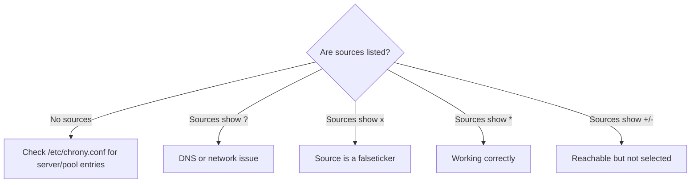

# How to Troubleshoot Time Synchronization Issues with chrony on RHEL

Author: [nawazdhandala](https://www.github.com/nawazdhandala)

Tags: RHEL, chrony, NTP, Troubleshooting, Linux

Description: Diagnose and fix common time synchronization problems with chrony on RHEL, from unreachable servers to large clock offsets.

---

Time synchronization problems show up in the strangest ways. Kerberos tickets expire instantly, two-factor authentication tokens fail, database replication breaks, and cron jobs fire at the wrong moment. When time is off, everything is off. Here is how to systematically track down and fix chrony sync issues on RHEL.

## Quick Health Check

Start with the big picture:

```bash
# Check overall time sync status
timedatectl
```

What to look for:

- `NTP service: active` - chrony is running
- `System clock synchronized: yes` - the clock is actually in sync
- `NTP enabled: yes` - NTP is enabled

If `System clock synchronized` shows `no`, you have a problem to investigate.

## Step 1: Is chronyd Running?

This sounds obvious, but check it first:

```bash
# Check the chronyd service status
sudo systemctl status chronyd
```

If it is not running:

```bash
# Start and enable chronyd
sudo systemctl enable --now chronyd
```

Check the journal for startup errors:

```bash
# Look for chrony errors in the system journal
sudo journalctl -u chronyd -n 50 --no-pager
```

## Step 2: Check NTP Sources

```bash
# Display NTP source status
chronyc sources -v
```



The key indicators in the `S` (state) column:

- `*` - current best source
- `+` - good source, not currently selected
- `-` - acceptable source, not currently used
- `?` - connectivity lost or not yet established
- `x` - designated falseticker (chrony thinks this source is wrong)

If all sources show `?`, the system cannot reach any NTP server.

## Step 3: Check Reachability

The `Reach` column in `chronyc sources` is an octal bitmask of the last 8 polling attempts. A value of `377` means all 8 were successful. A value of `0` means none were.

```bash
# Show source statistics including reach
chronyc sourcestats -v
```

If reach is 0 for all sources:

```bash
# Test basic connectivity to an NTP server
ping -c 3 0.rhel.pool.ntp.org

# Test UDP port 123 specifically
sudo nc -vzu 0.rhel.pool.ntp.org 123
```

## Step 4: Check DNS Resolution

If chrony cannot resolve NTP server hostnames, it will silently fail to add them:

```bash
# Test DNS resolution for NTP pool
dig +short 0.rhel.pool.ntp.org
```

If DNS is broken, temporarily use IP addresses in `/etc/chrony.conf` while you fix DNS:

```
# Temporary IP-based NTP sources
server 129.6.15.28 iburst
server 129.6.15.29 iburst
```

## Step 5: Check the Firewall

Outbound UDP port 123 must be allowed:

```bash
# Check if NTP traffic is allowed through the firewall
sudo firewall-cmd --list-all
```

For outbound access, the default zone usually allows it. But if you have strict egress rules:

```bash
# Explicitly allow NTP
sudo firewall-cmd --permanent --add-service=ntp
sudo firewall-cmd --reload
```

Also check if there is an external firewall or network ACL blocking UDP 123.

## Step 6: Check for Large Clock Offset

If the system clock is very far off (minutes or hours), chrony may refuse to adjust it because `makestep` only allows large steps during the first few updates.

Check the current offset:

```bash
# Show the current tracking details
chronyc tracking
```

Look at the `System time` line. If the offset is large:

```bash
# Force an immediate time step
sudo chronyc makestep
```

For really large offsets (days or more), you might need to set the time manually first:

```bash
# Stop chrony, set the time manually, then restart
sudo systemctl stop chronyd
sudo date -s "2026-03-04 12:00:00"
sudo systemctl start chronyd
```

## Step 7: Check for Conflicting NTP Services

Make sure you do not have multiple time sync services fighting each other:

```bash
# Check if ntpd is somehow installed and running
systemctl status ntpd 2>/dev/null
systemctl status systemd-timesyncd 2>/dev/null
```

If either is running, stop and disable them:

```bash
# Disable conflicting time services
sudo systemctl stop systemd-timesyncd
sudo systemctl disable systemd-timesyncd
```

RHEL should only have chronyd, but custom installations or third-party repos sometimes introduce conflicts.

## Step 8: Analyze the Drift File

chrony records clock drift in `/var/lib/chrony/drift`:

```bash
# View the drift value (parts per million)
cat /var/lib/chrony/drift
```

A normal value is typically between -50 and +50 PPM. If the value is very large, your system's clock hardware may be unreliable (common in VMs).

If the drift file is corrupt or contains garbage:

```bash
# Remove the drift file and restart chrony to regenerate it
sudo systemctl stop chronyd
sudo rm /var/lib/chrony/drift
sudo systemctl start chronyd
```

## Step 9: Check SELinux

SELinux can interfere with chrony if contexts are wrong:

```bash
# Check for SELinux denials related to chrony
sudo ausearch -m AVC -ts recent | grep chrony
```

If you find denials:

```bash
# Restore SELinux contexts for chrony files
sudo restorecon -Rv /var/lib/chrony/
sudo restorecon -Rv /etc/chrony.conf
```

## Step 10: Enable Verbose Logging

For deeper debugging, increase chrony's logging:

```bash
# Add detailed logging to chrony.conf
echo "log tracking measurements statistics refclocks" | sudo tee -a /etc/chrony.conf
sudo systemctl restart chronyd
```

Check the logs:

```bash
# View chrony tracking logs
ls /var/log/chrony/
cat /var/log/chrony/tracking.log | tail -20
```

The tracking log shows time offset and frequency error at each update, which helps identify patterns.

## Common Scenarios and Fixes

### VM After Suspend/Resume

VMs that get suspended and resumed often have large time jumps. Configure chrony to handle this:

```
# In /etc/chrony.conf - allow stepping at any time if offset is over 1 second
makestep 1 -1
```

The `-1` means unlimited steps (not just the first 3 updates). Use this carefully, as time jumps can affect running applications.

### NTP Server Changed IP

If your NTP server changed its IP but the hostname still resolves to the old one:

```bash
# Flush chrony's cached DNS
chronyc refresh
```

### Clock Jumping Forward and Back

If the clock keeps jumping, check if something is fighting chrony. Tools like `vmtoolsd` (VMware Tools) can interfere:

```bash
# Check if VMware time sync is enabled
vmware-toolbox-cmd timesync status 2>/dev/null
```

Disable VMware time sync if chrony is managing time:

```bash
# Disable VMware time sync
vmware-toolbox-cmd timesync disable
```

### All Sources Are Falsetickers

If chrony marks all sources as falsetickers (`x`), it means the sources disagree with each other significantly. Check each source individually:

```bash
# Show detailed data for each NTP source
chronyc ntpdata
```

You may need to add more sources so chrony can determine which ones are correct through majority voting.

## Wrapping Up

Time sync troubleshooting on RHEL follows a logical path: verify the service is running, check source reachability, verify firewall rules, look at the clock offset, and check for conflicts. `chronyc sources` and `chronyc tracking` are your two best friends here. Most issues come down to DNS problems, firewall rules, or the clock being too far off for automatic correction.
