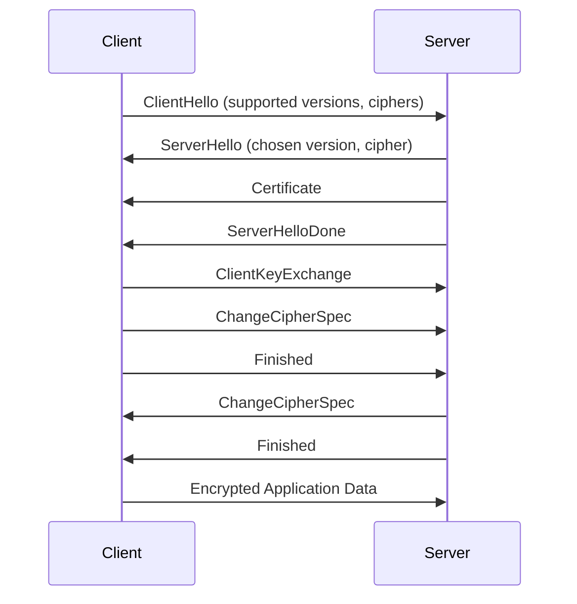

# How to Troubleshoot TLS Handshake Failures on RHEL

Author: [nawazdhandala](https://www.github.com/nawazdhandala)

Tags: RHEL, TLS, Troubleshooting, SSL, Linux

Description: Practical techniques for diagnosing and fixing TLS handshake failures on RHEL, covering common causes like protocol mismatches, expired certificates, and crypto policy conflicts.

---

TLS handshake failures are one of those problems where the error messages are almost never helpful. You get "connection reset," "handshake failure," or the ever-informative "unknown error," and you are left staring at the screen. After debugging hundreds of these issues across production systems, I have a reliable process that finds the problem fast.

This guide walks through the most common causes and the tools you need on RHEL.

## The TLS Handshake Process

Before diving into troubleshooting, it helps to understand what actually happens during a TLS handshake:



A failure at any step produces different symptoms. The trick is figuring out which step broke.

## Tool #1: openssl s_client

This is your primary debugging tool. Connect to a server and see exactly what happens:

```bash
# Connect and show the full handshake details
openssl s_client -connect myserver.example.com:443 -servername myserver.example.com </dev/null
```

The `-servername` flag sends the SNI (Server Name Indication) header, which is important when a server hosts multiple certificates.

Key things to look for in the output:

- **Verify return code:** 0 means the certificate chain is valid
- **Protocol:** Which TLS version was negotiated
- **Cipher:** Which cipher suite was chosen
- **Certificate chain:** The full chain from server cert to root

## Tool #2: gnutls-cli

GnuTLS provides an alternative client that sometimes gives better error messages:

```bash
# Test the connection with GnuTLS
gnutls-cli myserver.example.com -p 443
```

## Tool #3: curl with Verbose Output

```bash
# Make an HTTPS request with full TLS debugging output
curl -vvv https://myserver.example.com/ 2>&1 | head -50
```

The `-vvv` flag shows the TLS handshake details mixed with the HTTP conversation.

## Common Cause #1: Protocol Version Mismatch

RHEL's DEFAULT crypto policy requires TLS 1.2 minimum. If a client only supports TLS 1.0 or 1.1, the handshake fails immediately.

Diagnose it:

```bash
# Try connecting with only TLS 1.0
openssl s_client -connect myserver.example.com:443 -tls1 </dev/null 2>&1 | head -5
```

If you see "no protocols available" or "handshake failure," the server correctly rejects old TLS versions.

Check the server's crypto policy:

```bash
# View the current system crypto policy
update-crypto-policies --show
```

If a legacy client must connect and you cannot update it, you can temporarily lower the policy:

```bash
# Switch to LEGACY policy to allow older TLS versions (not recommended long-term)
sudo update-crypto-policies --set LEGACY
sudo systemctl restart httpd
```

## Common Cause #2: Cipher Suite Mismatch

The client and server must agree on at least one cipher suite. If their lists do not overlap, the handshake fails.

Check what the server offers:

```bash
# List the cipher suites the server accepts
openssl s_client -connect myserver.example.com:443 </dev/null 2>&1 | grep "Cipher  "
```

Check what your system allows:

```bash
# List ciphers enabled by the current crypto policy
openssl ciphers -v
```

If a specific cipher is needed but your policy blocks it, create a sub-policy or adjust your application config.

## Common Cause #3: Expired or Invalid Certificates

Check the certificate dates:

```bash
# Show certificate validity dates
openssl s_client -connect myserver.example.com:443 -servername myserver.example.com </dev/null 2>/dev/null | openssl x509 -noout -dates
```

If the certificate has expired, you will see a `notAfter` date in the past. Renew it.

Check the full verification result:

```bash
# Get the verification return code
openssl s_client -connect myserver.example.com:443 </dev/null 2>&1 | grep "Verify return code"
```

Common verification errors:

| Code | Meaning |
|------|---------|
| 10 | Certificate has expired |
| 18 | Self-signed certificate |
| 19 | Self-signed certificate in chain |
| 20 | Unable to get local issuer certificate |
| 21 | Unable to verify the first certificate |

## Common Cause #4: Missing Intermediate Certificates

This is probably the most common TLS issue I see in production. The server sends its own certificate but forgets the intermediate certificate. Browsers sometimes work around this by fetching intermediates, but command-line tools and other services do not.

```bash
# Show the certificate chain depth
openssl s_client -connect myserver.example.com:443 </dev/null 2>&1 | grep -A2 "Certificate chain"
```

If you see only one certificate (depth 0) and verification fails, the intermediate is missing. Fix it by concatenating the certificates:

```bash
# Create a full chain file with server cert + intermediate
cat server.crt intermediate.crt > fullchain.crt
```

Update your web server to use the full chain file.

## Common Cause #5: SNI Issues

If a server hosts multiple sites with different certificates, it uses SNI to pick the right one. Forgetting to send SNI can result in the wrong certificate or a handshake failure.

```bash
# Connect without SNI
openssl s_client -connect myserver.example.com:443 </dev/null 2>&1 | grep "subject="

# Connect with SNI
openssl s_client -connect myserver.example.com:443 -servername myserver.example.com </dev/null 2>&1 | grep "subject="
```

If the subjects differ, SNI is the issue. Make sure your client sends it.

## Common Cause #6: Hostname Mismatch

The certificate's Subject Alternative Names (or CN) must match the hostname you are connecting to:

```bash
# Check what names the certificate covers
openssl s_client -connect myserver.example.com:443 -servername myserver.example.com </dev/null 2>/dev/null | openssl x509 -noout -ext subjectAltName
```

## Common Cause #7: Firewall or Network Issues

Sometimes it is not a TLS problem at all. The connection never completes because of a firewall or network issue.

```bash
# Test basic TCP connectivity to port 443
nc -zv myserver.example.com 443 -w 5
```

If this times out, TLS never even gets a chance to start.

## Packet-Level Debugging with tcpdump

When the higher-level tools are not giving you enough information:

```bash
# Capture TLS handshake packets on port 443
sudo tcpdump -i eth0 -nn -s 0 -w /tmp/tls-debug.pcap 'port 443' &

# Run your failing connection
openssl s_client -connect myserver.example.com:443 </dev/null

# Stop the capture
sudo kill %1
```

Open the pcap in Wireshark on your workstation. Filter with `tls.handshake` to see only handshake messages. Look for `Alert` messages, which tell you exactly where and why the handshake failed.

## Checking SELinux

SELinux can prevent a service from reading its certificate or key files:

```bash
# Check for SELinux denials related to TLS
sudo ausearch -m AVC -ts recent | grep -i "cert\|ssl\|tls\|key"
```

If you find denials, fix the file contexts:

```bash
# Restore proper SELinux contexts
sudo restorecon -Rv /etc/pki/tls/
```

## Wrapping Up

TLS handshake debugging follows a pattern: check the protocol version, check the cipher overlap, check the certificate chain, check the names, and check the network. Use `openssl s_client` as your starting point and work through each layer. On RHEL, always consider the system crypto policy as a potential source of mismatches, especially after upgrades or when connecting to older systems.
