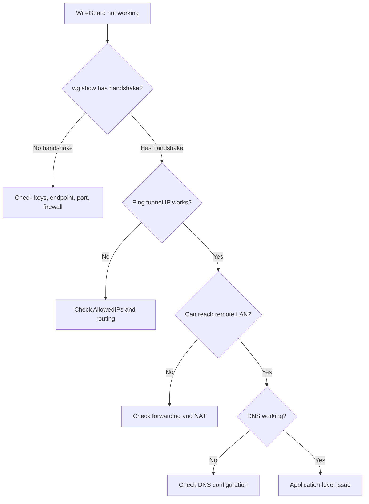

# How to Troubleshoot WireGuard VPN Connection Issues on RHEL 9

Author: [nawazdhandala](https://www.github.com/nawazdhandala)

Tags: RHEL, WireGuard, VPN, Troubleshooting, Linux

Description: A systematic guide to diagnosing and resolving common WireGuard VPN connection problems on RHEL 9, from failed handshakes and routing issues to DNS and performance problems.

---

WireGuard is simple by design, which means when something goes wrong, the problem space is relatively small. But WireGuard's simplicity also means it doesn't give you much feedback when things fail. No verbose logs, no error messages in the tunnel. You have to know where to look.

## Diagnostic Workflow



## Problem 1: No Handshake

This is the most common issue. The tunnel is up but `wg show` shows no "latest handshake" timestamp.

```bash
# Check current WireGuard status
sudo wg show wg0
```

If there's no handshake, the two peers haven't successfully communicated at all.

**Check 1: Is the endpoint correct?**

```bash
# Verify the endpoint in your config
sudo wg show wg0 endpoints

# Try reaching the endpoint directly
ping -c 4 SERVER_IP
```

**Check 2: Is the port open on the server?**

```bash
# On the server, verify WireGuard is listening
ss -ulnp | grep 51820

# Check the firewall allows the port
sudo firewall-cmd --list-ports | grep 51820
```

**Check 3: Are the keys correct?**

The most common misconfiguration is swapping keys. The server config needs the client's public key, and vice versa. Neither side should have the other's private key.

```bash
# On the client, check what public key is configured for the peer
sudo wg show wg0 peers

# This should match the server's public key
# On the server, run:
sudo cat /etc/wireguard/server_public.key
```

**Check 4: NAT or carrier-grade NAT**

If both sides are behind NAT, at least one side needs port forwarding configured on the router. WireGuard can't punch through NAT without help from at least one publicly reachable endpoint.

## Problem 2: Handshake Works but No Traffic

You see a handshake timestamp in `wg show`, but pings through the tunnel fail.

**Check AllowedIPs:**

```bash
# Show allowed IPs for each peer
sudo wg show wg0 allowed-ips
```

AllowedIPs serves as both a routing table and an access control list. If the destination IP isn't covered by a peer's AllowedIPs, WireGuard won't send the packet through the tunnel.

```bash
# Common mistake: client has AllowedIPs = 10.0.0.1/32
# This only allows traffic to the server's tunnel IP
# To route all traffic: AllowedIPs = 0.0.0.0/0
# To route specific subnets: AllowedIPs = 10.0.0.0/24, 192.168.1.0/24
```

**Check the routing table:**

```bash
# See if routes were created for the tunnel
ip route show | grep wg0

# If using wg-quick, it should have added routes automatically
# If using nmcli, check the connection's route settings
nmcli connection show "wg-vpn" | grep route
```

## Problem 3: Traffic Works One Way

You can ping from the server to the client, but not the other way (or vice versa).

```bash
# Check AllowedIPs on BOTH sides
# On the server:
sudo wg show wg0 allowed-ips
# On the client:
sudo wg show wg0 allowed-ips

# The server must have the client's tunnel IP in AllowedIPs
# The client must have the server's tunnel IP (or 0.0.0.0/0) in AllowedIPs
```

Also check for asymmetric firewall rules:

```bash
# On the server
sudo firewall-cmd --list-all
sudo firewall-cmd --zone=trusted --list-all

# Make sure wg0 is in a zone that allows traffic
sudo firewall-cmd --get-active-zones
```

## Problem 4: DNS Not Working Through the Tunnel

WireGuard itself doesn't handle DNS. It's up to the client configuration.

```bash
# Check DNS configuration
cat /etc/resolv.conf

# If using wg-quick, DNS should be set in the config
grep DNS /etc/wireguard/wg0.conf

# If using NetworkManager, check the connection
nmcli connection show "wg-vpn" | grep dns
```

When using wg-quick, the DNS setting modifies `/etc/resolv.conf`. If you have systemd-resolved running, there might be conflicts:

```bash
# Check if systemd-resolved is managing DNS
resolvectl status

# If so, configure DNS through the proper channel
sudo resolvectl dns wg0 1.1.1.1
```

## Problem 5: Slow Performance

WireGuard should be fast. If it's not, check these:

```bash
# Check the MTU - WireGuard overhead is 60 bytes for IPv4, 80 for IPv6
ip link show wg0

# The WireGuard interface MTU should be your physical MTU minus overhead
# For a 1500-byte physical MTU: WireGuard MTU should be 1420

# Set the MTU if needed
sudo ip link set wg0 mtu 1420
```

```bash
# Check for CPU bottlenecks (WireGuard uses the CPU for encryption)
top -bn1 | head -20

# Test raw throughput through the tunnel
# On one side:
iperf3 -s
# On the other:
iperf3 -c 10.0.0.1
```

## Problem 6: Connection Drops Behind NAT

If the client is behind NAT and the connection drops after periods of inactivity:

```bash
# Check if PersistentKeepalive is set
sudo wg show wg0

# If not, add it to the peer configuration (in seconds)
sudo wg set wg0 peer SERVER_PUBLIC_KEY persistent-keepalive 25
```

25 seconds is the standard recommendation. It keeps the NAT mapping alive without adding significant overhead.

## Problem 7: wg-quick Fails to Start

```bash
# Check the systemd service status
sudo systemctl status wg-quick@wg0

# Look for specific errors
journalctl -u wg-quick@wg0 --since "5 minutes ago"

# Common issues:
# - Config file permissions too open
# - IP address conflict with existing interface
# - Missing wireguard kernel module (unlikely on RHEL 9)
```

```bash
# Verify the kernel module is loaded
lsmod | grep wireguard

# Check config file permissions
ls -la /etc/wireguard/wg0.conf
# Should be 600 or 640
```

## Useful Debug Commands

```bash
# Full WireGuard diagnostic snapshot
echo "=== WG Status ===" && sudo wg show
echo "=== WG Interface ===" && ip addr show wg0
echo "=== Routes ===" && ip route show | grep wg
echo "=== Firewall ===" && sudo firewall-cmd --list-all
echo "=== Forwarding ===" && sysctl net.ipv4.ip_forward
echo "=== Listening ===" && ss -ulnp | grep 51820
```

## Wrapping Up

WireGuard troubleshooting comes down to a few categories: handshake issues (keys, endpoint, firewall), routing issues (AllowedIPs, ip routes), forwarding issues (sysctl, firewalld), and DNS. The lack of verbose logging is a feature in terms of security, but it means you need to methodically check each layer rather than relying on log messages to tell you what's wrong.
