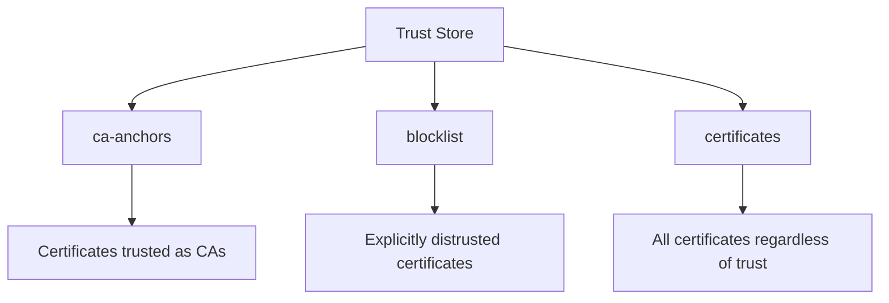
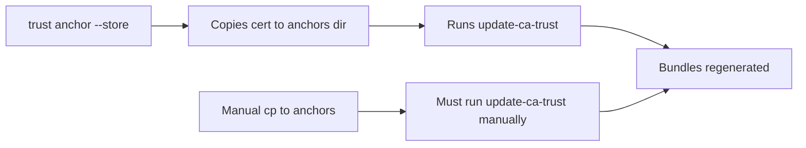

# How to Use the trust Command to Manage Certificates on RHEL 9

Author: [nawazdhandala](https://www.github.com/nawazdhandala)

Tags: RHEL, trust Command, Certificates, Security, Linux

Description: A practical guide to using the p11-kit trust command on RHEL 9 for listing, adding, removing, and modifying certificate trust settings.

---

RHEL 9 includes the `trust` command (part of the p11-kit package) as a higher-level interface for managing the system certificate trust store. While `update-ca-trust` handles the bundle regeneration, `trust` gives you finer control over individual certificates, including the ability to set specific trust purposes and inspect what is actually in your store.

## What is the trust Command?

The `trust` command is part of `p11-kit-trust`, which provides a PKCS#11 trust module. It acts as a front-end to the system trust store and can:

- List all trusted certificates
- Add or remove certificates
- Extract certificates in various formats
- Modify trust flags on individual certificates
- Block specific certificates

```bash
# Verify the trust command is available
which trust
rpm -qf $(which trust)
```

## Listing Trusted Certificates

The most basic operation, see what your system trusts:

```bash
# List all trusted CA certificates
trust list
```

This produces a lot of output. Filter it down:

```bash
# List only certificate authorities
trust list --filter=ca-anchors
```

```bash
# Search for a specific CA
trust list | grep -B2 -A4 "DigiCert"
```

Each entry shows:

- The PKCS#11 URI
- The type (certificate, trust-assertion, etc.)
- The label
- Trust settings

## Understanding Trust Categories

The `trust` command organizes certificates into categories:



- **ca-anchors**: Certificates explicitly trusted as certificate authorities
- **blocklist**: Certificates that are explicitly distrusted
- **certificates**: All certificates in the store

```bash
# Count certificates in each category
echo "CA Anchors:"
trust list --filter=ca-anchors | grep -c "type: certificate"

echo "Blocklist:"
trust list --filter=blocklist | grep -c "type: certificate"
```

## Adding a Certificate with trust

While you can manually copy files to the anchors directory, `trust anchor` provides a cleaner interface:

```bash
# Add a CA certificate to the trust store
sudo trust anchor --store /path/to/my-ca-cert.pem
```

This copies the certificate into the appropriate directory and updates the trust store automatically. No need to run `update-ca-trust` separately.

Verify it was added:

```bash
# Check that the certificate appears in the store
trust list | grep -i "my-ca"
```

## Removing a Certificate with trust

To remove a certificate you previously added:

```bash
# First find the certificate's PKCS#11 URI
trust list | grep -B1 "My Internal CA"
```

You will see a URI like `pkcs11:id=...;type=cert`. Use it to remove:

```bash
# Remove by PKCS#11 URI
sudo trust anchor --remove "pkcs11:id=%AA%BB%CC...;type=cert"
```

Alternatively, remove by file:

```bash
# Remove a certificate that was previously stored
sudo trust anchor --remove /path/to/my-ca-cert.pem
```

## Extracting Certificates

The `trust extract` command lets you pull certificates out of the store in various formats:

### Extract as PEM Bundle

```bash
# Extract all trusted CAs as a PEM bundle
trust extract --format=pem-bundle --filter=ca-anchors --purpose=server-auth extracted-cas.pem
```

### Extract as Individual PEM Files

```bash
# Extract each CA as a separate PEM file in a directory
mkdir -p /tmp/ca-certs
trust extract --format=pem-directory-hash --filter=ca-anchors --purpose=server-auth /tmp/ca-certs/
```

### Extract as Java Keystore

```bash
# Extract as a Java keystore
trust extract --format=java-cacerts --filter=ca-anchors --purpose=server-auth /tmp/cacerts
```

### Extract as OpenSSL Bundle

```bash
# Extract in OpenSSL's extended trust format
trust extract --format=openssl-bundle --filter=ca-anchors --purpose=server-auth /tmp/ca-bundle.trust.crt
```

## Trust Purposes

Certificates can be trusted for different purposes. The `--purpose` flag filters based on intended use:

```bash
# Extract only CAs trusted for server authentication (TLS)
trust extract --format=pem-bundle --purpose=server-auth --filter=ca-anchors server-cas.pem

# Extract only CAs trusted for email (S/MIME)
trust extract --format=pem-bundle --purpose=email --filter=ca-anchors email-cas.pem

# Extract CAs trusted for code signing
trust extract --format=pem-bundle --purpose=code-signing --filter=ca-anchors code-cas.pem
```

## Blocklisting a Certificate

If you want to explicitly distrust a certificate (maybe a CA was compromised or you do not want to trust it for policy reasons):

```bash
# Copy the certificate to the blocklist directory
sudo cp distrusted-ca.pem /etc/pki/ca-trust/source/blocklist/
sudo update-ca-trust
```

Verify it is blocked:

```bash
# Check the blocklist
trust list --filter=blocklist
```

You can also set more granular trust. For example, trust a CA for email but not for server authentication:

```bash
# Create a trust override file
sudo trust anchor --store --purpose=email my-ca-cert.pem
```

## Inspecting a Specific Certificate

To get detailed information about a certificate in the store:

```bash
# Dump full details of a certificate by its label
trust list --filter=ca-anchors | grep -A10 "DigiCert Global Root G2"
```

For even more detail, extract it and use openssl:

```bash
# Extract a single CA and inspect it
trust extract --format=pem-bundle --filter="pkcs11:id=%....." /tmp/single-ca.pem
openssl x509 -in /tmp/single-ca.pem -noout -text
```

## Comparing Trust Stores Between Systems

When debugging trust issues across multiple servers, it helps to compare their trust stores:

```bash
# Generate a sorted list of trusted CA subjects
trust list --filter=ca-anchors | grep "label:" | sort > /tmp/trusted-cas-$(hostname).txt
```

Copy these files from different servers and diff them:

```bash
# Compare two servers' trust stores
diff /tmp/trusted-cas-server1.txt /tmp/trusted-cas-server2.txt
```

## Scripting with the trust Command

Here is a practical script that audits your trust store:

```bash
#!/bin/bash
# Audit script for the certificate trust store

echo "=== Trust Store Audit ==="
echo "Date: $(date)"
echo "Host: $(hostname)"
echo ""

echo "Total CA anchors:"
trust list --filter=ca-anchors | grep -c "type: certificate"

echo ""
echo "Blocklisted certificates:"
trust list --filter=blocklist | grep -c "type: certificate"

echo ""
echo "Custom CA certificates in anchors directory:"
ls -la /etc/pki/ca-trust/source/anchors/ 2>/dev/null || echo "  (none)"

echo ""
echo "Blocklist entries:"
ls -la /etc/pki/ca-trust/source/blocklist/ 2>/dev/null || echo "  (none)"

echo ""
echo "ca-certificates package version:"
rpm -q ca-certificates
```

## How trust Relates to update-ca-trust

These two commands complement each other:

- `trust` is the PKCS#11 interface for querying and modifying the store
- `update-ca-trust` regenerates the output bundles from the source directory

When you use `trust anchor --store`, it handles both the file placement and the update. When you manually copy files, you need to run `update-ca-trust` yourself.



## Wrapping Up

The `trust` command is the modern way to interact with RHEL 9's certificate trust store. For quick operations like adding or removing a CA, `trust anchor` saves you a step over the manual copy-and-update workflow. For auditing and extraction, `trust list` and `trust extract` give you exactly the information you need in the format you need it. Make it part of your standard toolkit.
