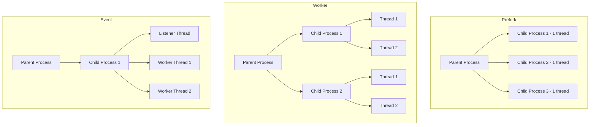

# How to Tune Apache MPM Worker and Event for Performance on RHEL

Author: [nawazdhandala](https://www.github.com/nawazdhandala)

Tags: RHEL, Apache, MPM, Performance Tuning, Linux

Description: A guide to selecting and tuning Apache Multi-Processing Modules (MPM) on RHEL for optimal performance under different workloads.

---

Apache uses Multi-Processing Modules (MPMs) to handle incoming connections. The choice between prefork, worker, and event MPMs dramatically affects performance and resource usage. On RHEL, the event MPM is the default and best choice for most workloads. This guide explains how to select and tune the right MPM.

## Prerequisites

- A RHEL system with Apache installed
- Root or sudo access
- Understanding of your expected traffic patterns

## Understanding the Three MPMs



- **Prefork**: One process per connection. Safe for non-thread-safe modules (like older PHP). Uses the most memory.
- **Worker**: Multiple threads per process. Uses less memory than prefork. Good for static content.
- **Event**: Like worker, but with a dedicated listener thread that handles keepalive connections efficiently. Best for modern workloads.

## Step 1: Check the Current MPM

```bash
# See which MPM is currently loaded
httpd -V | grep MPM

# Or check loaded modules
httpd -M | grep mpm
```

## Step 2: Switch MPMs

```bash
# Edit the MPM configuration file
sudo vi /etc/httpd/conf.modules.d/00-mpm.conf
```

```apache
# Comment out the current MPM and enable the one you want

# Prefork (uncomment only if you need it for non-thread-safe modules)
# LoadModule mpm_prefork_module modules/mod_mpm_prefork.so

# Worker MPM
# LoadModule mpm_worker_module modules/mod_mpm_worker.so

# Event MPM (recommended for most workloads)
LoadModule mpm_event_module modules/mod_mpm_event.so
```

Only one MPM can be loaded at a time.

## Step 3: Tune the Event MPM

The event MPM is the default on RHEL. Here are the key settings:

```apache
# /etc/httpd/conf.d/mpm-tuning.conf

<IfModule mpm_event_module>
    # Number of child processes to start
    StartServers             3

    # Minimum number of idle threads
    MinSpareThreads          75

    # Maximum number of idle threads
    MaxSpareThreads          250

    # Number of threads per child process
    ThreadsPerChild          25

    # Maximum number of simultaneous connections
    # This equals ServerLimit * ThreadsPerChild
    MaxRequestWorkers        400

    # Maximum number of child processes
    ServerLimit              16

    # Number of requests a child process handles before being recycled
    MaxConnectionsPerChild   10000

    # Async connections factor for keepalive handling
    AsyncRequestWorkerFactor 2
</IfModule>
```

### Calculating MaxRequestWorkers

The formula is: `MaxRequestWorkers = ServerLimit * ThreadsPerChild`

For a server with 4 GB of RAM:

```bash
# Check current memory usage per Apache process
ps aux | grep httpd | awk '{sum += $6} END {print sum/NR/1024 " MB average per process"}'

# Example: if each process uses ~50MB and you have 4GB available for Apache
# Available memory / memory per process = max processes
# 3072MB / 50MB = ~60 processes
# With 25 threads each = 1500 MaxRequestWorkers
```

## Step 4: Tune the Worker MPM

If you use the worker MPM instead:

```apache
<IfModule mpm_worker_module>
    StartServers             3
    MinSpareThreads          75
    MaxSpareThreads          250
    ThreadsPerChild          25
    MaxRequestWorkers        400
    ServerLimit              16
    MaxConnectionsPerChild   10000
</IfModule>
```

## Step 5: Tune the Prefork MPM

Only use prefork if you run non-thread-safe PHP modules (mod_php):

```apache
<IfModule mpm_prefork_module>
    # Number of child processes to start
    StartServers             5

    # Minimum idle child processes
    MinSpareServers          5

    # Maximum idle child processes
    MaxSpareServers          10

    # Maximum simultaneous connections
    MaxRequestWorkers        256

    # Maximum child processes (must be >= MaxRequestWorkers)
    ServerLimit              256

    # Recycle processes after this many requests
    MaxConnectionsPerChild   4000
</IfModule>
```

## Step 6: Additional Performance Tuning

```apache
# /etc/httpd/conf.d/performance.conf

# Keep connections alive for efficiency
KeepAlive On

# Maximum requests per keepalive connection
MaxKeepAliveRequests 100

# Timeout for keepalive connections (seconds)
# Lower values free up threads faster
KeepAliveTimeout 5

# General request timeout
Timeout 60

# Enable compression for text-based content
<IfModule mod_deflate.c>
    AddOutputFilterByType DEFLATE text/html text/plain text/xml
    AddOutputFilterByType DEFLATE text/css application/javascript
    AddOutputFilterByType DEFLATE application/json
</IfModule>

# Enable browser caching for static assets
<IfModule mod_expires.c>
    ExpiresActive On
    ExpiresByType image/jpeg "access plus 1 year"
    ExpiresByType image/png "access plus 1 year"
    ExpiresByType text/css "access plus 1 month"
    ExpiresByType application/javascript "access plus 1 month"
</IfModule>
```

## Step 7: Monitor Performance

```bash
# Enable the server-status page for monitoring
cat <<'EOF' | sudo tee /etc/httpd/conf.d/server-status.conf
<Location "/server-status">
    SetHandler server-status
    Require ip 127.0.0.1
    Require ip ::1
</Location>
ExtendedStatus On
EOF

# Reload and check the status
sudo systemctl reload httpd
curl http://localhost/server-status?auto

# Watch active connections and throughput
watch -n 1 'curl -s http://localhost/server-status?auto | head -20'
```

## Step 8: Apply and Test

```bash
# Test configuration
sudo apachectl configtest

# Restart Apache (restart required when changing MPMs)
sudo systemctl restart httpd

# Verify the new MPM is active
httpd -V | grep MPM

# Load test with Apache Bench
ab -n 1000 -c 50 http://localhost/
```

## Troubleshooting

```bash
# Check if Apache is hitting MaxRequestWorkers
sudo grep "MaxRequestWorkers" /var/log/httpd/error_log

# Monitor process and thread count
ps aux | grep httpd | wc -l

# Check memory usage
free -h

# If Apache is consuming too much memory, reduce MaxRequestWorkers
# If connections are being rejected, increase MaxRequestWorkers
```

## Summary

The event MPM is the best choice for most Apache workloads on RHEL. It handles keepalive connections efficiently without tying up worker threads. Key tuning parameters are MaxRequestWorkers (total concurrent connections), ThreadsPerChild (threads per process), and KeepAliveTimeout (how long idle connections persist). Monitor your server's memory usage and connection patterns to find the right balance.
