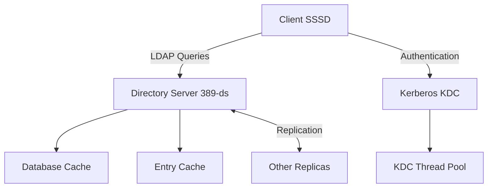

# How to Tune IdM Performance for Large-Scale Deployments on RHEL

Author: [nawazdhandala](https://www.github.com/nawazdhandala)

Tags: RHEL, IdM, Performance, FreeIPA, Linux

Description: A guide to tuning IdM (FreeIPA) for large-scale environments on RHEL, covering Directory Server tuning, Kerberos optimization, SSSD client settings, and system-level improvements.

---

IdM works fine out of the box for a few hundred users. When you scale to thousands of users, hundreds of hosts, and dozens of replicas, the default settings start showing cracks. Searches get slow, replication lags, and clients time out. This guide covers the performance knobs that actually matter when scaling IdM on RHEL.

## Where Performance Bottlenecks Happen



The main bottlenecks in a large IdM deployment are: Directory Server cache misses, LDAP search performance, Kerberos KDC thread exhaustion, replication lag, and client-side SSSD enumeration.

## Tuning the Directory Server (389-ds)

The Directory Server is the heart of IdM. Most performance tuning starts here.

### Increase the Database Cache

The database cache (also called the DB cache or nsslapd-dbcachesize) should be large enough to hold the entire database in memory.

```bash
# Check the current database size
sudo du -sh /var/lib/dirsrv/slapd-EXAMPLE-COM/db/

# Check current cache settings
sudo dsconf -D "cn=Directory Manager" ldap://localhost \
  backend config get

# Increase the database cache to 1 GB
sudo dsconf -D "cn=Directory Manager" ldap://localhost \
  backend config set --db-cache-size=1073741824
```

### Increase the Entry Cache

The entry cache stores parsed LDAP entries in memory. For large directories, increase it.

```bash
# Check current entry cache size
sudo dsconf -D "cn=Directory Manager" ldap://localhost \
  backend suffix get "dc=example,dc=com" | grep "Entry Cache"

# Set entry cache to 500 MB
sudo dsconf -D "cn=Directory Manager" ldap://localhost \
  backend suffix set "dc=example,dc=com" \
  --cache-memsize=524288000

# Set entry cache max entries (set to 0 for unlimited)
sudo dsconf -D "cn=Directory Manager" ldap://localhost \
  backend suffix set "dc=example,dc=com" \
  --cache-entries=-1
```

### Increase Connection and Thread Limits

```bash
# Increase maximum number of connections
sudo dsconf -D "cn=Directory Manager" ldap://localhost \
  config replace nsslapd-maxdescriptors=8192

# Increase thread count
sudo dsconf -D "cn=Directory Manager" ldap://localhost \
  config replace nsslapd-threadnumber=32

# Increase the connection backlog
sudo dsconf -D "cn=Directory Manager" ldap://localhost \
  config replace nsslapd-listen-backlog-size=256
```

### Optimize Index Configuration

Make sure frequently searched attributes are indexed properly.

```bash
# List existing indexes
sudo dsconf -D "cn=Directory Manager" ldap://localhost \
  backend index list "dc=example,dc=com"

# Add a new index if needed (example: adding an index on employeeNumber)
sudo dsconf -D "cn=Directory Manager" ldap://localhost \
  backend index create --index-type eq --attr employeeNumber \
  "dc=example,dc=com"

# Reindex after adding new indexes
sudo dsconf -D "cn=Directory Manager" ldap://localhost \
  backend index reindex "dc=example,dc=com"
```

### Monitor Access Logs for Slow Queries

```bash
# Find LDAP searches that take longer than 1 second
sudo grep "etime=" /var/log/dirsrv/slapd-EXAMPLE-COM/access | \
  awk -F'etime=' '{if ($2+0 > 1) print $0}' | tail -20
```

## Tuning the Kerberos KDC

### Adjust KDC Worker Processes

On busy servers, the default KDC configuration may not handle the authentication load.

```bash
# Check current KDC configuration
sudo cat /var/kerberos/krb5kdc/kdc.conf
```

You can adjust the KDC settings in `/var/kerberos/krb5kdc/kdc.conf`:

```bash
# Edit KDC configuration
sudo vi /var/kerberos/krb5kdc/kdc.conf
```

Add or modify under the `[kdcdefaults]` section:

```ini
[kdcdefaults]
 kdc_tcp_listen_backlog = 10
```

Restart the KDC after changes:

```bash
sudo systemctl restart krb5kdc
```

## Tuning SSSD on Clients

Client-side performance is just as important as server-side tuning. A misconfigured SSSD can hammer the IdM server with unnecessary queries.

### Disable Enumeration

This is the single most impactful client-side setting. Never enable enumeration in large environments.

```ini
[domain/example.com]
# CRITICAL: keep this off in large environments
enumerate = False
```

### Tune Cache Timeouts

```ini
[domain/example.com]
# How long cached entries are valid (default 5400 seconds)
entry_cache_timeout = 14400

# How long to cache negative lookups
entry_cache_nowait_percentage = 50

# DNS resolver cache timeout
dns_resolver_timeout = 10
```

### Limit User/Group Lookups

If most users should not have access to most machines, use access filters to limit what SSSD resolves.

```ini
[domain/example.com]
# Only resolve users who are members of a specific group
access_provider = ipa
ipa_hbac_refresh = 120
```

### Use the Fast Cache (memcache)

SSSD's memory cache speeds up repeated lookups significantly.

```ini
[nss]
# Enable the memcache (enabled by default on RHEL)
memcache_timeout = 300
```

## System-Level Tuning

### File Descriptor Limits

IdM services need plenty of file descriptors in large deployments.

```bash
# Check current limits for the dirsrv service
sudo systemctl show dirsrv@EXAMPLE-COM | grep LimitNOFILE

# Create an override for the Directory Server
sudo mkdir -p /etc/systemd/system/dirsrv@.service.d/
sudo tee /etc/systemd/system/dirsrv@.service.d/limits.conf << EOF
[Service]
LimitNOFILE=65536
EOF

sudo systemctl daemon-reload
sudo systemctl restart dirsrv@EXAMPLE-COM
```

### Memory and Swap

IdM servers should have enough RAM to hold the entire directory database in cache. A rule of thumb:

- Up to 10,000 users: 4 GB RAM minimum
- 10,000 to 50,000 users: 8 GB RAM minimum
- 50,000+ users: 16 GB RAM or more

### Network Tuning

For servers handling heavy replication traffic:

```bash
# Increase TCP connection backlog
sudo sysctl -w net.core.somaxconn=1024
sudo sysctl -w net.ipv4.tcp_max_syn_backlog=2048

# Make persistent
echo "net.core.somaxconn = 1024" | sudo tee -a /etc/sysctl.d/99-idm-tuning.conf
echo "net.ipv4.tcp_max_syn_backlog = 2048" | sudo tee -a /etc/sysctl.d/99-idm-tuning.conf
sudo sysctl -p /etc/sysctl.d/99-idm-tuning.conf
```

## Monitoring Performance

Set up monitoring to track performance metrics over time.

```bash
# Monitor Directory Server connection count
sudo dsconf -D "cn=Directory Manager" ldap://localhost monitor server | grep connection

# Check Directory Server cache hit ratio
sudo dsconf -D "cn=Directory Manager" ldap://localhost monitor backend | grep -i "cache hit"

# Monitor replication lag
ipa-replica-manage list -v
```

## Quick Reference

| Component | Setting | Small (<1K users) | Large (10K+ users) |
|-----------|---------|-------------------|---------------------|
| 389-ds | DB Cache | 256 MB | 1+ GB |
| 389-ds | Entry Cache | 100 MB | 500+ MB |
| 389-ds | Threads | 16 | 32-64 |
| SSSD | Enumerate | False | False |
| SSSD | Cache Timeout | 5400 | 14400 |
| System | File Descriptors | 4096 | 65536 |
| System | RAM | 4 GB | 16+ GB |

Performance tuning is iterative. Start with the defaults, monitor under load, identify bottlenecks, tune the relevant settings, and measure again. Do not change everything at once, or you will never know which change actually helped.
