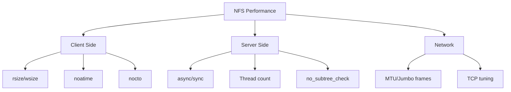

# How to Tune NFS Performance with rsize, wsize, and async Options on RHEL 9

Author: [nawazdhandala](https://www.github.com/nawazdhandala)

Tags: RHEL, NFS, Performance, Tuning, Linux

Description: Optimize NFS throughput on RHEL 9 by tuning read/write buffer sizes, sync/async behavior, and other performance-critical mount and server options.

---

## Why Tune NFS?

Out-of-the-box NFS settings are conservative. They work for general use, but if you are pushing significant data volumes, running databases over NFS, or serving files to many clients simultaneously, tuning can make a big difference. I have seen 2-3x throughput improvements from proper tuning alone.

## Understanding the Key Parameters

### rsize and wsize

These control the maximum read and write buffer sizes in bytes. Larger values mean fewer network round trips for large file operations.

- Default on RHEL 9: 1,048,576 (1 MB) when negotiated
- Useful range: 8192 to 1048576
- Best for large files: 65536 to 1048576

### sync vs async

**Server-side** (in /etc/exports):
- `sync` - The server writes data to disk before acknowledging the write to the client. Safer but slower.
- `async` - The server acknowledges the write before data hits disk. Faster but risky if the server crashes.

**Client-side** (mount option):
- The client-side `sync` mount option forces all writes to be synchronous, regardless of the server setting.

## Tuning Client Mount Options

```bash
# Mount with tuned buffer sizes
sudo mount -t nfs -o rsize=65536,wsize=65536,hard,noatime 192.168.1.10:/srv/nfs/data /mnt/nfs-data
```

For persistent mounts in /etc/fstab:

```bash
192.168.1.10:/srv/nfs/data  /mnt/nfs-data  nfs  rw,hard,rsize=65536,wsize=65536,noatime,_netdev  0 0
```

## Checking Current Mount Parameters

```bash
# View actual negotiated NFS parameters
nfsstat -m

# Or check mount output
mount | grep nfs

# Detailed per-mount info
cat /proc/mounts | grep nfs
```

## Server-Side Tuning

### Increase NFS Threads

The default number of NFS server threads (8) is often too low for servers handling many clients:

```bash
# Check current thread count
cat /proc/fs/nfsd/threads

# Set to 32 threads (good starting point for busy servers)
# Edit /etc/nfs.conf
# [nfsd]
# threads=32

# Restart NFS server
sudo systemctl restart nfs-server

# Verify
cat /proc/fs/nfsd/threads
```

### Use async Exports (With Caution)

```bash
# /etc/exports with async for high-throughput workloads
/srv/nfs/scratch  192.168.1.0/24(rw,async,no_subtree_check)
```

Only use `async` when:
- The data can be regenerated if lost
- The server has a UPS and reliable storage
- Throughput is more important than crash safety

## Benchmarking NFS Performance

Use dd for quick throughput tests:

```bash
# Write test - 1 GB file
dd if=/dev/zero of=/mnt/nfs-data/test-write bs=1M count=1024 oflag=direct

# Read test
dd if=/mnt/nfs-data/test-write of=/dev/null bs=1M count=1024 iflag=direct

# Clean up
rm /mnt/nfs-data/test-write
```

For more thorough testing, use fio:

```bash
# Install fio
sudo dnf install -y fio

# Sequential write test
fio --name=seq-write --directory=/mnt/nfs-data --rw=write --bs=1M --size=1G --numjobs=1 --direct=1

# Random read/write test
fio --name=rand-rw --directory=/mnt/nfs-data --rw=randrw --bs=4K --size=512M --numjobs=4 --direct=1
```

## Performance Tuning Matrix



## Additional Client Optimizations

```bash
# Full optimization mount
sudo mount -t nfs -o rsize=1048576,wsize=1048576,hard,noatime,nocto,nodiratime,_netdev \
    192.168.1.10:/srv/nfs/data /mnt/nfs-data
```

| Option | Effect |
|--------|--------|
| `noatime` | Skip updating access times on reads |
| `nodiratime` | Skip access time updates for directories |
| `nocto` | Disable close-to-open cache consistency checks (for read-heavy workloads) |
| `ac` | Enable attribute caching (default) |
| `actimeo=60` | Cache file attributes for 60 seconds |

Use `nocto` only when files are not being modified by multiple clients simultaneously.

## Network-Level Tuning

### Enable Jumbo Frames

If your network supports it, jumbo frames reduce overhead:

```bash
# Set MTU to 9000 on the NFS network interface
sudo nmcli connection modify "ens192" ethernet.mtu 9000
sudo nmcli connection up "ens192"

# Verify
ip link show ens192 | grep mtu
```

Both the server and client (and all switches between them) must support jumbo frames.

### TCP Buffer Tuning

```bash
# Increase TCP buffer sizes for better NFS throughput
echo "net.core.rmem_max = 16777216" | sudo tee -a /etc/sysctl.conf
echo "net.core.wmem_max = 16777216" | sudo tee -a /etc/sysctl.conf
echo "net.ipv4.tcp_rmem = 4096 87380 16777216" | sudo tee -a /etc/sysctl.conf
echo "net.ipv4.tcp_wmem = 4096 65536 16777216" | sudo tee -a /etc/sysctl.conf
sudo sysctl -p
```

## Wrap-Up

NFS performance tuning on RHEL 9 involves client mount options, server configuration, and network optimization. Start with rsize/wsize at 65536 or higher, increase server threads to match your client count, and add noatime for read-heavy workloads. Benchmark before and after each change to measure the impact. The biggest gains usually come from increasing rsize/wsize and adding more server threads, so start there.
