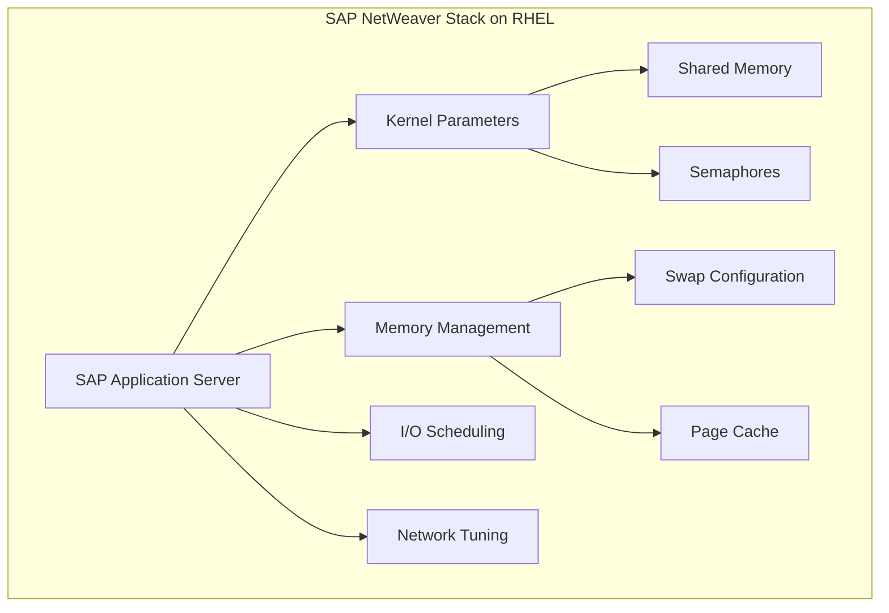
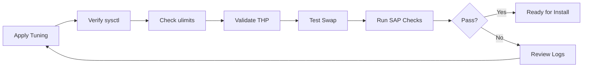

# How to Tune RHEL for SAP NetWeaver Workloads

Author: [nawazdhandala](https://www.github.com/nawazdhandala)

Tags: RHEL, SAP NetWeaver, Performance Tuning, SAP, Linux

Description: Learn how to optimize RHEL for SAP NetWeaver application server workloads with kernel tuning, memory settings, and performance profiles.

---

SAP NetWeaver is the application foundation for most SAP products, and running it efficiently on RHEL requires specific operating system tuning. This guide covers the kernel parameters, memory settings, filesystem configurations, and tuned profiles that will give your NetWeaver workloads the best performance.

## Understanding NetWeaver Requirements



## Prerequisites

- RHEL with SAP Solutions subscription
- Root or sudo access
- SAP NetWeaver installation media

## Step 1: Enable SAP Repositories and Install Preconfigure Roles

```bash
# Enable the SAP-specific repositories
sudo subscription-manager repos \
  --enable=rhel-9-for-x86_64-sap-solutions-rpms \
  --enable=rhel-9-for-x86_64-sap-netweaver-rpms

# Install the RHEL System Roles for SAP
sudo dnf install -y rhel-system-roles-sap

# Install the SAP NetWeaver tuned profile
sudo dnf install -y tuned-profiles-sap
```

## Step 2: Run the SAP General Preconfigure Role

```bash
# Create the playbook for SAP NetWeaver preparation
cat <<'EOF' > /tmp/sap-netweaver-prepare.yml
---
- name: Prepare RHEL for SAP NetWeaver
  hosts: localhost
  become: true
  vars:
    sap_general_preconfigure_modify_etc_hosts: true
    sap_general_preconfigure_update: true
    sap_netweaver_preconfigure_fail_if_not_enough_swap_space_configured: false
  roles:
    - role: sap_general_preconfigure
    - role: sap_netweaver_preconfigure
EOF

# Run the playbook
sudo ansible-playbook /tmp/sap-netweaver-prepare.yml
```

## Step 3: Configure Kernel Parameters

```bash
# Set kernel parameters optimized for SAP NetWeaver
sudo tee /etc/sysctl.d/sap-netweaver.conf > /dev/null <<'EOF'
# Shared memory settings for SAP
# SHMMAX should be set to at least the size of the largest SAP shared memory segment
kernel.shmmax = 21474836480
kernel.shmall = 5242880

# Semaphore settings: SEMMSL SEMMNS SEMOPM SEMMNI
kernel.sem = 1250 256000 100 8192

# Message queue settings
kernel.msgmni = 1024
kernel.msgmax = 65536
kernel.msgmnb = 65536

# File handle limits
fs.file-max = 6553600

# Network buffer sizes for SAP communication
net.core.rmem_max = 16777216
net.core.wmem_max = 16777216
net.core.rmem_default = 262144
net.core.wmem_default = 262144
net.ipv4.tcp_rmem = 4096 87380 16777216
net.ipv4.tcp_wmem = 4096 65536 16777216

# Keep connections alive
net.ipv4.tcp_keepalive_time = 300
net.ipv4.tcp_keepalive_intvl = 75
net.ipv4.tcp_keepalive_probes = 9

# Virtual memory tuning
vm.swappiness = 10
vm.dirty_ratio = 15
vm.dirty_background_ratio = 3
vm.max_map_count = 2147483647
EOF

# Apply immediately
sudo sysctl --system
```

## Step 4: Configure User Limits

```bash
# Set resource limits for SAP users
sudo tee /etc/security/limits.d/99-sap.conf > /dev/null <<'EOF'
# SAP user limits for NetWeaver
# Maximum number of open files
@sapsys    hard    nofile    1048576
@sapsys    soft    nofile    1048576

# Maximum number of processes
@sapsys    hard    nproc     unlimited
@sapsys    soft    nproc     unlimited

# Maximum locked memory (unlimited for SAP)
@sapsys    hard    memlock   unlimited
@sapsys    soft    memlock   unlimited

# Maximum stack size
@sapsys    hard    stack     unlimited
@sapsys    soft    stack     unlimited
EOF
```

## Step 5: Apply the SAP Tuned Profile

```bash
# List available tuned profiles
tuned-adm list | grep sap

# Activate the SAP NetWeaver tuned profile
sudo tuned-adm profile sap-netweaver

# Verify the active profile
tuned-adm active
```

## Step 6: Disable Transparent Huge Pages

SAP NetWeaver requires Transparent Huge Pages to be disabled.

```bash
# Disable THP via kernel command line
sudo grubby --update-kernel=ALL --args="transparent_hugepage=never"

# For immediate effect without reboot
echo never | sudo tee /sys/kernel/mm/transparent_hugepage/enabled
echo never | sudo tee /sys/kernel/mm/transparent_hugepage/defrag

# Verify THP is disabled
cat /sys/kernel/mm/transparent_hugepage/enabled
# Output should show: always madvise [never]
```

## Step 7: Configure Swap Space

SAP recommends specific swap sizes based on RAM.

```bash
# SAP swap recommendation:
# RAM up to 32 GB: swap = RAM size
# RAM 32-64 GB: swap = 32 GB minimum
# RAM > 64 GB: swap = 32 GB minimum

# Create a swap file if needed (example: 32 GB)
sudo dd if=/dev/zero of=/swapfile bs=1G count=32
sudo chmod 600 /swapfile
sudo mkswap /swapfile
sudo swapon /swapfile

# Add to fstab for persistence
echo '/swapfile swap swap defaults 0 0' | sudo tee -a /etc/fstab

# Verify swap
swapon --show
```

## Step 8: Verify the Configuration

```bash
# Check kernel parameters
sysctl kernel.shmmax kernel.shmall kernel.sem

# Check user limits (as the SAP user)
sudo su - sidadm -c 'ulimit -a'

# Check THP status
cat /sys/kernel/mm/transparent_hugepage/enabled

# Check the tuned profile
tuned-adm active

# Verify hostname resolution
hostname -f
ping -c 1 $(hostname)
```

## Performance Validation Flow



## Conclusion

Proper OS-level tuning is essential for SAP NetWeaver performance on RHEL. The RHEL System Roles for SAP automate most of this configuration, but understanding each setting helps you troubleshoot issues and fine-tune for your specific workload. Always validate your configuration against the latest SAP Notes before going to production.
