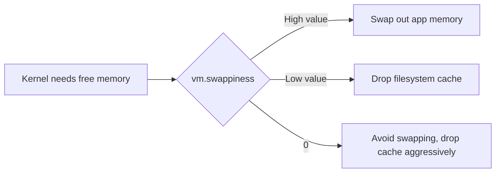

# How to Tune the vm.swappiness Parameter on RHEL

Author: [nawazdhandala](https://www.github.com/nawazdhandala)

Tags: RHEL, Swappiness, Memory, Tuning, Linux

Description: Understand and tune the vm.swappiness kernel parameter on RHEL to control how aggressively the system uses swap space.

---

The `vm.swappiness` parameter is one of the most commonly tuned kernel settings, and also one of the most misunderstood. It does not control when swapping starts. It controls the balance between swapping out anonymous memory pages versus reclaiming memory from the filesystem page cache.

## What vm.swappiness Actually Does

The kernel constantly makes decisions about memory management. When it needs to free up RAM, it has two main options:

1. Drop filesystem cache pages (they can be re-read from disk)
2. Swap out anonymous pages (application memory that is not file-backed)

The `vm.swappiness` value influences this decision:

- **Higher values** (closer to 100) - The kernel more aggressively swaps anonymous pages
- **Lower values** (closer to 0) - The kernel prefers to drop filesystem cache instead of swapping
- **Value of 0** - The kernel avoids swapping as much as possible, but will still swap to prevent OOM conditions



The default on RHEL is 60.

## Check the Current Value

```bash
# Show current swappiness setting
sysctl vm.swappiness
```

Or read it directly:

```bash
# Read from proc
cat /proc/sys/vm/swappiness
```

## Temporary Change (Until Reboot)

```bash
# Set swappiness to 10 temporarily
sysctl -w vm.swappiness=10
```

This takes effect immediately but reverts on reboot.

## Persistent Change (Survives Reboot)

Create a sysctl configuration file:

```bash
# Create a persistent swappiness setting
echo "vm.swappiness = 10" > /etc/sysctl.d/99-swappiness.conf
```

Apply it:

```bash
# Load the new setting
sysctl -p /etc/sysctl.d/99-swappiness.conf
```

Verify:

```bash
# Confirm the change
sysctl vm.swappiness
```

## Recommended Values by Workload

There is no universal best value. It depends on what the system does:

### Database Servers (PostgreSQL, MySQL/MariaDB)

Databases manage their own caching and generally do not want the OS swapping their memory:

```bash
# Low swappiness for database servers
echo "vm.swappiness = 10" > /etc/sysctl.d/99-swappiness.conf
sysctl -p /etc/sysctl.d/99-swappiness.conf
```

Oracle Database recommends a value of 10. Some DBAs use 1.

### Web Servers and Application Servers

These benefit from keeping the filesystem cache active for serving static content:

```bash
# Moderate swappiness for web servers
echo "vm.swappiness = 30" > /etc/sysctl.d/99-swappiness.conf
sysctl -p /etc/sysctl.d/99-swappiness.conf
```

### Desktop or Development Systems

The default of 60 is usually fine. If the system feels sluggish, try lowering it:

```bash
# Slightly reduced swappiness for desktops
echo "vm.swappiness = 40" > /etc/sysctl.d/99-swappiness.conf
sysctl -p /etc/sysctl.d/99-swappiness.conf
```

### Kubernetes Nodes (With Swap Enabled)

If running Kubernetes with swap support, keep swappiness low:

```bash
# Minimal swapping for Kubernetes
echo "vm.swappiness = 0" > /etc/sysctl.d/99-swappiness.conf
sysctl -p /etc/sysctl.d/99-swappiness.conf
```

| Workload | Recommended Range | Notes |
|----------|------------------|-------|
| Database server | 1-10 | Let the DB manage its cache |
| Web server | 20-40 | Balance between cache and app memory |
| General purpose | 40-60 | RHEL default works fine |
| File server | 50-70 | Keep filesystem cache warm |
| Minimal swap use | 0-5 | Avoid swapping except in emergencies |

## Monitoring the Impact

After changing swappiness, monitor the effect:

```bash
# Watch swap usage in real time
vmstat 1 10
```

Key columns to watch:
- `si` - swap in (pages read from swap)
- `so` - swap out (pages written to swap)
- `free` - free memory
- `buff/cache` - buffer and page cache

```bash
# Check swap I/O over time
sar -W 1 10
```

```bash
# See detailed memory statistics
cat /proc/meminfo | grep -E "SwapTotal|SwapFree|SwapCached|Cached|MemFree|MemAvailable"
```

## Common Misconceptions

**"Setting swappiness to 0 disables swap"** - No. The system can still swap. It just prefers dropping cache first. Swap is only completely disabled with `swapoff`.

**"Lower swappiness is always better"** - Not necessarily. If your workload reads a lot of files (like a file server or build system), you want the filesystem cache to stay warm. Too-low swappiness forces the kernel to drop cache pages that might be needed again soon.

**"Swappiness controls the percentage of RAM used before swapping starts"** - This is completely wrong. It is a weight in the kernel's page reclaim algorithm, not a RAM usage threshold.

## Combining with Other Memory Parameters

For a more complete memory tuning approach:

```bash
# Create a comprehensive memory tuning config
cat > /etc/sysctl.d/99-memory-tuning.conf << 'EOF'
# Reduce swap usage preference
vm.swappiness = 10

# Keep a minimum of 128 MB free
vm.min_free_kbytes = 131072

# Reduce tendency to write dirty pages
vm.dirty_ratio = 20
vm.dirty_background_ratio = 5
EOF

# Apply all settings
sysctl -p /etc/sysctl.d/99-memory-tuning.conf
```

## Summary

The `vm.swappiness` parameter controls how the kernel balances between swapping application memory and dropping filesystem cache. The default of 60 works for general use. Database servers benefit from lower values (1-10), while file-heavy workloads might want moderate values (30-50). Make changes persistent via `/etc/sysctl.d/`, monitor with `vmstat` and `sar`, and remember that swappiness is a preference weight, not a hard threshold.
