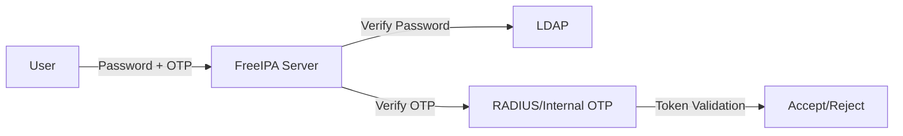

# How to Set Up Two-Factor Authentication (OTP) in FreeIPA on RHEL 9

Author: [nawazdhandala](https://www.github.com/nawazdhandala)

Tags: RHEL, FreeIPA, 2FA, OTP, Security, Linux

Description: A step-by-step guide to enabling two-factor authentication with one-time passwords (OTP) in FreeIPA on RHEL 9, covering TOTP and HOTP token setup, user enrollment, and troubleshooting.

---

Passwords alone are not enough. Two-factor authentication (2FA) with one-time passwords (OTP) adds a second layer that protects accounts even when passwords are compromised. FreeIPA on RHEL 9 has built-in OTP support that works with standard TOTP apps like Google Authenticator, FreeOTP, and hardware tokens. No third-party plugins needed.

## How OTP Works in FreeIPA



When 2FA is enabled, users authenticate by entering their password immediately followed by the OTP token value (no space between them). FreeIPA validates both factors before issuing a Kerberos ticket.

## OTP Token Types

FreeIPA supports two types of OTP tokens:

- **TOTP (Time-based One-Time Password)**: Generates a new code every 30 seconds. This is what most authenticator apps use.
- **HOTP (HMAC-based One-Time Password)**: Generates a new code based on a counter. Each code is valid until used.

## Step 1 - Enable OTP as the Default Authentication Method

First, configure IdM to require OTP authentication globally or per-user.

```bash
# Set OTP as the default authentication method for all users
ipa config-mod --user-auth-type=otp

# Or enable both password and OTP (users can use either)
ipa config-mod --user-auth-type=password --user-auth-type=otp
```

To enable OTP for a specific user instead of globally:

```bash
# Enable OTP for a single user
ipa user-mod jsmith --user-auth-type=otp

# Enable both password and OTP for a user
ipa user-mod jsmith --user-auth-type=password --user-auth-type=otp
```

## Step 2 - Add an OTP Token for a User

### Option A: Admin Creates the Token

The admin can create a token and share the QR code or secret with the user.

```bash
# Create a TOTP token for a user
ipa otptoken-add --owner=jsmith --type=totp

# The command outputs a URI that can be converted to a QR code
# Example output includes the otpauth:// URI
```

The output will include an `otpauth://` URI. The user scans this as a QR code in their authenticator app.

```bash
# Generate a QR code from the URI (install qrencode first)
sudo dnf install qrencode -y

# Create a QR code image
qrencode -o /tmp/jsmith-otp.png "otpauth://totp/jsmith@EXAMPLE.COM?secret=JBSWY3DPEHPK3PXP&issuer=EXAMPLE.COM"
```

### Option B: User Self-Enrolls

Users can add their own tokens through the FreeIPA web UI:

1. Log in to the FreeIPA web UI at `https://idm.example.com`
2. Navigate to Authentication, then OTP Tokens
3. Click Add
4. Scan the QR code with an authenticator app

## Step 3 - Test OTP Authentication

After the token is configured, test the login. The user enters their password immediately followed by the OTP code.

```bash
# Authenticate with password + OTP (no space between them)
# If password is "MyPassword" and OTP is "123456":
kinit jsmith
# Enter: MyPassword123456

# Verify the ticket was issued
klist
```

## Step 4 - Configure SSSD for OTP on Clients

SSSD on IdM-enrolled clients handles OTP automatically, but verify the configuration.

```bash
# Check that SSSD is configured for IPA authentication
sudo grep auth_provider /etc/sssd/sssd.conf
# Should show: auth_provider = ipa
```

For the login prompt to properly handle OTP, make sure the PAM configuration is correct:

```bash
# Verify authselect profile
authselect current
# Should show sssd profile
```

## Step 5 - Manage OTP Tokens

### List Tokens

```bash
# List all OTP tokens
ipa otptoken-find

# List tokens for a specific user
ipa otptoken-find --owner=jsmith
```

### Remove a Token

```bash
# List tokens to find the token ID
ipa otptoken-find --owner=jsmith

# Remove a specific token
ipa otptoken-del <token-id>
```

### Disable a Token Temporarily

```bash
# Disable a token without deleting it
ipa otptoken-mod <token-id> --disabled=TRUE

# Re-enable it
ipa otptoken-mod <token-id> --disabled=FALSE
```

## Step 6 - Handle Token Synchronization Issues

TOTP tokens depend on time synchronization. If the server and the user's device have different times, authentication will fail.

```bash
# Synchronize time on the IdM server
chronyc tracking

# Check time sync status
timedatectl
```

FreeIPA has a token sync window. You can adjust how much clock skew is tolerated:

```bash
# Show current OTP token configuration
ipa otpconfig-show

# Adjust the TOTP sync step (number of intervals to check)
ipa otpconfig-mod --totp-auth-window=10
```

If a user's token gets out of sync, they can resynchronize by providing two consecutive OTP values.

## Step 7 - Configure OTP for SSH Access

SSH logins also use OTP when configured properly. Make sure the SSH server supports challenge-response authentication.

```bash
# Verify SSH configuration on the client
sudo grep -E "ChallengeResponseAuthentication|KbdInteractiveAuthentication" /etc/ssh/sshd_config
```

SSSD handles the OTP prompting for SSH sessions. The user will see a combined password+OTP prompt or two separate prompts depending on the SSSD version and configuration.

## Step 8 - Recovery: When a User Loses Their Token

If a user loses their phone or hardware token, you need a recovery procedure.

```bash
# As admin, temporarily switch the user back to password-only auth
ipa user-mod jsmith --user-auth-type=password

# Remove the old token
ipa otptoken-find --owner=jsmith
ipa otptoken-del <old-token-id>

# Create a new token
ipa otptoken-add --owner=jsmith --type=totp

# After the user enrolls the new token, re-enable OTP
ipa user-mod jsmith --user-auth-type=otp
```

## Practical Tips

- **Start with a pilot group**: Do not enable OTP for all users at once. Start with admins and IT staff, work out the kinks, then roll out to everyone else.
- **Keep password-only as a fallback**: During initial rollout, allow both password and OTP authentication. Remove password-only after everyone has enrolled.
- **Document the recovery process**: Users will lose phones. Have a documented, tested procedure for token replacement.
- **Use TOTP over HOTP**: TOTP is more widely supported and less prone to desynchronization.
- **Monitor failed attempts**: A sudden increase in failed OTP attempts could indicate an attack or a widespread token issue.

```bash
# Check authentication failures in the KDC log
sudo journalctl -u krb5kdc | grep -i "preauth" | tail -20
```

OTP in FreeIPA is straightforward to set up and dramatically improves your security posture. The hardest part is not the technical configuration, it is getting users to actually enroll and use their tokens consistently. Start with clear documentation and a supportive rollout process.
