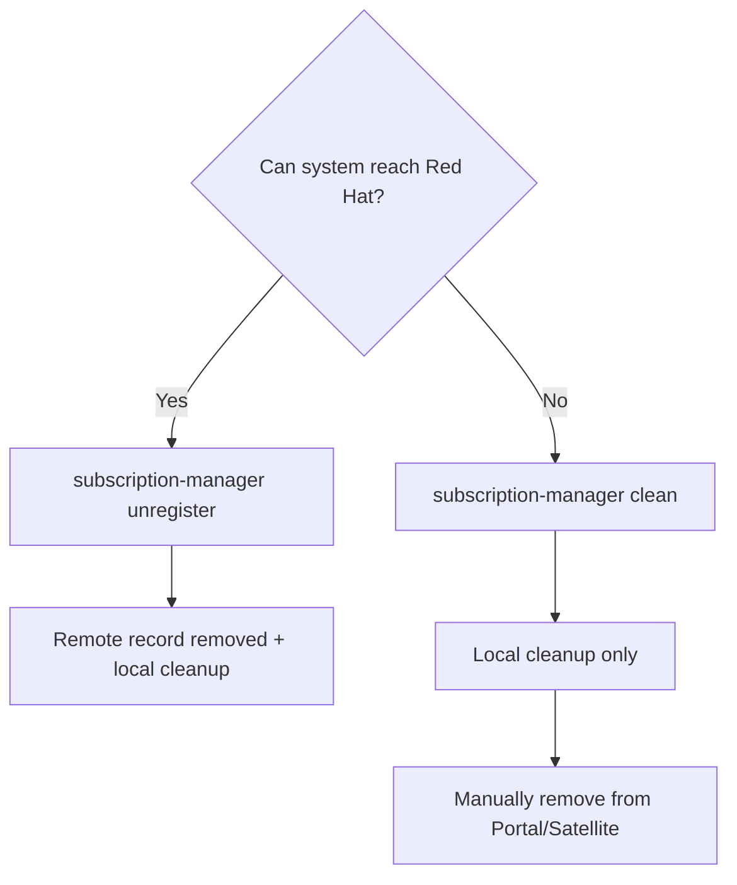

# How to Unregister and Re-register a RHEL 9 System with subscription-manager

Author: [nawazdhandala](https://www.github.com/nawazdhandala)

Tags: RHEL, Subscription Manager, Registration, Red Hat, Linux

Description: Learn when and how to properly unregister a RHEL 9 system from Red Hat and re-register it, covering common scenarios like system cloning, migration, and troubleshooting.

---

There are plenty of legitimate reasons to unregister a RHEL 9 system and register it again. Maybe you cloned a VM and ended up with a duplicate system UUID. Maybe you are migrating from one Red Hat account to another. Or maybe your registration is just broken and you need to start fresh. Whatever the reason, here is how to do it correctly without leaving orphaned entries in Red Hat's systems.

## When to Unregister and Re-register

Common scenarios where this is necessary:

- Cloned VMs that share the same system identity
- Moving a system from one Red Hat organization to another
- Switching from Customer Portal registration to Satellite Server (or vice versa)
- Fixing corrupted registration data or certificates
- Decommissioning a system and freeing its subscription

## Checking Current Registration Status

Before doing anything, see what state the system is in:

```bash
# Check if the system is currently registered
sudo subscription-manager identity

# Check subscription status
sudo subscription-manager status

# List consumed subscriptions
sudo subscription-manager list --consumed
```

If the identity command returns an error or shows stale data, that is a sign you may need to clean up and re-register.

## Unregistering a System

The `unregister` command removes the system from Red Hat's records and cleans up local certificates:

```bash
# Unregister the system from Red Hat
sudo subscription-manager unregister
```

This does three things:
1. Removes the system from the Red Hat Customer Portal (or Satellite)
2. Removes all local entitlement certificates
3. Removes the system's identity certificate

After unregistering, the system will no longer have access to Red Hat repositories.

## The Difference Between Unregister and Clean

There is an important distinction between `unregister` and `clean`:

```bash
# unregister: contacts Red Hat to remove the system remotely, then cleans local data
sudo subscription-manager unregister

# clean: only removes local data without contacting Red Hat
sudo subscription-manager clean
```

Use `unregister` when the system can reach the Red Hat server. Use `clean` when the system is offline or when the remote record has already been removed.



## Re-registering the System

After unregistering, register again using your preferred method.

With username and password:

```bash
# Re-register with credentials
sudo subscription-manager register --username=your_username --password=your_password
```

With an activation key:

```bash
# Re-register with an activation key
sudo subscription-manager register --activationkey=my-key --org=my-org
```

If you are switching to a Satellite Server, install the Satellite CA certificate first:

```bash
# Switch to Satellite registration
sudo dnf install -y http://satellite.example.com/pub/katello-ca-consumer-latest.noarch.rpm
sudo subscription-manager register --activationkey=my-key --org=my-org
```

## Handling Cloned VMs

VM cloning is one of the most common reasons for re-registration. When you clone a VM, the clone has the same system UUID as the original, which causes conflicts in Red Hat's records.

On the cloned system:

```bash
# Clean the local identity data
sudo subscription-manager clean

# Remove the old system identity certificate
sudo rm -f /etc/pki/consumer/cert.pem /etc/pki/consumer/key.pem

# Register as a new system
sudo subscription-manager register --username=your_username --password=your_password
```

The new registration generates a fresh UUID, and Red Hat treats it as a new system.

## Switching Between Organizations

If you need to move a system from one Red Hat account to another:

```bash
# Step 1: Unregister from the current organization
sudo subscription-manager unregister

# Step 2: Register to the new organization
sudo subscription-manager register --username=new_account_user --password=new_account_pass --org=new_org_id
```

## Switching Between CDN and Satellite

To move a system from direct Red Hat CDN registration to Satellite:

```bash
# Step 1: Unregister from CDN
sudo subscription-manager unregister

# Step 2: Install Satellite CA certificate
sudo dnf install -y http://satellite.example.com/pub/katello-ca-consumer-latest.noarch.rpm

# Step 3: Register to Satellite
sudo subscription-manager register --activationkey=my-key --org=my-org
```

To move from Satellite back to CDN:

```bash
# Step 1: Unregister from Satellite
sudo subscription-manager unregister

# Step 2: Remove Satellite CA certificate
sudo dnf remove -y katello-ca-consumer-*

# Step 3: Restore CDN configuration
sudo subscription-manager config --server.hostname=subscription.rhsm.redhat.com \
    --server.port=443 \
    --server.prefix=/subscription \
    --rhsm.baseurl=https://cdn.redhat.com

# Step 4: Register to CDN
sudo subscription-manager register --username=your_username --password=your_password
```

## Forcing Re-registration

If a system is already registered and you want to re-register it (for example, with different settings), use the `--force` flag:

```bash
# Force re-registration without unregistering first
sudo subscription-manager register --username=your_username --password=your_password --force
```

The `--force` flag unregisters the system and re-registers it in a single step. This is convenient but be aware that it removes the existing registration record.

## Cleaning Up Orphaned Systems

After unregistering or decommissioning systems, check the Customer Portal for orphaned entries. Systems that were cleaned locally (using `subscription-manager clean`) without unregistering will still appear in the portal. Remove them manually:

1. Log in to access.redhat.com
2. Go to Subscriptions, then Systems
3. Find the orphaned system
4. Delete it

## Automating with Ansible

For bulk operations:

```yaml
# Ansible playbook to unregister and re-register systems
- name: Re-register RHEL 9 systems
  hosts: rhel9_servers
  become: true
  tasks:
    - name: Unregister from current subscription
      community.general.redhat_subscription:
        state: absent

    - name: Register with new activation key
      community.general.redhat_subscription:
        activationkey: rhel9-new-key
        org_id: new-org
        state: present
```

## Post-Registration Verification

After re-registering, always verify the system is in good shape:

```bash
# Verify identity
sudo subscription-manager identity

# Check status
sudo subscription-manager status

# Verify repos are accessible
sudo subscription-manager repos --list-enabled

# Test package access
sudo dnf check-update
```

## Summary

Unregistering and re-registering RHEL 9 systems is a routine task for any sysadmin managing a dynamic environment. The key points to remember: use `unregister` when possible to clean both local and remote records, use `clean` only when the system cannot reach the server, and always verify registration after re-registering. For cloned VMs, always clean and re-register to avoid UUID conflicts. And if you are doing this across many systems, Ansible makes the process painless.
