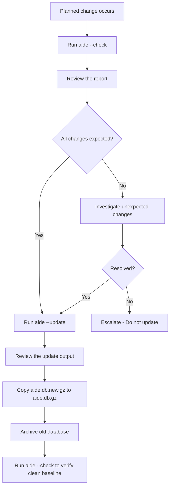

# How to Update the AIDE Database After Legitimate System Changes on RHEL

Author: [nawazdhandala](https://www.github.com/nawazdhandala)

Tags: RHEL, AIDE, Database Update, Linux

Description: Learn the correct process for updating the AIDE database on RHEL after legitimate system changes like patches, configuration updates, and software installations.

---

Every time you patch your RHEL system, install software, or change configuration files, AIDE is going to flag those changes on the next check. If you do not update the database, you will drown in false positives and eventually start ignoring the reports entirely. That defeats the whole purpose of file integrity monitoring. Here is how to handle database updates properly.

## The Update Process

AIDE provides an `--update` option that simultaneously runs a check against the current database and creates a new database reflecting the current state:

```bash
# Run an update, which checks and builds a new database at the same time
sudo aide --update
```

This produces output showing what changed (just like `--check`) and writes a new database to `/var/lib/aide/aide.db.new.gz`. You then need to move it into place:

```bash
# Replace the active database with the updated one
sudo cp /var/lib/aide/aide.db.new.gz /var/lib/aide/aide.db.gz
```

## When to Update the Database

The database should be updated whenever you have verified that changes are legitimate. Common triggers include:

- After applying system patches with `dnf update`
- After installing or removing packages
- After making intentional configuration changes
- After deploying application updates
- After user account modifications

The key word is "verified." Do not blindly update the database. Always review the changes first.

## Recommended Workflow

A disciplined approach keeps your monitoring effective:



## Step-by-Step: Post-Patching Update

Here is the full process after running system updates:

```bash
# Step 1: Run the updates
sudo dnf update -y

# Step 2: Check what AIDE sees as changed
sudo aide --check > /tmp/aide-post-patch.log 2>&1

# Step 3: Review the changes
cat /tmp/aide-post-patch.log

# Step 4: Verify changes match the packages that were updated
sudo dnf history info last
```

If the changes align with what was patched, proceed with the update:

```bash
# Step 5: Archive the current database before replacing it
sudo cp /var/lib/aide/aide.db.gz /var/lib/aide/aide.db.gz.pre-patch-$(date +%Y%m%d)

# Step 6: Run the update to generate a new database
sudo aide --update

# Step 7: Activate the new database
sudo cp /var/lib/aide/aide.db.new.gz /var/lib/aide/aide.db.gz

# Step 8: Verify clean baseline
sudo aide --check
```

The final check should show zero changes. If it does not, something changed between the update and the verification check, which is worth investigating.

## Archiving Old Databases

Keep old databases around for a while. They can be useful for forensic analysis if you need to go back and figure out when a change actually occurred:

```bash
# Create an archive directory
sudo mkdir -p /var/lib/aide/archive

# Archive with date stamp and description
sudo cp /var/lib/aide/aide.db.gz /var/lib/aide/archive/aide.db.gz.$(date +%Y%m%d)-pre-patch

# List archived databases
ls -la /var/lib/aide/archive/
```

Set up a cleanup policy so archives do not consume too much space:

```bash
# Remove archives older than 180 days
sudo find /var/lib/aide/archive -name "aide.db.gz.*" -mtime +180 -delete
```

## Automating Post-Patch Database Updates

If you have a standardized patching process, you can script the database update as part of it. Be careful with this - you still want human review of the changes:

```bash
# Create a post-patch AIDE update script
sudo tee /usr/local/sbin/aide-post-patch.sh << 'SCRIPT'
#!/bin/bash
# Update AIDE database after patching
# Run this only after reviewing that all changes are from the patch

ARCHIVE_DIR="/var/lib/aide/archive"
TIMESTAMP=$(date +%Y%m%d-%H%M%S)
LOGFILE="/var/log/aide/post-patch-${TIMESTAMP}.log"

mkdir -p "${ARCHIVE_DIR}"

echo "=== AIDE Post-Patch Update ===" | tee "${LOGFILE}"
echo "Timestamp: $(date)" | tee -a "${LOGFILE}"

# Archive current database
cp /var/lib/aide/aide.db.gz "${ARCHIVE_DIR}/aide.db.gz.${TIMESTAMP}"
echo "Archived current database" | tee -a "${LOGFILE}"

# Run update
echo "Running AIDE update..." | tee -a "${LOGFILE}"
aide --update >> "${LOGFILE}" 2>&1

# Activate new database
cp /var/lib/aide/aide.db.new.gz /var/lib/aide/aide.db.gz
echo "New database activated" | tee -a "${LOGFILE}"

# Verify clean baseline
echo "Verification check:" | tee -a "${LOGFILE}"
aide --check >> "${LOGFILE}" 2>&1

echo "=== Update complete ===" | tee -a "${LOGFILE}"
SCRIPT

sudo chmod 700 /usr/local/sbin/aide-post-patch.sh
```

## Partial Updates: When You Cannot Update Everything

Sometimes you want to accept changes in one area but not another. AIDE does not support partial database updates directly, but you can work around this:

```bash
# Check with a limited scope using a temporary config
sudo cp /etc/aide.conf /tmp/aide-partial.conf

# Edit the temporary config to only include the paths you want to update
# Then run update with the modified config
sudo aide --update --config=/tmp/aide-partial.conf
```

In practice, most admins just review the full output and accept all verified changes at once. If you have unresolved suspicious changes, fix those before running the update.

## Common Mistakes to Avoid

1. **Updating without reviewing** - This is the biggest mistake. If you blindly update after every alert, you might accept malicious changes into your baseline.

2. **Forgetting to copy the new database** - Running `aide --update` without copying `aide.db.new.gz` to `aide.db.gz` means the next check will still use the old database.

3. **Not archiving the old database** - Once you overwrite `aide.db.gz`, the previous baseline is gone unless you archived it.

4. **Running update on a compromised system** - If you suspect compromise, do not update the database. Preserve it for forensic analysis.

5. **Updating during active changes** - Wait until all changes are complete before updating. Running an update while someone is still deploying code means you might capture an incomplete state.

## Verifying the New Baseline

After every update, run a clean check:

```bash
# This should return exit code 0 with no changes
sudo aide --check
echo "Exit code: $?"
```

If you see changes on a check right after an update, something is still modifying files. Common culprits are log rotation, cron jobs writing temporary files, or services that regenerate config on startup. Address these by adding appropriate exclusions to your AIDE configuration.
